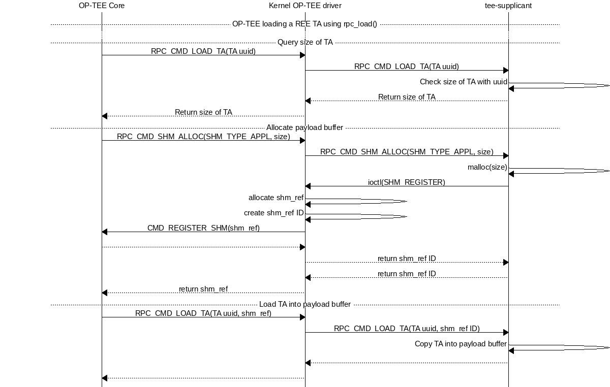

> ⚠️ The code is based on: [https://gitlab.com/riseproject/riscv-optee/optee_os/-/tree/dev-optee-mpxy](https://gitlab.com/riseproject/riscv-optee/optee_os/-/tree/dev-optee-mpxy)
>
> Commit ID: **`75df9ba41a404aec897399ead0ff0aebcbff48ca`**

- Reference:

    [Trusted Applications — OP-TEE documentation  documentation](https://optee.readthedocs.io/en/latest/architecture/trusted_applications.html#loading-ree-fs-ta)

---

- `ree_fs_ta_open()`
    - Call [`rpc_load()`](/posts/optee-ree-filesystem-ta/#rpc-load) to request TA from tee-supplicant.
    - Validate the loaded TA.
- `rpc_load()`
    - Call [`thread_rpc_cmd()`](/posts/optee-rpc/#thread-rpc-cmd) with `OPTEE_RPC_CMD_LOAD_TA` RPC command **without** `struct thread_param_memref` parameter to request the size of TA.
        - `OPTEE_RPC_CMD_LOAD_TA` RPC command is saved to `struct optee_msg_arg.cmd`.
        - `struct optee_msg_arg` is stored in the shared memory shared with the untrusted domain.
    - Call `thread_rpc_alloc_payload(`) to allocate data for TA.
        - Call `thread_rpc_alloc()` to allocate shared memory for TA.
            - Call [`thread_rpc()`](/posts/optee-rpc/#thread-rpc) with `rpc_args` (`rv[THREAD_RPC_NUM_ARGS]`). `rpc_args`’s first element is set to `OPTEE_ABI_RETURN_RPC_CMD` function. The RPC command is set to `OPTEE_RPC_CMD_SHM_ALLOC` to allocate the shared memory for TA.
    - Call [`thread_rpc_cmd()`](/posts/optee-rpc/#thread-rpc-cmd) with `OPTEE_RPC_CMD_LOAD_TA` RPC command again **with** `struct thread_param_memref parameter` to load TA.
