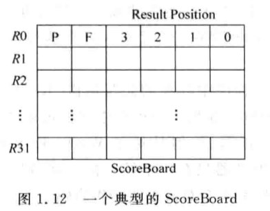

# 1.2 - 普通處理器的流水線

## 1.2.2 - 流水線的劃分

- Pipeline CPU，其 cycle time 由最長 cycle time 的 pipeline stage 所決定
    - 因此，最好每個 pipeline stage 的 cycle time 都是差不多長的
- 解決各個 pipeline stage cycle time 不平衡的方法：
    - 合：
        - 將多個 pipeline stages 合併成一個 stage，例如：
            - Fetch (7 ns) & Decode (3 ns) | Operand fetch (8 ns) & Execute (5 ns) | Memory (10 ns) & Write back (3 ns)
        - 此方法將 pipeline stages 從 5 個降為 3 個，原本各個 pipeline stage cycle time 不平衡的情況也變成：10 ns | 13 ns | 13 ns
        - 適用於對於性能要求不高的 CPU，例如：ARM7、ARM9、Cortex-M0、Cortex-M3
            - 因為 pipeline stage 的 cycle time 增加了，從原本的 `max(7 ns, 3 ns, 8 ns, 5 ns, 10 ns, 3 ns) ⇒ 10 ns`，增加為 `max(10 ns, 13 ns, 13 ns) ⇒ 13 ns`，cycle time 增加，就代表 CPU 的 frequency 會降低
    - 拆：
        - 將 pipeline stage 拆成更小的 stages，例如：
            - Fetch (7 ns)  ⇒ Fetch1 (3.5 ns) & Fetch2 (3.5 ns)
        - 適用於高性能 CPU，因為可以提昇 CPU 的 frequency
        - 缺點：
            - 增加所需的硬體元件，例如：需要多個 pipeline registers
            - 功耗會增大
            - 較深的 pipeline 也會增加 branch misprediction 的 penalty

## 1.2.3 - 指令間的相依性

- Instructions hazard：
    - RAW (Read After Write)，為 true hazard，無法避免；可以透過 forwarding 的方式來緩解
    - WAR (Write After Read)，可以透過 register renaming 避免
    - WAW (Write After Write)，可以透過 register renaming 避免
- Control hazard：
    - 需要等到 branch target address，或是是否會 branch 的結果計算出來後，才知道要去哪裡 fetch 下一道指令來執行
    - 在結果出來之前，只能依據 branch predict 的結果 fetch 指令
- Load/store address dependency：

    ```asm
    sw r1, 0(r5)
    ld r2, 0(r6)
    ```

    - 如果上述的 `r5`, `r6` 的值相同，那麼就會產生 RAW dependency

# 1.3 - Superscalar 處理器的流水線

- In-Order vs. Out-of-Order：


    |  | Frontend | Issue | Write back | Commit |
    | --- | --- | --- | --- | --- |
    | In-Order Superscalar | **In-Order** | **In-Order** | **In-Order** | **In-Order** |
    | Out-of-order Superscalar | **In-Order** | **Out-of-Order** | **Out-of-Order** | **In-Order** |
    - Frontend ⇒ Fetch + Decode，很難 Out-of-Order
    - Issue，只要 operands 有準備好且有多個 FU (Function Unit) 可用，就可以 Out-of-Order
    - Write back，可以透過 register renaming 實現 Out-of-Order
    - Commit，一定要 In-Order

## 1.3.1 - In-Order

- Scoreboard：
    - 用來紀錄每個指令的執行狀況，例如：

        

- In-Order pipeline (Dual Issue Superscalar)：

    

    - 因為 Write back stage 是 In-Order 的，因此所有的 FU 都必須擁有相同數量的 pipeline stages，會以最長的那個為主 (X0, X1, X2)
    - Pipeline 範例：

        

        - 指令 A depends on 指令 C, 指令 C depends on 指令 E
        - 指令 B depends on 指令 D 和指令 E
        - 因為要等到 Write back stage 才能 forwarding 結果，因此：
            - 指令 C 和指令 D 必須等到 cycle 6 才能進到 Execute stage
            - 指令 E 要等到 cycle 9 才能進到 Execute stage
        - 且因為是 In-Order pipeline，因此縱使指令 F 沒有任何的 dependency，還是得等到 cycle 8 才能被 issued
        - 共需要 **12 個 cycles** 才可以完成所有的指令

## 1.3.2 - Out-of-Order

- Out-of-Order pipeline (Dual Issue Superscalar)：

    

    - 在 Decode stage 可以做 register renaming 來解決 WAR 和 WAW hazards
        - 將 ARF (architecture register file)，rename 成 PRF (physical register file)
    - 直到 Issue stage 才可以 Out-of-Order Issue
        - 指令會先存在 Issue queue，一旦指令的 operands 準備好了，就可以被 issued 到 FU
    - 由於 Write back stage 是 Out-of-Order 的，因此 FU 不需擁有相同數量的 pipeline stages
        - 一旦指令計算完畢，便可以將結果寫回 PRF
    - 不過由於 branch misprediction 及 exception，PRF 的結果不一定會被寫回 ARF 中
    - 為了保持指令的 commit 順序是 In-Order 的，所有的指令都會被存進 ROB (Re-Order Buffer) 中
    - Commit stage 會將指令依據 ROB 中的排列順序，一一 commit 並將結果從 PRF 寫回 ARF 中，一定 commit 成功 (離開 commit stage)，該指令便被 retired 了
    - 由於 store 指令會更新 register，如果在 write back stage 就先將 store 指令的結果寫進 register，一旦發生 branch misprediction 或是 exception，就必須將寫入的結果給還原
        - 為了解決這問題，store 指令在 write back stage 會先將結果寫進 SB (store buffer)，來紀錄尚未 retire 的 store 指令結果
        - 只有當 store 指令真的 retire 的時候，才會將 store 的結果更新至 register 中
    - Pipeline 範例：

        

        - 只需要 **9 個 cycles** 就可以完成所有的指令
    - Register renaming stage 需要比較長的執行時間，因此通常都會單獨使用一個 pipeline stage，而不是跟 Decode stage 放在一起
    - Dispatch stage 負責將 renaming 後的指令依照 program order 放入 Issue queue、ROB 和 SB
        - 如果 Issue queue、ROB、SB 沒有多餘的空間存放該指令，那麼就必須 stall pipeline
        - Dispatch stage 可以跟 Register name stage 一起放在同一個 stage；如果對 CPU frequency 有要求，也可以單獨使用一個 pipeline stage
    - Issue stage 負責將 dispatched 的指令依據指令需求，issue 到對應的 Issue queue 中；Select （仲裁) 電路會再從 Issue queue 中找出合適的指令，issue 到對應的 FU 中來執行
        - Issue stage 是 Out-of-Order CPU，從 In-Order 轉回 Out-of-Order 的分界點
    - 被 Select 電路選中的指令會需要讀取 PRF，或是透過 forwarding 獲取所需的 operands，這部份就是在 Register file read stage 中執行
        - 由於 superscalar CPU 一個 cycle 內會執行多個指令，會需要使用 multi-port register file；而由於 multi-port register file 的存取速度通常不快，Register file read stage 需要比較長的執行時間，因此通常都會單獨使用一個 pipeline stage
    - Write back stage 會將 FU 的運算結果，更新回 PRF；同時間也會將運算結果 forwarding 給 FU 的輸入端，讓其他的指令可以使用
        - Forwarding 的電路延遲時間會嚴重影響 CPU 的 cycle time，因此現代 CPU 使用了 cluster 架構，將 FU 分成不同的組
            - 同一個 cluster 內的 forwarding 通常可以在一個 cycle 內完成
            - 但跨 clusters 的 forwarding 就需要兩個以上的 cycles 才能完成了
    - Commit stage 會依據 ROB 中的 order 來 retire 指令
        - Commit stage 也會負責處理 exception
            - 指令在很多的 pipeline stages 都有可能會發生 exception，但所有的 exceptions 都必須等到 Commit stage 的時候才能被處理，才能保證 exception handler 也是依照 program order 被執行的
            - 指令在從 ROB 中離開後，就會被 retired 了
    - 在 Out-of-Order cores 中，狀態恢復電路也是非常重要的
        - Branch misprediction 和發生 exception 的時候需要恢復正確的狀態
