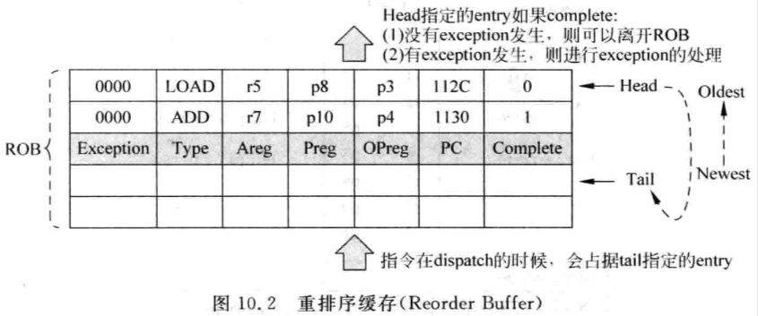

# 10.1 - 概述

- 在 out-of-order superscalar CPU 中，為了保持程式執行順序的一致性，一般通常都會在 pipeline 的最後增加一個 `commit` stage
    - 當指令抵達 commit stage 時，會將這條指令在 ROB 中的 entry 標記為 complete
    - 此時只代表這個指令已經計算完成，不代表可以離開 pipeline (i.e. retire)
- 指令進到 commit stage 並不代表它一定是正確的，有可能這條指令處在 mis-prediction 或是 exception 的路徑上，最後需要從 pipeline 中被 flushed 掉
    - 只有當這條指令之前的指令都已經 retire 了，且這條指令已經是 complete 的狀態，才可以 retire 並離開 pipeline
- 在一條指令 retire 前，它的狀態都是 speculative 的，只有當這條指令真的 retire 後，才可以將它的狀態更新到 CPU 的 architecture state
- 對一個 *N-way* 的 superscalar，因為每個 cycle 最少可以 fetch *N* 條指令進 pipeline 中，pipeline **至少**也需要 retire *N* 條指令，才能確保 pipeline 不會被堵塞

# 10.2 - ROB

## 10.2.1 - 一般架構

- ROB 本質上是一個 FIFO，ROB 中儲存了指令的相關訊息，例如：一條指令的類型、結果、destination register 和 exception 的類型等
    
    
    
    - `Complete`：
        - 一條指令是否執行完畢
    - `Areg`：
        - 指令的 architecture destination register 編號
    - `Preg`：
        - 指令的 physical destination register 編號
    - `OPreg`：
        - 指令的 architecture destination register 被 renamed 成 `Preg` 前，舊的 `Preg` 編號
            - 當需要恢復 CPU 的狀態時 (e.g. mis-prediction、exception)，需要透過這個映射關係來[恢復 RAT](../superscalar-overview-ch7/#rat-recovery)
    - `PC`：
        - 指令的 PC 值，當發生 interrupt 或 exception 時，需要保存指令的 PC 值，以便可以重新執行指令
            - E.g. RISC-V 的 `$mepc`、`$sepc` 會保存發生 interrupt 或 exception 指令的 PC 值，就可以從 `PC` 獲得
    - `Exception`：
        - 發生 exception 時的 exception 類型
        - 當指令 retire 並需要處理 exception 時，會依據 `Exception` 的資訊來做對應的處理
    - `Type`：
        - 指令的類型
        - 當指令 retire 時，不同類型的指令會有不同的處理
            - 例如：
                - Store 指令要寫 D-Cache
                - 分支指令要釋放 checkpoint 資源
- 一個 ROB 的範例 (不包含 source registers 的部份)，假設採用[使用統一的 PRF 來實做暫存器重命名](../superscalar-overview-ch7/#723---使用統一的-prf-來實做暫存器重命名)：
    
    
    
    - `i1` (除法) 和 `i2` (依賴 `i1`) 的執行時間會很長，`i3` 和 `i4` 會提前被執行完成，但是 `i3` 和 `i4` 的結果在 `i1` 和 `i2` retire 前不能更新到 CPU 的 architecture state
    
    
    
    - (a)：指令 `i1` ~ `i3` 完成 register renaming，但指令都還沒完成，因此 `Complete` 都是 Not ready
        - `i1` 和 `i3` 的 architecture destination registers 都是 `r1`，可以透過 register renaming 解決 WAW 相關性
    - (b)：指令 `i4` 進到 ROB；指令 `i3` 和 `i4` 執行完成，`Complete` 更新為 Ready，但由於還不是最舊的指令，因此無法 retire
    - (c)：指令 `i1` 執行完畢，且由於其為最舊的指令，因此可以 retire，ROB entry 會被釋放 (ROB Head index++)，physical register：`p8` 同樣也會被釋放

## 10.2.2 - 端口需求

- 對於 4-way superscalar CPU，ROB 中每個 cycle 至少可以 retire 4 條指令；需要對 ROB 中從 head pointer 開始連續 4 條指令的 `Complete` 訊號進行判斷，如果某個指令的 `Complete` 訊號為 `0`，那麼在它後面的所有指令都不用允許在這個 cycle 被 retired：
    
    
    
    - 對於 4-way superscalar CPU，除了 `en0` ~ `en3` (4 個 read ports) 外，其他的 pipeline stages 也會存取 ROB，因此需要更多的 read ports 和 write ports
    - [使用 ROB 來實做暫存器重命名](../superscalar-overview-ch7/#721---使用-rob-來實做暫存器重命名)對於 ROB 的 ports 需求是最多的：
        - 在 register renaming stage，需要從 ROB 中讀取 4 條指令的 source registers，假設每條指令有 2 個 source registers，那麼就需要 4 * 2 = 8 個 read ports
        - 在 dispatch stage，需要向 ROB 寫入 4 條指令 (需將 register renamed 後的指令寫入 ROB)，因此需要 4 個 write ports
        - 在 write-back stage，需要向 ROB 寫入”至少” 4 條指令的計算結果 (issue width 是有可能 ≥ machine width 的)，因此需要至少 4 個 write ports
        - 因此，對於 4-way superscalar CPU，ROB 至少需要 12 個 read ports 以及 8 個 write ports；然而這種 multi-port 的 FIFO 很難優化其硬體面積及 latency，這也是[使用 ROB 來實做暫存器重命名](../superscalar-overview-ch7/#721---使用-rob-來實做暫存器重命名)所面臨的最大問題

## 10.3 - 管理處理器的狀態

- Superscalar CPU 內部有兩個狀態：
    - Architecture state (指令集定義的狀態)
    - Speculative state
- 一條指令只有在 retire 時才會更新處理器的 architecture state，在此之前，指令只能更新處理器的 speculative state
- 在 superscalar CPU 中，根據架構的不同，會用不同的方法來管理 architecture state，包含：
    - 使用 ROB 管理 architecture state
        - Intel P6 架構、Intel Core 架構採用此方法
    - 使用 physical register 管理 architecture state
        - Intel Pentium 4、Alpha 21264、MIPS R10000 採用此方法

## 10.3.1 - 使用 ROB 管理指令集定義的狀態

- 對於[使用 ROB 來實做暫存器重命名](../superscalar-overview-ch7/#721---使用-rob-來實做暫存器重命名)來說，一條指令在 retire 之前，都會使用 ROB 來保存指令的結果；當指令 retire 時，就可以用這條指令的計算結果來更新 CPU 的 architecture state，此時會將這條指令的計算結果從 ROB 中搬到 architecture registers
    - 在這種架構中，architecture registers 是真實存在的；由於 architecture registers 儲存了所有 retired 指令所對應的 destination registers 的值，因此這種方法的 ARF 也被稱為 `RRF (Retire Register File)`：
    
    
    
- 在 ROB 中所記錄的所有指令的計算結果都是 speculative state
    - 當一條指令退休時，會將這條指令的計算結果從 ROB 搬到 ARF/RRF 中，同時也會將這條指令所佔用的 ROB entry 給釋放掉
- [使用 ROB 來實做暫存器重命名](../superscalar-overview-ch7/#721---使用-rob-來實做暫存器重命名)通常都會搭配 [**data-capture**](../superscalar-overview-ch8-part1/#data-capture) 的 issue 方式 (參考：[link](../superscalar-overview-ch7/#721---使用-rob-來實做暫存器重命名))
    - 當指令在做 register renaming 時會讀 RAT
        - 如果發現這個指令的 source registers 的值已經被先前的指令給計算出來了，那麼就可以直接從 ROB (如果計算結果的指令尚未 retire) 或是 architecture registers (如果計算結果的指令已經 retire) 讀取這個值，然後寫到 payload RAM 中
        - 如果發現這個指令的 source registers 的值還沒被先前的指令給計算出來，就將 source registers 在 ROB 中的位址寫到 payload RAM 中，並等待 bypassing network 將計算結果 bypass 至 payload RAM，此時這個指令就可以被 wake up (已進入 issue stage) 並在被 select 電路選中後，從 payload RAM 獲得所需的計算結果
    
    
    
    - 指令 A 會將其計算結果在 write-back stage 寫進 ROB，並透過 bypassing network 將計算結果寫進 paylad RAM；此時也會 wake up 正在 Issue Queue 中等待的指令 B
    - 指令 B 在做 register renaming 時發現 source registers 的值還沒被指令 A 給計算出來，因此只能先將 source registers 在 ROB 中的位址寫到 payload RAM 中；等到指令 A 將其結果計算出來並 wake up 指令 B，指令 B 在被 select 電路選中後就可以讀取 payload RAM 獲得其所需的 source registers 的值並進入 execute stage
    - 指令 C 和指令 D 在做 register renaming 時發現 source registers 的值已經被指令 A 給計算出來了，由於指令 A 還沒有 retire，因此其計算結果仍儲存在 ROB 中，因此需要讀取 ROB 獲得其所需的 source registers 的值，並寫到 payload RAM 中
    - 指令 E 在做 register renaming 時發現 source registers 的值已經被指令 A 給計算出來了，由於指令 A 已經 retire 了，因此可以直接讀取 ARF 來獲得其所需的 source registers 的值，並寫到 payload RAM 中
    - **由於都是從 payload RAM 獲得 source registers 的值，因此不必操心其值是存在 ROB 或 ARF 中**
- 如果[使用 ROB 來實做暫存器重命名](../superscalar-overview-ch7/#721---使用-rob-來實做暫存器重命名)但搭配 [**non-data-capture**](../superscalar-overview-ch8-part1/#non-data-capture) 的 issue 方式：
    - Non-data-capture issue 方式在指令被 select 電路選中後，需要直接從需要的位置讀取 source registers 的值，這個位置資訊是在 register renaming 時透過讀取 RAT 時一起被寫入 Issue Queue 中的，但當指令被 wake up 時，有可能 source registers 的值還存在 ROB 中，也有可能已經被搬進 ARF 了，這個位置變更的資訊，需要一併通知 Issue Queue 中的指令，因此 Issue Queue 需要增加額外的 write ports 以及 bypassing network，增加了設計的複雜度
        
        
        
        - 指令 A 會將其計算結果在 write-back stage 寫進 ROB
        - 指令 B 和指令 C 都可以從 ROB 中讀取指令 A 的計算結果
        - 由於指令 A retire 時會將計算結果從 ROB 搬至 ARF，因此指令 D 得從 ARF 讀取指令 A 的計算結果
            - 在這中間需要有額外的 write ports 以及 bypassing network 通知在 Issue Queue 中的指令 D，指令 A 計算結果存放的位置被更新了

## 10.3.2 - 使用物理暫存器管理指令集定義的狀態

- [使用統一的 PRF 來實做暫存器重命名](../superscalar-overview-ch7/#723---使用統一的-prf-來實做暫存器重命名)在一條指令做 register renaming 時，architecture register 的計算結果會一直被存在 PRF 中
- [使用 ROB 來實做暫存器重命名](../superscalar-overview-ch7/#721---使用-rob-來實做暫存器重命名)：
    
    
    - 優點：
        - Register renaming 流程簡單，在指令寫入 ROB 時，將 architecture register 和 physical register 的映射關係一併記錄到 ROB 即可，不須增加複雜的硬體控制邏輯電路
    
    - 缺點：
        - 暫存器的值需要被搬移 (ROB → ARF)，功耗較大
        - 由於暫存器的值有可能存在 ROB 或是 ARF，當指令 retire 時，需要額外的電路同步所有有使用到該暫存器的指令來告知該暫存器已經從 ROB 搬移到 ARF，功耗較大
        
        - 很多指令並不會更新 destination register，因此也就不用對 destination register 做 renaming，但每條指令仍然會佔用 ROB entry 中 destination register 的 physical register renaming 的空間，無法省略，浪費硬體空間
        
        - 對於一條指令而言，它既可以從 ROB 中讀取 operands，也可以從 ARF 中讀取 operands，所以 ROB 和 ARF 最壞的情況就是一個 cycle 內，所有的指令都需要同時讀取 ROB 或 ARF，會增加 ROB 和 ARF 的 read ports 所需的數量
            - 例如：4-way issue CPU，指令最多需要 2 個 source registers，那麼 ROB 和 ARF 都需要準備 2 x 4 = 8 個 read ports，對硬體面積和延遲造成負面的影響
            - 如果 CPU 有支援 multiple destination registers 的指令，那麼同樣也會對 ROB 和 ARF 的 write ports 數量造成影響
- [使用統一的 PRF 來實做暫存器重命名](../superscalar-overview-ch7/#723---使用統一的-prf-來實做暫存器重命名)：
    
    
    - 優點：
        - 暫存器的值只需寫入一次，不需要再被搬移，功耗較小
        - 暫存器的值只會存在一個地方，不需要
    
    - 缺點：
        - 需要使用一個 free list 以及兩個 RAT，因此需要使用複雜的硬體控制邏輯電路

# 10.4 - 特殊情況的處理

- 由於 out-of-order CPU 採用了很多種的預測方式來執行指令，因此並不是 pipeline 中所有的指令都可以 retire
    - 分支指令和發生了異常的指令，都需要將其後面的指令從 pipeline 中給 flush 掉，並恢復處理器的狀態，然後從指定的位址開始重新 fetch 指令來執行
    - 此外，在 commit stage 還需要對 store 指令做特別的處理
        - Store 指令只有在指令 retire 時才可以更新 D-Cache 的內容，如果在這期間發生了 D-Cache miss，store 指令會 block 所有其後面的指令 retire (retire 是 in-order 的)，因此需要對 store 指令做特別的處理
- 在 commit stage 還會對其他的指令有一些特殊的限制，以減少其對處理器中其他的元件造成影響

## 10.4.1 - 分支預測失敗的處理

- 當發生 branch mis-prediction 時，除了需要從 pipeline 中 flush 掉分支指令後面的指令，還需要恢復這些指令對處理器的修改，包含：
    - RAT
    - ARF
    - PRF
    - PC
    - … etc
- 當發生 branch mis-prediction 時，處理器的狀態恢復可以以 **register renaming** 為分界，分為兩個獨立的任務：
    - **Front-end recovery**
        - 較簡單
        - 需將 register renaming stage 前的指令給全部 flush 掉
        - 需將 GHR、BHR 等 branch predictor 的 history tables 給恢復
        - 使用正確的位址重新 fetch 指令
    - **Back-end recovery**
        - 需將處理器所有的內部元件給恢復，包含：
            - Issue Queue
            - Store buffer
            - RAT
                - 將錯誤指令對 RAT 的修改給恢復
            - PRF
                - 將錯誤指令佔用的 physical registers 給釋放
            - ROB
                - 將錯誤指令佔用的 ROB entries 給釋放
            - … etc
    
    
    
    - Front-end recovery 和 back-end recovery 可以同步進行
    - Front-end recovery 通常可以很快完成，處理器此時就可以從正確的位址開始 fetch 指令
        - 這些新 fetch 的指令可以一直執行到 register renaming stage
            - 如果 back-end recovery 在這些指令準備離開 register renaming stage 前已經完成，此時就不需要 stall pipeline
                - i.e. `Time (backe-end recovery) < Time (front-end recovery) + Time (fetch → renaming)`
            - 反之，pipeline 就必須 stall，直到 back-end recovery 完成，這些新 fetch 的指令才可以離開 register renaming stage
- 當發生 branch mis-prediction 時，大部分的恢復任務都是對 register renaming 相關的元件做恢復，因為大部分在 mis-prediction 路徑上的指令，都會經過這個 stage 並修改了 RAT 及相關的元件
- 除此之外，pipeline 中其他的元件也必須被恢復，包含 Issue Queue、ROB 和 store buffer 等，不過這些元件的恢復相對比較容易
- Register renaming 的實做方式直接決定了要如何恢復 register rename 元件的狀態：
    - [使用 ROB 來實做暫存器重命名](../superscalar-overview-ch7/#721---使用-rob-來實做暫存器重命名)
        - 每當一條指令 retire 時，其計算結果會從 ROB 移至 ARF，因此一個 register 在其生命週期內，有兩個位置可以存放它的值 (ROB 和 ARF)
            
            
            
            - RAT 中記錄了 registers 的映射關係 (存在 ROB 或 ARF 中)
            - 一條 retired 的指令將 destination register 的值從 ROB 搬到 ARF 後，不一定代表後續的指令就一定需要從 ARF 讀取這個 destination register 的值：
                
                ```asm
                指令 A：add  $r1, $r2, $r3
                指令 B：add  $r1, $r1, $r4
                指令 C：add  $r1, $r1, $r5
                ```
                
                - 經過 register renamed 後，只有指令 C 的 destination register：`$r1` 的映射關係才會被寫進 RAT 中，因此即使指令 A 已經 retired 並將 destination register 的值從 ROB 搬到 ARF，後續的指令在使用 `$r1` 時，仍會使用指令 C 的結果
                - 只有一條 retire 的指令發現自己的 destination register 是最新的映射狀態，才能將其 destination register 在 RAT 中的映射關係從 ROB 改成 ARF
            - 一條 retire 的指令要如何檢查自身的 destination register 是否是最新的映射關係呢?
                - 在這條指令要 retire 時，可以使用其 destination register 編號來讀取 RAT，讀出這個 architecture register 所對應的 ROB index，如果發現這個 ROB index 與現在要 retire 的指令在 ROB 中所佔據的位址是一樣的，就表示這條 retire 的指令就是最新的映射關係了
                    - 如果不一樣，就代表有其他的指令更新了 RAT 中該 register 的映射關係，因此這條要 retire 的指令就不是最新的映射關係了
        - 當發生 branch mis-prediction 時，會先停止 fetch 新的指令，而在發生 mis-prediction 的分支指令前的指令，會被繼續執行 (i.e. pipeline 會被 drain out)；等到這條分支指令和其前面的指令都 retire 後，此時 ARF 的 registers 內容就都會是正確的了，剩餘在 pipeline 中的指令，都是在 mis-prediction 的錯誤路徑上，因此可以直接將 pipeline 給 flush，並將 RAT 中所有的映射關係都改映射到 ARF，這樣就完成了 RAT 的恢復，並可以開始從新的位址 fetch 指令
        - 優點：
            - Register renaming 容易實現
            - 當發生 branch mis-prediction 時，處理器的狀態恢復也相對容易
        - 缺點：
            - 如果分支指令之前有 load/store 指令發生 D-Cache miss，則這條分支指令需要等一段時間才能 retire，mis-prediction penalty 會增加
    - [擴充 ARF 來實做暫存器重命名](../superscalar-overview-ch7/#722---擴充-arf-來實做暫存器重命名)
        - 與上述使用 ROB 來實做暫存器重命名雷同
    - [使用統一的 PRF 來實做暫存器重命名](../superscalar-overview-ch7/#723---使用統一的-prf-來實做暫存器重命名)
        - 使用統一的 PRF 來實做暫存器重命名使用了兩個 RAT：**Speculative RAT** 及 **Architecture RAT**
            - Architecture RAT 的內容永遠是正確的
        - 當發生 branch mis-prediction 時，會先停止 fetch 新的指令，而在發生 mis-prediction 的分支指令前的指令，會被繼續執行 (i.e. pipeline 會被 drain out)；等到這條分支指令和其前面的指令都 retire 後，剩餘在 pipeline 中的指令，都是在 mis-prediction 的錯誤路徑上，因此可以直接將 pipeline 給 flush，並將 architecture RAT 的內容全部複製到 speculative RAT，這樣就完成了 RAT 的恢復，並可以開始從新的位址 fetch 指令
        
        
        
        - 缺點：
            - 如果分支指令之前有 load/store 指令發生 D-Cache miss，則這條分支指令需要等一段時間才能 retire，mis-prediction penalty 會增加
    - 上述兩種在指令 retire 時恢復 CPU 狀態的方法，也被稱為：`Recovery at Retire`
    - 使用 [checkpoint](../superscalar-overview-ch4-part2/#checkpoint-recovery) 的方式，就可以在發生 branch mis-prediction 時 (e.g. execute stage)，馬上恢復 RAT 的狀態
        - 在每條分支指令改變處理器的狀態前，都將處理器的狀態 (e.g. RAT) 給存下來 (i.e. checkpoint)，當發生 branch mis-prediction 時，除了將 pipeline 中分支指令之後的指令給全部 flush 掉外，同時使用 checkpoint 來恢復處理器的狀態，然後就可以開始從新的位址 fetch 指令
        - 優點：
            - 處理器狀態恢復的速度比較快
            - 對於[基於 CAM 的重命名映射表](../superscalar-overview-ch7/#732---基於-cam-的重命名映射表)，由於每個 checkpoint 只需保存 valid bits，因此可以支援很多個 checkpoints，在 pipeline 中也就可以同時存在多條分支指令
        - 缺點：
            - 對於[基於 SRAM 的重命名映射表](../superscalar-overview-ch7/#731---基於-sram-的重命名映射表)，由於每個 checkpoint 都需要保存完整的 RAT，因此限制了 checkpoints 的數量，也就限制了 pipeline 中同時可以存在的分支指令的數量
            - 對於[基於 CAM 的重命名映射表](../superscalar-overview-ch7/#732---基於-cam-的重命名映射表)，使用 CAM 的電路面積和延遲會很大
                - 使用 CAM 實做的 RAT，RAT entries 的個數跟 physical registers 的個數成正本；當 physical registers 的數量增多時，RAT 的面積也會一併增大
    - 除此之外，也可以對哪些分支指令需要做 checkpoint 進行預測，因為大部分的分支指令的預測準確度很高，因此實際上不需要使用那麼多的 checkpoints
        - 可以同樣透過 `2-bit saturating counter` 來實現，當一條分支指令的預測準確率很高時，其 `2-bit saturating counter` 會處於飽和的狀態，這樣就不用替這條分支指令分配 checkpoint 了
        - 但當預測錯誤時：
            - 同樣等待分支指令和其前面的指令都 retire，並 flush pipeline 後，用上述的方式恢復 RAT 並重新從新的位址 fetch 指令
            - 也可以透過 ROB 來恢復 RAT：
                - ROB 中記錄著 RAT 被修改的歷史，每當一條指令被 register renamed 後，除了需要將 register 新的映射關係寫進 RAT 外，也需要將舊的映射關係寫進 ROB 中 (參考：[link](#1021---一般架構))
                - 因此當一條分支指令沒有被分配 checkpoint 時，可以透過 ROB 來恢復 RAT
        - 優點：
            - 需要的 checkpoints 硬體比較少，因此硬體面積也比較小
        - 缺點：
            - 在分支指令沒有被分配 checkpoint 並發生預測錯誤時，RAT 的恢復速度會比較慢

## 10.4.2 - 異常的處理

- 處理器的 exceptions 必須依照程式的執行順序來處理，一個比較早觸發的 exception 不代表它就一定會比比較晚觸發的 exception 早處理
    
    
    
    - 依照程式的執行順序，Page Fault Exception (由第一條指令觸發) 需要比 Undefined Instruction Exception (由第二條指令觸發) 先被處理，縱使 Page Fault Exception 比 Undefined Instruction Exception 晚觸發
- 一條指令的 exception 要被處理，必須先保證在它之前的指令的 exception 都已經被處理了，如果發現一條指令在準備要 retire 時發現其 ROB 中被標記有 pending 的 exception，那這條指令就不能 retire，需要先處理 exception
    
    
    
- 在 superscalar CPU 中，為了支持 precise exception，當發現要 retire 的指令有 pending 的 exception 時，在跳到 exception handler 前，必須先將 pipeline 中這條指令之後的所有指令都 flush 掉，並恢復 CPU 的狀態
    
    
    
- Exception 的 CPU 狀態恢復與 [Recovery at Retire](#recovery-at-retire) 相似，待 CPU 狀態恢復後，就可以跳到 exception handler 並 fetch 新的指令來執行
- 使用 [Recovery at Retire](#recovery-at-retire) 來恢復 exception 的其中一個好處是，很多的 exceptions 其實是不用被處理的，比如在 mis-prediction 路徑上的指令所觸發的 exceptions，只在指令 retire 時才處理 exception 可以簡化設計和避免不必要的處理
- 除了 [Recovery at Retire](#recovery-at-retire) 外，還可以在處理 exception 時，透過 ROB 中所記錄的舊的 physical registers (`Preg`) 的映射關係來恢復 RAT，也就是先前介紹的 [WALK](../superscalar-overview-ch7/#752---使用-walk) 方式
    
    
    
- [使用統一的 PRF 來實做暫存器重命名](../superscalar-overview-ch7/#723---使用統一的-prf-來實做暫存器重命名)除了 RAT 外，還有 **free list** - 用來記錄 free 狀態的 physical registers；當 exception 發生時，除了 RAT 要恢復外，free list 也需要一併被恢復：
    - Free list 使用 FIFO 來實做，每當有指令做 register renaming 時，就會從 free list 讀出 free 狀態的 physical registers，此時只需移動 free list 的 read pointer 即可，free list entry 的內容無須改變；當有一條指令 retire 時並將其所使用的 physical register 釋放時，只需將該 physical register 寫入 free list 中，並移動 write pointer 即可
        - 因此要恢復 free list，只需每次在 ROB 讀取一條指令來恢復 RAT 時，同時也移動一次 read pointer，這樣當所有被 flushed 的指令對處理器的修改都恢復時，free list 也一併恢復完成了
- [使用統一的 PRF 來實做暫存器重命名](../superscalar-overview-ch7/#723---使用統一的-prf-來實做暫存器重命名)的架構在處理 exception 時，採用 ROB 的方式來恢復狀態是比較合適的；相反地，採用 [Recovery at Retire](#recovery-at-retire) 的方式雖然可以利用 architecture RAT 來恢復 speculatvie RAT，但是對 free list 的恢復就沒有那麼直接了，有可能需要透過 architecture RAT 中所記錄的 physical registers 映射關係來恢復 free list，增加處理 exception 的 latency，降低執行效率
- 結論：
    - 當處理 exception 時：
        - [使用統一的 PRF 來實做暫存器重命名](../superscalar-overview-ch7/#723---使用統一的-prf-來實做暫存器重命名)：比較適合使用 [Recovery at Retire](#recovery-at-retire) 方式來恢復 CPU 狀態
        - [使用 ROB 來實做暫存器重命名](../superscalar-overview-ch7/#721---使用-rob-來實做暫存器重命名)：比較適合使用 [WALK](../superscalar-overview-ch7/#752---使用-walk) 方式 (i.e. 透過 ROB) 來恢復 CPU 狀態
- 相較於 branch mis-prediction，exception 的發生頻率是更低的，因此對 exception 的處理可以慢一點，透過 [WALK](../superscalar-overview-ch7/#752---使用-walk) 方式 (i.e. 透過 ROB) 來恢復 CPU 狀態也是非常常見的 (e.g. MIPS R10000)

## 10.4.3 - 中斷的處理

- Exception 是同步的，interrupt 是非同步的，因此不能按照處理 exception 的方式來處理 interrupt
- 一般來說，有兩種方式處理 interrupt：
    1. 馬上處理：
        - 當 interrupt 發生時，flush 掉 pipeline 中所有的指令，並將 pipeline 中最老的指令的 PC 值以及其他的 status registers (e.g. ARM CSPR、SPSR) 給保存下來，恢復 CPU 的狀態後，跳到對應的 interrupt handler
        - 當從中斷返回時，使用當初所記下來的 PC 值重新 fetch 指令，也就是將先前被 flushed 掉的指令重新 fetch 進 pipeline
        - 優點：
            - Interrupt response latency 最低，可以很快的響應中斷，如果對 interrupt 響應時間有嚴格要求的，可以採用此設計
        - 缺點：
            - 原本執行到一半的指令因為 interrupt 的關係被 flushed 掉，相當於這些指令白作工，且這些指令在中斷返回後還是需要重新被執行，浪費了一些效率
    2. 延遲處理：
        - 當 interrupt 發生時，停止 fetch 新的指令，但要等到所有在 pipeline 中的指令都 retire 後，才會處理 interrupt
            - 由於 pipeline 中所有的指令都 retire 了，CPU 的狀態一定是正確的，因此不需要恢復 CPU 的狀態
        - 缺點：
            - 如果這些等待 retire 的指令中間發生了 D-Cache miss，需要很長的時間才能解決，導致 interrupt response latency 變長
            - 如果這些等待 retire 的指令中間發生了 branch mis-prediction，需要恢復 CPU 的狀態，也會消耗一定的時間，導致 interrupt response latency 變長
            - 如果這些等待 retire 的指令中間發生了 exception，那麼應該先處理 interrupt 或是 exception?
                - 一般來說都是先處理 interrupt
                    - 因為很多類型的 exception 處理都需要花費很長的時間，像是：D-Cache miss、TLB miss 或是 page fault… 等，會導致 interrupt response latency 變長

## 10.4.4 - Store 指令的處理

- Store 指令只有在 retire 時，才可以將資料寫到 D-Cache 中，在此之前，即使 store 指令已經計算完畢，也只會將結果先暫時存在 store buffer 中，直到 store 指令 retire 時，才會將 store buffer 中對應的內容寫到 D-Cache 中
    - 在 store 指令被 dispatch 時，就會在 store buffer 中佔據一個 entry 了
- 在使用 store buffer 後，所有的 load 指令除了讀取 D-Cache 外，也需要檢查 store buffer 中是否有存取位址相等且比這條 load 指令還老的 store 指令
    - 如果有發現，那 load 指令的資料就是來自 store buffer 中對應的 store 指令
- Store 指令要成功的將資料寫入 D-Cache 後，才可以 retire 並離開 pipeline，但如果發生了 D-Cache miss，就需要等待很長的時間才可以 retire，然而，這會導致後續的指令即使已經執行完成，也無法 retire (retire 必須是 in-order 的，只要前面指令的 ROB entry 還尚未被釋放，這條指令就無法 retire)，造成處理器性能的降低
    - 要解決這個問題，最簡單的就是在 store buffer 中的每個 entry 增加一個 state bit，用來標記一條 store 指令是否具備 retire 的條件：`un-complete`、`complete` 和 `retire`
        - 當一條 store 指令被 dispatched 時，會在對應的 store buffer entry 中，標記這條 store 指令是 `un-complete` 的
        - 當這條 store 指令的存取位址已經被計算出來並讀取到其所需的 store 的 register 資料，且尚未變成 pipeline 中最老的指令，就標記這條 store 指令是 `complete` 的
        - 當這條 store 指令變成 pipeline 中最老的指令，就標記這條 store 指令是 `retire` 的；此時就可以將這條 store 指令所佔據的 ROB entry 給釋放，讓後面的指令繼續執行；Store buffer 的 entry 則要等到 store 指令資料真的寫進 D-Cache 中後，才會被釋放
            - 要注意的是，此時 store buffer 標記為 retire 的 entry，也會變成 CPU architecture state 的一部分
                - 也就是程式在讀取記憶體資料時，也要檢查 store buffer 中是否有相同位址且標記為 `retire` 的 store 指令的資料
    - 由於一旦 store buffer 滿了以後，就無法再處理新的 store 指令；採用上述的方法，會降低 store buffer 可用的空間，不過由於這樣的設計實做相對簡單，因此算是可以接受的折衷方法
    - 如果不想造成 store buffer 實際可用空間的降低，可以將 retire 的 store 指令存在另外一塊`write back buffer` 中，write back buffer 中 store 指令的值會再被寫入 D-Cache 中；Store 指令寫入 write back buffer 中後，store buffer 中對應的 entry 以及 ROB 中對應的 entry 就可以被釋放了
        
        
        
        - 要注意的是，此時 write back buffer，也會變成 CPU architecture state 的一部分，因此 load 指令會需要同時在 store buffer 和 write back buffer 中尋找是否有位址相同的 store 指令，因此會增加設計的複雜度
        - 同樣的，一旦 write back buffer 中沒有空間了，就沒辦法再 retire store 指令了
        - Store 指令是 in-order 寫入 write back buffer 中的，因此在 store 指令寫入 write back buffer 時，還需要檢查是否存在相同位址的 store 指令，如果有的話，就必須將該 store 指令標記為 invalid，這樣 load 指令在讀取 write back buffer 時，才可以讀到最新的資料
        - P.S. 其實這就類似擴充了 store buffer 的容量，除了 write back buffer 中可能不需要儲存這麼多 store 指令相關的資訊，所需的硬體空間可能比較小外，不確定採用這樣方式具體的好處有多少?

## 10.4.5 - 指令離開流水線的限制

- 對於一個 4-way 的 superscalar CPU，在沒有發生 branch mis-prediciton、interrupt 以及 exception，且 ROB 中最老的四條指令都已經是可以 retire 的情況下，這四條指令理論上是可以在同一個 cycle 一起 retire 的；然而，這也代表：
    - D-Cache 或 write back buffer 需要 4 個 write ports
    - 假設這四條指令都是分支指令，那麼需要在 1 個 cycle 內，將這些分支指令的資訊寫回 branch predictor，也就需要 branch predictor 中的所有元件 (BTB、PHT… 等)，都需要 4 個 write ports；除此之外，每個 cycle 也需要能 release 4 個 checkpoints 的資源
    - 如果有對 load 指令和 store 指令做 [load/store 相關性的預測](../superscalar-overview-ch9/#load-store-dependency-prediction)，假設這四條指令都是 load 指令，那麼就需要能在 1 個 cycle 內將 load 指令的資訊，寫回相關的預測器中，這些預測器也就需要 4 個 write ports
- 然而，上述的情況其實發生的機率非常小，為了滿足這些情境而增加硬體設計的複雜度是非常划不來的，因此在 superscalar CPU 中，可以對上述的情境加以限制：
    - 例如：限制每個 cycle 最多只能 retire 一條分支指令，如果同時有超過一條的分支指令準備 retire，第二條以及其後的分支指令都只不允許在當個 cycle retire，這樣就不需要這麼多 write ports 了
- 在 commit stage 需要對分支指令、store 指令和 load 指令的個數進行限制：
    
    
    
    - ROB 本質是個 FIFO，在 commit stage 會讀取 ROB 中最老的四條指令，根據它們的 complete 訊號來判斷哪些指令可以在這個 cycle retire，然後再透過 Branch、Store、Load 檢查電路產生 masks，將多餘的指令給 mask 掉，進而得到這個 cycle 有哪些指令可以退休了
        - mask：
            - `1`：代表第一條 [branch|store|load] 指令，或是非 [branch|store|load] 指令，可以 retire
            - `0`：代表第二條 (或第三條… etc) [branch|store|load] 指令，不可以 retire
        - 例如：
            - `br_mask = 2’b1110`
            - `st_mask = 2’b1111`
            - `ld_mask = 2’b1111`
            - 代表這個 cycle 中，這四條指令不存在多餘一條的 store 和 load 指令，但存在多餘一條的分支指令
                - 第四條指令就是多餘的分支指令
            - `(br_mask & st_mask & ld_mask) = 2’b1110` => 代表這個 cycle 可以 retire 前三條指令
                - 實際上指令能不能 retire，還需考慮其他的條件，像是是否有發生 branch mis-prediction，或是是否有指令發生 exception… etc
- 每個 cycle 只能處理一個 exception，同樣可以用上述的方式來找到第一個被標記有 pending exception 的指令，並 mask 在其之後的指令
- 指令在 commit stage retire 後，需要根據最終 retire 指令的個數，更新 ROB 的 read pointer
    - i.e. 釋放 ROB entries
