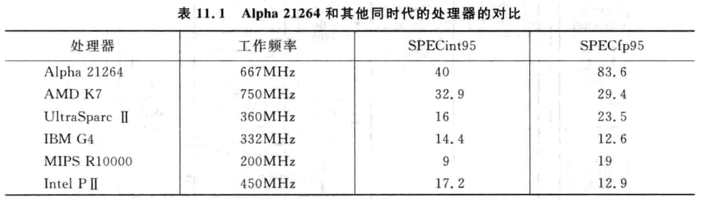

# 11.1 -  概述

- DEC 的 Alpha 21264 是 superscalar CPU 的一個典範，其為 4-way out-of-order superscalar CPU，工作頻率是 466 ~ 667 MHz，benchmark：SPECint95 - 40、SPECfp95 - 86；與同時期其他的處理器 benchmark 對比：

    

- Alpha 21264 的 pipeline 最多同時支持 80 條指令，以及 80 個 checkpoints，因此對於 branch mis-prediction、exception、interrupt，Alpha 21264 都可以快速地恢復 CPU 狀態
- Alpha 21264 的分支預測器實現了基於局部歷史 (Local prediction) 和基於全局歷史 (Global prediction) 兩種預測方式，並根據程式的執行情況，動態選擇預測率最高的方法，這就像是兩種分支預測方式在進行競爭一樣
- 對於 load/store 指令，Alpha 21264 採用了 Speculative Memory Disambiguation 和 Load hit/miss Prediction
- Alpha 21264 採用 7-stage pipeline，比較短的 pipeline 使 branch mis-prediction 發生時的 mis-penalty 比較低，從而提高處理器的效率：

    

- Alpha 21264 所使用的設計理念是領先於那個時代的，包含競爭的分支預測、store/load 指令間的相關性預測，數量豐富的 checkpoints 等，它的設計理念被用到了未來的 AMD 和 Intel CPU 中，直接或間接地影響了現代電腦產業

# 11.2 - 取指令和分支預測

- Alpha 21264 每個 cycle 可以從 I-Cache 中讀取四條指令進 pipeline，其 I-Cache 的 size 為 64 KB、採用 2-way associative，並使用了 2 個 stages 來讀取 I-Cache：`fetch0` 和 `fetch1`
    - `fetch0`：讀取 I-Cache，但這個 cycle 只能得到 I-Cache 的指令 (i.e. data) 和 tag，無法再做其他的事情
    - `fetch1`：進行 tag 比對的同時，還會將指令送到 decoder 和 register renaming 相關的元件
        - 在 Alpha 21264 中，這個傳輸需要跨越大半個晶片，比較花時間，這也是 Alpha 21264 使用了 2 個 stages 來讀取 I-Cache 的原因
- Alpha 21264 每個 cycle 都需要向 I-Cache 發送位址來讀取指令，為了盡早察覺到分支指令和分支指令的目標位址，Alpha 21264 透過兩個方法來提昇 instruction fetch 的準確度：
    - line/way 的預測 - 較簡單的分支預測器，可以在 `fetch0` 就得到結果，但是預測準確度比較低
    - 分支預測 - 較複雜的分支預測器，需使用 2 個 cycles，也就是 `fetch1` 才能得到結果，但是預測準確度比較高
        - 如果發現 `fetch0` 的預測結果與 `fetch1` 的預測結果不符，則會拋棄 `fetch0` 的預測結果，使用 `fetch1` 的預測結果來 fetch instruction，但也會因此產生 1 個 cycle 的 bubble
            - i.e. 使用 `fetch0` 的預測結果讀進來的 instruction 會被 flushed 掉

## 11.2.1 - line/way 的預測

- Alpha 21264 在 fetch stage，為了可以盡快地從 I-Cache fetch 指令，對 I-Cache 的 instruction fetch 位址也進行了預測，這就是 **line/way 預測**
    - 這種方法本質上就是將 BTB 放進了 I-Cache 中
- 由於 Alpha 21264 每個 cycle fetch 的四條指令必須是 4 words aligned 的，因此只需要對每條 cache line 中每一組 4 words aligned 的四條指令使用一個 line/way 預測即可：

    

    - 對於一條 64 bytes 的 cache line，需要使用 4 個 line/way 預測 (64 bytes / (4 words * 4 bytes/word) = 4)，每個 line/way 預測包含了以下的資訊：
        - `Successor way`：
            - 下一個 cycle 要取的 fetch group，位在 I-Cache 的那個 way
                - E.g. 4-way set-associative I-Cache，共需要 2 bits 來表示
        - `Successor index`：
            - 下一個 cycle 要取的 fetch group，第一條指令在 cache line 中的位置
                - E.g. 一個 64 KB、2-way set-associative cache、cache line 為 64 bytes 的 I-Cache：
                    - 需使用 `PC[14:6]` ⇒ **9 bits** (64 KB / 2-way set-associative / 64 byes = 512 bytes) 來找到一條 cache line
                    - 需使用 `PC[5:2]` ⇒ **4 bits** (64 bytes / 4 bytes/word ⇒ 16，一條 cache line 中共有 16 個 words) 來找到 cache line 中的某個 word
                    - 因此，`Successor index` 只需儲存 `PC[14:2]` ⇒ **13 bits** 即可
        - `Branch position`：
            - 此 cycle 所取出的 fetch group 中，如果存在分支指令，則將這條分支指令的下一條指令的位址資訊記錄在 `branch position` 欄位
            - 之所以不記錄分支指令本身的位址資訊，而是其下一條指令的位址資訊，是因為如果此 cycle 取出的 fetch group 中存在預測會跳轉的分支指令，則它後面的指令都不會進入 pipeline，但分支指令本身是會進入 pipeline 的
                - 因此記錄分支指令的下一條指令的位址資訊更容易找到此 cycle 所取出的 fetch group 中，哪些指令不應該進入 pipeline
                - 當此 cycle 所取出的 fetch group 中不存在分支指令，或是存在預測結果為不跳轉的分支指令時，只需將 `branch position` 寫入 `2’b00`，就可以表示 “此 cycle 取出的 fetch group 中的所有指令，都需要進 pipeline” 了
                - 如果預測跳轉的分支指令是這個 fetch group 的最後一條指令，那麼這個 fetch group 中的每條指令也都應該進 pipeline，同樣也只需將 `branch position` 寫入 `2’b00` 即可
- 在 Alpha 21264 中，當一個 cache line 從 L2 Cache 讀進 L1 I-Cache 時，這條 cache line 包含的所有預測資訊都會被初始化為“沒有需要跳轉的分支指令”，此時 line/way 的預測資訊會指向下一個 PC 值，i.e. `PC + sizeof(fetch group)`
    - 一旦在後面的過程中發現這個預測資訊是錯的 (e.g. `fetch1` 的預測結果與 `fetch0` 的預測結果不同)，就會修改 cache line 中的所記錄的預測資訊
    - 可以按照之前 `2-bit saturating counter` 的方式來管理 line/way 的預測值，也就是只有當連續兩次預測失敗時，line/way 的預測值才會改變
- 每個 cycle 都會依據目前 fetch group 的 line/way 的預測器，決定下個 cycle 要 fetch 的指令位址
- 範例：

    

    - 64 KB I-Cache，2-way set-associative，每條 cache line 是 32 bytes (i.e. 32 bytes / 4 bytes/word = 8 words)，每 4 個 words 使用一個 line/way 預測器，因此每條 cache line 都包含了 2 個 line/way 預測器
        - 可以用 `PC[14:2]` 從 I-Cache 中找到需要的指令
        - Cycle 0：
            - `PC = 0x20580354`，對應到 way 0；由於每個 cycle fetch 的四條指令必須是 4 words aligned 的，因此只能讀出三條指令
            - `Branch position = 2’b00`，因此這三條指令都會進 pipeline
                - i.e. A0 ~ A2 會進 pipeline
            - `Successor index = 0x360`，因此下一個要 fetch 的指令位址：`0x20580360`
        - Cycle 1：
            - `PC = 0x20580360`，對應到 way 1；由於是 4-word aligned 的，因此四條指令都可以被讀出
            - `Branch prediction = 2’b11`，因此最後一條指令不會進 pipeline
                - i.e. A3 ~ A5 會進 pipeline
            - `Successor index = 0xa28`，因此下一個要 fetch 的指令位址：`0x20580a28`
        - Cycle 2：
            - PC = `0x20580a28`，對應到 way 1；由於每個 cycle fetch 的四條指令必須是 4 words aligned 的，因此只能讀出兩條指令
            - `Branch position = 2’b00`，因此這兩條指令都會進 pipeline
                - i.e. B0 ~ B1 會進 pipeline
            - `Successor index = 0xa30`，因此下一個要 fetch 的指令位址：`0x20580a30`
        - Cycle 3：
            - `PC = 0x20580a30`，對應到 way 1；由於是 4-word aligned 的，因此四條指令都可以被讀出
            - `Branch prediction = 2’b11`，因此最後一條指令不會進 pipeline
                - i.e. B2 ~ B4 會進 pipeline
- Line/way 預測方法相當於將 BTB 放到了 I-Cache 中，然後相較於獨立的 BTB：
    - 缺點：
        - 每條 cache line 都要使用固定個數的預測資訊，例如上述範例，每條 cache line 都包含了 2 個 line/way 預測器：32 bytes cache line / (4 words * 4 bytes/word)) = 2
            - 然而很多 cache line 中其實並沒有分支指令，浪費硬體空間
            - 獨立的 BTB 不會有這個問題，因為它只會將預測結果為跳轉的分支指令放進 BTB 中
        - 隨著 cache line size 的增大，所需要的 line/way 預測器的個數也會跟著增多
            - E.g. 64 bytes cache line 需要使用 4 個 line/way 預測器
            - 獨立的 BTB size 都是固定的，不會隨著 cache line size 的變化而改變
        - 每當一條 cache line 被 replace 時，它的 line/way 預測資訊會被預設值所取代
            - 預設值 ⇒  `successor index` 會指到下一道 PC address
            - 獨立的 BTB 則與 cache replacement 無關
- 在 fetch1 stage 會驗證 fetch0 stage 的預測結果是否正確
    - 將 cache 的 tag (i.e. `PC[47:15]`) 與 successor index (i.e. `PC[14:2]`) 合併，就可以組成使用 line/way 預測的 PC address，在 fetch 1 stage，就可以與使用分支預測的預測結果相比，如果 PC address 不同，就代表 line/way 的預測錯誤，就會改使用 fetch1 stage 分支預測的 PC address 重新 fetch 指令
        - 因此會產生 1 個 cycle 的 bubble，也就是 line/way 預測的 mis-penalty
    - Alpha 21264 是使用 [VIVT 架構](../superscalar-overview-ch3/#343---將-tlb-和-cache-放入流水線)的 I-Cache，因此 PC address 可以直接比對
    - 如果是使用 [VIPT 架構](../superscalar-overview-ch3/#vipt-cache)的 I-Cache，由於 tag 是 physical address，因此還需要將 fetch1 分支預測的 PC address (VA) 透過 TLB 轉換成 PA 才可以比對 line/way 的預測結果是否正確
        - 因此，使用 line/way 預測時，使用 VIVT 架構的 I-Cache 是比較合理的設計
- Line/way 預測總結：

    


## 11.2.2 - 分支預測

- 為了獲得準確的分支預測，Alpha 21264 使用的分支預測器是比較複雜的，因此無法在 fetch0 stage 完成，需要使用 2 個 stages，在 fetch1 stage 才可以獲得預測結果
    - 這個結果會和 line/way 的預測結果做比較，如果發現不一致，就以分支預測的結果為主
- Alpha 21264 使用了競爭的分支預測法 (tournament branch prediction)；有些分支指令使用基於全局歷史的預測方法準確度比較高，有些分支指令則是使用基於局部歷史的預測方法準確度比較高，Alpha 21264 則是兩種預測方法都實現了；對於每條分支指令來說，處理器會根據兩種分支預測方法的準確度，動態地替每條分支指令選擇適合的分支預測方法，相當於這兩種分支預測方法彼此在競爭

    

    - 左邊為基於局部歷史的分支預測器：
        - Local history table ⇒ **BHT**：
            - 大小為 1024 x 10 bits，也就是使用了 10 bits 的 BHR，可以記錄一條分支指令過去 10 次的分支結果，總共可以記錄 1024 條分支指令的歷史記錄
        - Local prediction ⇒ **PHT**：
            - Alpha 21264 的 local history PHT 共包含了：2^10 = 1024 個 `saturating counter`，每個 saturating counter 為 3 bits (i.e. `3 bits saturating counter)`
                - 共需：1024 x 3 bits
    - 右邊為基於全局歷史的分支預測：
        - Path history ⇒ **GHR**
            - GHR 為 12 bits，可以記錄過去 12 條分支指令的分支結果
        - global prediction ⇒ **PHT**：
            - Alpha 21264 的 global history PHT 共包含了：2^12 = 4096 個 `saturating counter`，每個 saturating counter 為 2 bits (i.e. `2 bits saturating counter)`
                - 共需：4096 x 2 bits
    - Alpha 21264 基於局部歷史的分支預測器，採用了 **non-speculative** 的更新方法
        - 只有當指令 retire 時，才會更新分支預測器的內容 (e.g. BHR、saturating counter… etc)
    - Alpha 21264 基於全局歷史的分支預測器，採用了 **speculative** 的更新方法
        - 一旦有分支指令得到預測結果，就將這個預測結果更新到 GHR 中
            - i.e. GHR 的狀態有可能是不正確的
        - 為了在 mis-prediction 時恢復 GHR，因此採用了 [Checkpoint GHR](../superscalar-overview-ch4-part1/#checkpoint-ghr)；在更新 GHR 前，會將目前的 GHR 內容複製到 Checkpoint GHR 中；當發生 mis-prediction 時，就可以透過這個 Checkpoint GHR 來恢復 GHR

        

- 對於 PHT 的 saturating counters 一般都是在分支指令得到確定的結果後才更新 (參考：[link](../superscalar-overview-ch4-part1/#425---分支預測的更新))

# 11.3 - 暫存器重**命名**

- Alpha 21264 [使用了統一的 PRF 來實做暫存器重命名](../superscalar-overview-ch7/#723---使用統一的-prf-來實做暫存器重命名)，整個處理器中只有一個 PRF，一個 register 在它整個生命週期只會存在一的地方，不會發生位置的變化
    - Register renaming 消除了 WAW 和 WAR 相關性

    

- Alpha 指令集中有一個特殊的 `CMOV (Conditional-move)` 指令，格式為：

    ```asm
    CMOV  Ra, Rb ? Rc  # (Ra == 0) ? Rc = Rb : Rc = Rc
    ```

    - 這條指令在 register renaming stage，需要讀取三個 source registers：`Ra`, `Rb`, `Rc`
        - 由於 `Rc` 同時也是 destination register，因此需要分配一個 physical register 來存舊的 `Rc` 值，並再替 destination register：`Rc`，分配另一個 physical register
        - 然而，對於 Alpha 的其他指令，都只需要讀取兩個 source registers 即可，因此不值得特別為 `CMOV` 指令增加 RAT 的 read port
        - `CMOV` 指令可以拆解為下列兩條指令：

            ```asm
            CMOV1  Ra, oldRc -> newRc1
            CMOV2  newRC1, Rb -> newRc2
            ```

            - 透過這樣的方式，可以讓 `CMOV` 指令的 register renaming 按照一般的指令來處理，只是會需要分配兩個 physical registers
    - Alpha 21264 是一個 4-way superscalar CPU，每個 cycle 可以對四條指令做 register renaming，但如果這四條指令中存在 `CMOV` 指令，則會導致一個 cycle 內要對五條指令 register renaming
        - Alpha 21264 採用了比較簡單的方法，限制在做 register renaming 時，如果碰到 `COMV` 指令，則只有 `CMOV1` 指令以及其之前的指令可以在該 cycle 做 register renaming，`CMOV2` 以及其之後的指令必須等到下個 cycle 才可以做 register renaming

            

        - 雖然這樣的作法會讓 CPU 的執行效率有所降低，但 `CMOV` 指令出現的頻率並不高，且這種方法很容易實現，所以是一種可接受的折衷方法

# 11.4 - 發射

- Alpha 21264 包含了兩個 Issue Queue：Integer Issue Queue 以及 Floating-point Issue Queue，分別用來儲存整數類型的指令和浮點數類型的指令
    - Integer Issue Queue 可以儲存 20 條指令，並被 4 個 Integer FU 共享，每個 cycle 最多可以從 Integer Issue Queue 中選出 4 條整數指令出來執行
    - Floating-point Issue Queue 可以儲存 15 條指令，並被 2 個 Floating-point FU 共享，每個 cycle 可以從 Floating-point Issue Queue 中選出 2 條浮點數指令出來執行
- Alpha 21264 採用了 cluster 架構，將整數執行部份分成了 Cluster0 和 Cluster1 兩個部份，每個 cluster 都有完整的 Integer PRF，因此在處理器中共有兩個一模一樣的 Integer PRF
    - 每個 cluster 內部又被分成了兩個 subcluster，分別為：upper (U) 和 lower (L)
        - 整數部份的 4 個 FU分佈在這幾個 subclusers 中：Cluster0 的 U0、L0 以及 Cluster1 的 U1、L1

        

        - Alpha 21264 並沒有直接實現 4-of-20 的 select 電路，而是：
            - Cluster0 中的 U0 和 U1 共用同一個 select 電路：select0
            - Cluster1 中的 L0 和 L1 共用同一個 select 電路：select1
        - 這樣每個 select 電路只需要實做 2-of-20 的功能即可
- Alpha 21264 採用了 [Compressing Issue Queue](../superscalar-overview-ch8-part1/#compressing-issue-queue)，使 select 電路可以很容易地實現 oldest-first 的功能，不過會增加 Issue Queue 的複雜度，功耗由於每條指令被 issued 時，都會需要移動大量的指令 (通常 oldest-first 的指令都是在 Issue Queue 的底部)，因此不適合使用在行動裝置上
- Alpha 21264 中，除了 load 指令外，其他類型指令執行所需的 cycles 數都是固定的；Alpha 21264 簡化了 load 指令的 wake-up 機制：當 load 指令發生 D-Cache miss 時，在它的 [SW (Speculative Window)](../superscalar-overview-ch8-part2/#speculative-window) 中的所有指令都會從 pipeline 中被 flushed 掉，這些指令會重新在 Issue Queue 中等待被 wake up，然後參與仲裁；對於那些與 load 無關的指令很快就會再次被 select 電路選中，然而那些與 load 指令相關的指令則需要等待 D-Cache miss 被解決
    - 這種方式雖然降低了一點性能，但比較容易實現，因為不用識別 SW 中哪些指令和 load 指令存在相關性 (參考：[link](../superscalar-overview-ch8-part2/#853---推測喚醒))，是一種可以接受的折衷方法
- 為了配合上述的 wake-up 機制，指令在被 select 電路選中後，不能馬上”離開” Issue Queue，而是需要確認這條指令沒有被發生 D-Cache miss 的 load 指令所影響後，才能離開 Issue Queue
    - 因此，一條指令被 select 電路選中後，在 Issue Queue 中需要等待 2 個 cycles，才可以從 Issue Queue 中刪除該指令
        - *Cycle n*：
            - 指令被 select 電路選中
        - *Cycle n + 1*：
            - 指令仍會留在 Issue Queue 中，但不會再向 select 電路發出 request 訊號了
        - *Cycle n + 2*：
            - 如果這條指令所需的 operands 都可獲得 (不論是來自 bypassing network 或是 PRF)，這條指令就可以被正常執行，並從 Issue Queue 中刪除該指令 (代表指令離開 Issue Queue 了)
            - 如果這條指令所需的 operands 來自於前面的 load 指令，且該 load 指令發生了 D-Cache miss，那麼這條指令就沒辦法繼續被執行，需要重新”放回” Issue Queue 中並等待 D-Cache miss 被解決
                - 實際上這條指令並沒有真的離開 Issue Queue (i.e. 還是佔著 Issue Queue 的 entry)，只需修改對應的 status bits 即可
- 浮點數的 load/store 指令也是在整數的 cluster 中被執行的

# 11.5 - 執行單元

## 11.5.1 - 整數的執行單元

- Alpha 21264 共有 6 個 FU (4 個 Integer FU，2 個 Floating-point FU)，每個 cycle 可以同時執行六條指令
    - i.e. Alpha 21264 是一個 machine width = 4，issue width = 6 的 superscalar CPU
- Alpha 21264 採用了 [non-data-capturing](../superscalar-overview-ch8-part1/#non-data-capture) 的架構，在指令被 select 電路選中後，才去讀 PRF
    - Integer PRF 因此需要支持四條指令的讀取，也就是需要 8 個 read ports (假設每條指令有兩個 source registers)，導致執行速度較慢
    - 為了解決這個問題，Alpha 21264 採用了 cluster 架構，將整數執行部份分為了 cluster0 和 cluster1，每個 cluster 都使用了一個完整的 Integer PRF；每個 cluster 內部又被分成了兩個 subcluster：upper (U) 以及 lower (L)
        - 因此，每個 Integer PRF 只需 4 個 read ports，簡化了 PRF 的設計，加快執行速度
- 如果兩條連續的指令是在同一個 cluster 內執行，那麼就可以 back-to-back 的執行；然而如果兩條連續的指令是在不同的 clusters，如果要將一條指令的計算結果透過 bypassing network 傳給另一個 cluster 的指令，就需要跨越 cluster，經過比較長的電路，因此需要獨立使用一個 stage，導致兩條連續的指令之間會間隔一個 cycle，沒辦法 back-to-back 的執行
    - 一個 cluster 中指令執行的計算結果需要間隔一個 cycle 才能寫入另一個 cluster 的 PRF 中

    

    

    - 由於 Alpha 21264 是 out-of-order CPU，因此硬體會盡可能地找到一條不相關的指令插入間隔中，就不會降低處理器的執行效率了

## 11.5.2 - 浮點數的執行單元

- Alpha 21264 有 2 個 Floating-point FU，每個 cycle 可以執行兩條 floating-point 指令
- 為了盡量減少連線的延遲，每個 cluster 中的 FU 都與自己的 PRF 緊靠在一起，大量地縮短 cluster 內 bypassing network 的電路，保證同一個 cluser 內連續的指令可以 back-to-back 的執行

    

- Alpha 21264 同一個 cluster 內，不同指令的 latency：


    | Instruction class | Latency (cycles) |
    | --- | --- |
    | Simple integer operations | 1 |
    | Special instruction | 3 |
    | Integer multiply | 7 |
    | Integer load | 3 (假設 D-Cache hit) |
    | Floating-point add | 4 |
    | Floating-point load | 4 (假設 D-Cache hit) |
    | Floating-point multiply | 4 |
    | Floating-point divide | 12 (single-precision); 15 (double-precision) |
    | Floating-point square-root | 12 (single-precision); 30 (double-precision) |

    - 如果跨 cluster，則需要再增加一個 cycle

# 11.6 - 記憶體的存取

- Alpha 21264 的訪問記憶體元件採用了兩個特殊的設計：
    - 能夠對 load 指令和 store 指令之間存在的 RAW 相關性進行預測，從而規劃某些 load 指令進入 pipeline 的時間，防止它們提前進入 pipeline 做白工，稱為：`Speculative disambiguation`
    - 能夠對 load 指令存取 D-Cache 時是否 hit 做預測，從而避免不必要的 wake up，稱為：`Load hit/miss Prediction`
    - 以上兩種方法本質上都是透過預測的方式來提昇處理器的執行效率，並仍然在現代處理器中被廣泛地使用

## 11.6.1 - Speculative Disambiguation

- 對於 load 指令和 store 指令來說，它們之間的相關性在 register renaming stage 是無法被解決的，只有到了 execute stage，將指令中的存取位址計算出來後，才可以判斷它們之間是否存在相關性，也就是：`Memory Disambiguation`
- Alpha 21264 採用了[完全 out-of-order](../superscalar-overview-ch9/#fully-out-of-order) 的方式來執行 load 指令和 store 指令，為了最大限度地減少對 pipeline 的負面影響，Alpha 21264 還對 load 指令是否和其之前的 store 指令存在相關性進行了預測
    - 如果預測一條 load 指令和 pipeline 中還沒有 retire 的 store 指令之間不存在 RAW 相應，那麼這條 load 指令就不須等待 store 指令的存取位置被計算出來，可以直接 out-of-order 進入 execute stage 被執行，提高了執行性能

    

    - Alpha 21264 將對 D-Cache 的存取拆分成兩個不同的 stages (`D-Cache1`、`DCache2`)：
        - D-Cache1 stage：讀取 D-Cache，但這個 cycle 沒辦法得到結果
        - D-Cache2 stage：得到 data 和 tag，並比較 tag，以判斷是否 cache hit
- 將 D-Cache 的存取採取了 pipeline 的方式：
    - 缺點：
        - 增加了 load 指令的執行 cycles 數
        - 增加了 load 指令和與其存在相關性的指令所間隔的 cycles 數，產生更多的 bubbles
    - 優點：
        - 可以提高 CPU 的 frequency
        - Out-of-order CPU 會盡可能地找到不相關的指令插入間隔中，因此不會對性能造成太大的負面影響
    - 因此，現代處理器基本上都使用 pipeline 的方式來存取 D-Cache
- 在 D-Cache1 stage 中，由於 load 指令和先前的 store 指令的存取位址都已經被計算出來，因此可以檢查 load 指令是否與先前的 store 指令存在相關性，也就是：`disambiguation`，可以透過下列的硬體元件來完成：
    1. **Load/store Issue Queue：**
        - 以 out-of-order 的方式將 load 指令和 store 指令送到 FU 來執行
    2. **Load Queue：**
        - 依照 program order 的順序儲存著所有 load 指令的存取位址
        - Load 指令在 register renaming stage 就會被寫進 load queue 中 (register renaming stage 還是 in-order 的)
        - 當 load 指令 retire 時，就會將 load 指令在 load queue 中對應的 entry 給釋放
        - 使用 CAM 來實現，以便可以快速的比較 load 指令的存取位址
    3. **Store Queue：**
        - 依照 program order 的順序儲存著所有 store 指令的存取位址
        - Store 指令在 register renaming stage 就會被寫進 store queue 中 (register renaming stage 還是 in-order 的)
        - 當 store 指令 retire 時，就會將 store 指令在 store queue 中對應的 entry 給釋放
        - 使用 CAM 來實現，以便可以快速的比較 store 指令的存取位址
    4. **Wait Table：**
        - 一個 1024 x 1 bit 的表格，**使用 PC address 作為索引**，用來儲存 load 指令的相關性資訊
        - Wait table 中的每個 bit 都稱為：`Wait bit`，初始值皆為 **0**，表示所有的 load 指令和其之前的 store 指令之間都不存在相關性，可以 out-of-order execution
        - 當發現了 store/load 違例，也就是發現了一條或多條在 load 指令前的 store 指令，與該 load 指令所存取的記憶體地址相同 (實際上，只要是存取範圍有重疊就存在相關性)，此時就會將該 load 指令在 wait table 中所對應的 wait bit 給設成 **1**
        - 在 decode stage，每當 decode 出一條 load 指令，就需讀取 wait table，並將 load 指令所對應的 wait bit 一起寫進 Issue Queue 中
            - 如果一條 load 指令的 wait bit 為 1，則該 load 指令必須等到所有在其之前的 store 指令都計算出存取位址後，才可以向 select 電路發出 request 請求仲裁
        - Wait table 每 16,384 個 cycles 就會全部清為 0，以避免 wait table 的內容在經過一段時間的執行後全部變成 1 (這樣所有的 load 指令都無法 out-of-order execute 了)
            - 就算是同一條 load 指令 (i.e. PC address 相同)，也不一定每次執行時都與 store 指令仍然存在相關性

            

- 指令進到 issue stage 後的下一個 cycle，進到 register read stage 並從 PRF 中讀取 operands，然後再到下一個 cycle，進到 address calculation stage 就可以計算指令的存取位址了，將存取位址計算出來後，就可以進到 D-Cache1 stage
- 在 D-Cache1 stage 會檢查 load 指令和 store 指令之間是否存在相關性，因此這個 cycle stage 也被稱為 `Disambiguation stage`，load 指令和 store 指令的 disambiguation 分別為：
    1. **Load Disambiguation：**
        - Load 指令會將其存取位址寫到 **load queue** 對應 entry 中，同時 load 指令還會完成以下兩件事情：
            1. Load 指令會去查詢 **store queue**，如果發現存在同樣存取位址且年齡比該 load 指令還**老**的 **store 指令**，那這條 load 指令就不需要存取 D-Cache 了，直接透過 store queue 就可以得到結果
            2. Load 指令還需要去查詢 **load queue**，Alpha 21264 要求訪問相同位址的 load 指令必須是 in-order (i.e. program-order) 的，如果不滿足這個規則，在 multi-core 的環境下有可能會發生錯誤
                - 如果發現存在存取位址相同且比該 load 指令還要**年輕**的 **load 指令**，就代表發生了 load/load 指令違例：

                    

                    - Load 指令 X 和 load 指令 Y 執行的中間有可能被其他的 CPU 將該存取位址的值給更動了，因此如果 load 指令的執行順序改變，其結果就會出錯
        - Alpha 21264 定義了各種記憶體存取應該保持的執行順序：


            | First Instruction In Pair | Second Instruction in Pair | Reference Order |
            | --- | --- | --- |
            | Load memory to address X | Load memory to address X | Maintained |
            | Load memory to address X | Load memory to address Y | Not Maintained |
            | Store memory to address X | Store memory to address X | Maintained |
            | Store memory to address X | Store memory to address Y | Maintained |
            | Load memory to address X | Store memory to address X | Maintained |
            | Load memory to address X | Store memory to address Y | Not Maintained |
            | Store memory to address X | Load memory to address X | Maintained |
            | Store memory to address X | Load memory to address Y | Not Maintained |
            - 兩條 load 指令存取同一個位址，order 必須 maintain ⇒ 否則就是 load/load 指令違例
            - Store 指令一定是 in-order 執行，因此兩條 store 指令不論存取位址是否相同，order 都必須 maintain
            - 一條比較年輕的 load 指令，與一條比較老的 store 存取同一個位址，order 必須 maintain ⇒ 否則就是 store/load 指令違例
            - 一條比較年輕的 store 指令，與一條比較老的 load 指令存取同一個位址，order 必須 maintain ⇒ 否則就是 store/load 指令違例
            - 其他狀況，都可以 out-of-order 執行
            - Alpha 21264 中 load 指令和 store 指令是 out-of-order 執行的，因此需要在 disambiguation stage 解決順序性
            - 然而，load 指令在查詢 store queue 時，如果發現存在同樣存取位址且年齡比該 load 指令還老的 store 指令，這種情況不需要 flush pipeline，因為這只代表 load 指令可以直接從 store buffer 中讀取 store 指令的資料 (需等待 store 指令執行完畢)，不需存取 D-Cache，但是 store 指令和 load 指令之間的執行仍然要保持 in-order
                - 但如果 load 指令需要的資料寬度大於 store 指令的資料寬度 (e.g. 32-bit load vs. 8-bit store) 時，代表 load 指令所需要的資料有一部分存在 store queue 中，另外一部份存在 D-Cache 中，load 指令就沒辦法在同一個 cycle 內得到其所需的資料了

                    

                    - 此時，仍需將 load 指令和與其相關的指令都從 pipeline 中給 flush 掉，並重新從 I-Cache fetch 這些指令
                        - 在 Alpha 21264 中，這個過程稱為：`replay trap`
    2. **Store Disambiguation：**
        - 在 pipeline 的 disambiguation stage，store 指令會將其計算出來的存取位址寫到 **store queue** 中對應的 entry 中，並在同一個 cycle 查詢 **load queue**，如果發現存在同樣存取位址且年齡比該 store 指令還年輕的 load **指令**，則代表這條提前執行的 load 指令沒有使用到正確的計算結果，產生了 store/load 指令違例

            

        - 當發生 store/load 指令違例時，最理想的解決方法是只將違例的 load 指令以及所有與其相關的指令從 pipeline 中給 flush 掉 (參考：[Selective Replay](../superscalar-overview-ch8-part2/#selective-replay))；然而這種設計增加了設計的複雜度，因此 Alpha 21264 採用了相對比較簡單的 replay trap 處理方法
            - 當已經離開 issue queue 的 load 指令或 store 指令由於某個原因不能再繼續執行時，這條 load 指令或 store 指令及它之後的所有指令都會從 pipeline 中被 flushed 掉，並恢復 CPU 的狀態 (Alpha 21264 有非常豐富的 checkpoints)，然後重新從 I-Cache fetch 這些指令來執行
            - Alpha 21264 中，load/load 指令違例也是採用 replay trap 的方式來處理
        - 缺點：
            - 降低了處理器的性能，如果經常發生 store/load 指令違例或是 load/load 指令違例，那麼就需要經常的 flush pipeline 中的部份指令，並重新從 I-Cache fetch 這些指令來執行
                - 因此 Alpha 21264 才使用了 wait table 來對 store 和 load 之間的相關性進行預測，這樣可以避免大部分的 store/load 指令違例，降低需要 replay trap 的次數
        - 當發生 store/load 指令違例後，除了進行 replay trap，還需要更新 wait table，將 load 指令在 wait table 所對應的 bit 給設成 1，這樣當下次這條違例的 load 指令再次被執行時，就需要等它之前所有的 store 指令都被 select 電路選中後，才允許這條 load 指令向 select 電路發出 request
            - 這條指令最後在執行時，有可能可以直接從 store queue 取得所需的資料

            

        - Alpha 21264 選擇將這些被 flushed 的指令重新從 fetch stage 開始執行，而不是將違例的 load 指令及與其相關的所有指令重新放回 Issue Queue 中重新仲裁，是因為此時的 Issue Queue 可能已經沒有空間儲存這些指令了
            - 當 Issue Queue 沒有空間儲存這些指令時，這些指令就必須等待；這個等待時間可能會很長，而且需要額外一個硬體元件來儲存這些等待的指令
            - 此外，由於這些指令沒辦法進入 Issue Queue，因此就不能 wake up Issue Queue 中其他的指令
                - 如果此時在 Issue Queue 中的指令正在等待這些指令來 wake up 它們，那麼在 Issue Queue 中的指令也沒辦法離開 Issue Queue，導致 Issue Queue 永遠沒有空間空出來，便會發生 **dead lock**

                

                - Store 指令在 disambiguation stage 發現在其之後的 load 指令先被執行了，因此發生了 store/load 指令違例
                - 為了避免 dead lock，Alpha 21264 直接將第一組和第二組的全部指令從 pipeline 中給 flush 掉，並使用 checkpoint 來恢復 CPU 的狀態，然後重新從 I-Cache fetch 這些指令來執行
        - Alpha 21264 採用的 replay 方法是基於 I-Cache 的，這種方法會降低處理器的效能，如果想基於 Issue Queue 來 replay，有兩種方式可以採用：
            1. 當指令被 select 電路選中時，不離開 Issue Queue，只要等到指令 retire 時才允許其離開 Issue Queue (參考：[Issue Queue Based Replay](../superscalar-overview-ch8-part2/#issue-queue-based-replay))


                - 優點：
                    - 設計複雜度比較低

                - 缺點：
                    - 由於指令被 select 電路選中後，並不會馬上離開 Issue Queue，只有在該條指令確認可以被正確執行後 (i.e. 不需要 replay)，才會允許該條指令離開 Issue Queue；然而實際上由於 D-Cache hit rate 是很高的，且發生 store/load 指令等違例的機率並不高，所以大部分指令被 select 電路選中後，其實並不需要 replay，但這些指令仍佔據著 Issue Queue 的空間，直到確認其不需要 replay 為止，導致 Issue Queue 中實際可用的 entries 數減少
                        - 增加 Issue Queue 的空間則會增加 select 和 wake-up 電路的 latency，因此無法無上限地增加
            2. 採用 [Replay Queue Based Replay](../superscalar-overview-ch8-part2/#replay-queue-based-replay) 的方式，增加一個 Replay Queue，用來保存離開 Issue Queue 但還沒 retire 的指令
                - 當發生 store/load 指令違例時，所有要被 replay 的指令只需從 Replay Queue 重新向 select 電路發出 request 即可
                    - Intel Pentium 4 採用了這種設計

                - 優點：
                    - 提高了 Issue Queue 的使用效率

                - 缺點：
                    - Replay Queue 會佔用額外的硬體空間
                    - Replay Queue 也需一起參與 select 電路的仲裁和 wake up，因此設計較複雜

## 11.6.2 - Load hit/miss Prediction

- 在 Alpha 21264 中，load 指令執行的 cycles 數是不固定的，D-Cache hit/miss、D-Cache 中是否有 bank conflict、是否和其他的元件產生 D-Cache read port conflict 等，都會影響 load 指令執行的 cycles 數；但是，如果需要等到 load 指令讀取到資料後才 wake up Issue Queue 中等待的指令，會導致 latency 過長
    - 然而，大部分的情況下 D-Cache 都會是 hit 的，因此可以直接假設 D-Cache 總是 hit 來 wake up Issue Queue 中相關的指令，也就是採用 [Speculative wake-up](../superscalar-overview-ch8-part2/#853---推測喚醒)

        

        - Load 指令被 select 電路選中後，需要等待 2 個 cycles 才可以 wake up 相關的指令
        - Cycel 4、cycle 5 和 load 相關的指令就可以被 wake up 了，這兩個 cycles 也稱為：`Speculative Window (SW)`
            - 在這兩個 cycles 被 select 電路所選中的指令都不能離開 Issue Queue (i.e. 採用 [Issue Queue Based Replay](../superscalar-overview-ch8-part2/#issue-queue-based-replay) 的設計)，不論它們是否真的和 load 指令存在相關性
            - 當發現 load 指令真的是 D-Cache hit 時，這兩條指令就可以離開 Issue Queue
            - 但如果發現 load 指令是 D-Cache miss 時，這兩條指令就必須從 pipeline 中給 flush 掉，並在 Issue Queue 中重新等待被 wake up，然後重新向 select 電路發出 request
- Alpha 21264 中並沒有區分 SW 中哪些指令和 load 指令相關，而是假設全部指令都與 load 指令相關；在發現 D-Cache miss 時會將 SW 中的所有指令從 pipeline 中給 flush 掉，並在 Issue Queue 中重新等待被 wake up，此時會假設 L2 Cache 是 hit 的，因此這些指令可以再次 (在 cycle 6 時) 被 select 電路選中，這會導致 4 個 cycles 的 latency

    

    - 如果 L2 Cache hit，那麼這些指令就可以從 Issue Queue 中離開
    - 如果 L2 Cache miss，那麼這些指令就必須在 Issue Queue 中繼續等待
- 在發現 D-Cache miss 時會需要將 SW 中的所有指令從 pipeline 中給 flush 掉，但這樣就浪費了執行效率，因為這些 cycles 原本可以選擇其他指令來執行
    - 為了盡量避免這種情況發生，Alpha 21264 中對 load 指令是否會 D-Cache hit 也進行了預測，只有那些預測 D-Cache hit 的 load 指令才會以 2 cycles latency 的方式來 wake up 相關的指令，否則就以 4 cycles latency (假設 L2 Cache 是 hit) 的方式來 wake up 相關的指令
    - Alpha 21264  使用了一個 `4-bit saturating counter` 來預測 load 指令是否會 D-Cache hit
        - 每當 D-Cache hit 時，counter += 1
        - 每當 D-Cache miss 時，counter -= 2
        - 使用 counter 的 MSB 來作為 load 指令的預測值
            - `MSB = 1`：預測 load 指令會 D-Cache hit
            - `MSB = 0`：預測 load 指令會 D-Cache miss
    - 在 `Independent Window (IW)` (i.e. 2 cycles latency 或是 4 cycles latency) 中可以選擇與 load 指令不相關的指令來執行，即使預測 D-Cache miss，這 4 個 cycles latency 由於仍然可以執行其他不相關的指令，因此也不會對 CPU 的性能造成太大的影響
- 對於浮點數 load 指令來說，由於需要 128 bits 的資料，因此需要 2 個 cycles 才可以從 D-Cache 中讀出完整的結果 (64 bits x 2)，因此浮點數 load 指令的 latency 需要增加 1 個 cycle ⇒ 共 3 個 cycles

    

    - 此時 SW 只有 1 個 cycle (從 load 指令等待 3 個 cycles 後開始將相關的指令 wake up，直到執行時發現是否為 D-Cache hit/miss，中間所間隔的 cycles 數)
        - 如果發現 load 指令是 D-Cache hit 時，這條指令就可以離開 Issue Queue
        - 如果發現 load 指令是 D-Cache miss 時，這條指令就必須從 pipeline 中給 flush 掉，並在 Issue Queue 中重新等待被 wake up，然後重新向 select 電路發出 request
- 當發生 D-Cache miss 時，需要從 L2 Cache 讀取資料，浮點數 load 指令 L2 Cache hit 的 latency 同樣需要增加 1 個 cycle ⇒ 共 5 個 cycles
    - i.e. 指令 A 可以在 cycle 7 時再次被 select 電路選中
- 對於浮點數 load 指令來說，由於其 SW 只有 1 個 cycle，且浮點數指令執行所需的 cycles 通常都比較長，當浮點數 load 指令發生 D-Cache miss 時有足夠的時間進行處理，因此浮點數 load 指令**並不會**使用 saturating counter 來預測其 D-Cache 是否會 hit

# 11.7 - 退休

- 在 Alpha 21264 中，一條指令要 retire 時發現了 exception，那麼在 pipeline 中的所有指令都會被 flushed 掉，這些被 flushed 的指令所佔據的 physical registers 也會被釋放，並放回 free list 中，RAT 可以透過 checkpoint 來恢復到產生 exception 那道指令之前的狀態
    - Alpha 21264 的 ROB 中每條指令都有一個對應的 checkpoint，80 個 ROB entries 共對應了 80 個 checkpoints，以便快速的恢復 CPU 的狀態
    - Alpha 21264 的 RAT 是[使用 CAM 實現](../superscalar-overview-ch7/#732---基於-cam-的重命名映射表)的，因此佔用的硬體資源也是很小的
- Alpha 21264 一個 cycle 內最多可以 retire 8 條指令

# 11.8 - 結論

- Alpha 21264 為了達到很高的 CPU frequency，在很多地方都加了額外的 pipeline stage，例如 對 cache 的存取；然而，這也同時增加了 mis-prediction penalty，並增大了 load latency
    - Out-of-order execution 可以緩解 load latency 增大所引起的問題
- Alpha 21264 使用了複雜的分支預測方法來準確地預測分支指令，為了加快 branch mis-prediction 及 exception 發生時恢復 CPU 狀態的效率，Alpha 21264 為每個 ROB 中的每條指令都分配了一個對應的 checkpoint
- Alpha 21264 使用了 cluster 架構來解決 multi-port PRF 所產生的問題
- Alpha 21264 使用 load hit/miss prediction 和 speculative disambiguation 這兩種預測方法來加快 load/store 指令的執行
- 更深的 pipeline 加上更準確的預測方法，使 Alpha 21264 在運行更快的 CPU frequency 的同時，保持了較高的執行效率
- Alpha 21264 的 pipeline：

    

    - 對於普通的指令，Alpha 21264 使用了 7 stages 的 pipeline
    - 對於 load/store 類型的指令，由於對 D-Cache 的存取也採取了 pipeline 的方式，因此 Alpha 21264 使用了 9 stages 的 pipeline
    - 對於 floating-point 類型的指令，Alpha 21264 使用了 10 stages 的 pipeline
- 事實上，不能依 pipeline 的 stages 個數來判斷一個 CPU 的性能高低，而是還需要考慮 pipeline 的執行效率，而這需要使用更準確的各種預測方法，才能使 pipeline 保持高效率的執行
