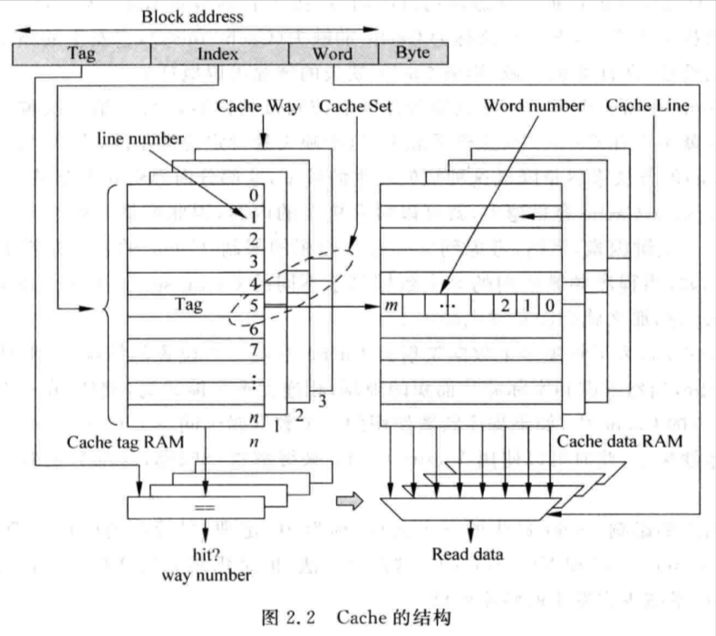

# 2.1 - Cache 的一般設計

- L1 Cache 通常分為 I-Cache 和 D-Cache，為 private cache
    - I-Cache 需要能夠在一個 cycle 內，讀取多條的指令
    - D-Cache 需要能在一個 cycle 內，處理多條 load/store 指令的訪問，因此需要使用 multi-port 的設計
- Instruction fetch 的時候，會向 L1 Cache 嘗試讀取指令，因此 L1 Cache 也是 pipeline 的一部分
- L1 Cache 必須保持跟 CPU 相近的速度，因此通常是透過 SRAM 實現的
- L2 Cache 通常都是指令和資料一起 share 整個 cache，容量通常以 MB 為單位
- 現在大部份的 multi-core 都是 shared 同一個 L3 Cache
- L2 Cache 被訪問的頻率通常不是很高 (L1 Cache miss 才會訪問 L2 Cache)，因此不需要使用 multi-port 的設計
- 需要盡可能的提昇 L2 Cache 的命中率，因為如果 L2 Cache miss，且沒 L3 Cache 的話，就需要去訪問 DRAM 了，訪問時間會很長

## 2.1.1 - Cache 的組成方式

- Set-associative cache：

    

    - TLB 和 Victim Cache 通常使用 fully-associative 架構
    - I-Cache 和 D-Cache 通常使用 set-associative 架構
    - Compulsory miss 可以透過 prefetching 來降低其發生的頻率
    - Capacity miss 沒有方法可以降低其發生的頻率
    - Conflict miss 可以透過 Victim Cache 來降低其發生的頻率
    - Set-associative：
        - 優點：
            - 可以降低 cache miss rate
        - 缺點：
            - 需要比對多個 cache line，因此 latency 會比較高
    - 補充：

        

        - 4-way set associative cache：
            - 共 256 個 sets，透過 (Set) Index (8 bits) 來選取
            - 每個 set 有 4 個 ways (i.e. 共 4 條 cache line)
            - 同時間這四個 ways 中對應的 cache line 都會被選中，然後透過比對 Tag 來決定是哪個 way hit
            - 最後再透過 Word + Byte (= Block Offset)，決定 way hit 的那條 cache line 中，要被讀/寫的 word (一條 cache line 通常包含了好幾個 words)
    - 在實際的實做上，Cache Tag 和 Data 是分開的，也就是：Tag SRAM 和 Data SRAM
    - Tag SRAM 和 Data SRAM 有兩種存取方式：
        - 同時訪問 Tag SRAM 和 Data SRAM

            

            

            - Address Calculation stage 先計算出 memory 的位址，Disambiguation stage 再透過 LSU (Load-Store Unit) 檢查 load/store 指令之間的 memory disambiguation，確保 load/store 指令之間依賴關係有正確的被處理 (因為指令是 Out-of-Order 執行)，Cache Access stage 再根據 tag 的比較結果，決定存取哪一個 cache set；Tag hit 的 way 就可以同時間訪問其 Tag SRAM 和 Data SRAM，最後在 Result Drive stage 根據 block offset 從 cache line 上取得資料
            - 優點：
                - 比先訪問 Tag SRAM，再訪問 Data SRAM 的設計，少了一個 pipeline stage
                - 較適合 In-Order CPU
            - 缺點：
                - 較低的 CPU frequency (因為 pipeline stage 比較少)
                - 較大的功耗 (因為多了 Way Mux)
                - 較不適合 Out-of-Order CPU
        - 先訪問 Tag SRAM，根據 Tag 的比較結果，再訪問 Data SRAM

            

            

            - Address Calculation stage 先計算出 memory 的位址，Disambiguation stage 再透過 LSU (Load-Store Unit) 檢查 load/store 指令之間的 memory disambiguation，確保 load/store 指令之間依賴關係有正確的被處理 (因為指令是 Out-of-Order 執行)，Tag access stage 可以直接比對 tag 是否 hit，而不需要使用 Way Mux 決定是哪條 way (因為 Data SRAM 還沒有被存取)。Tag hit 的 way 就可以在 Data Access stage 訪問其 Data SRAM，最後在 Result Drive stage 根據 block offset 從 cache line 上取得資料
            - 優點：
                - 較高的 CPU frequency (因為 pipeline stage 比較多)
                - 較小的功耗 (因為少了 Way Mux)
                - 較適合 Out-of-Order CPU
            - 缺點：
                - 比同時訪問 Tag SRAM 和 Data SRAM 的設計，多了一個 pipeline stage
                    - 不過 Out-of-Order CPU 可以將訪問 cache 這段時間，透過 reorder 其他的指令來填補
                        - 因此比較不適合 In-Order CPU
    - Fully-associative cache：

        

        - 所有的 cache lines 的 Tag 都會被比較
        - 因此通常都是使用 CAM (Content Address Memory) 來儲存 Tag，SRAM 來儲存 Data

            > CAM 是一種類型的記憶體，它允許透過**內容**（而非位址）來存取儲存的資料。這與傳統的 RAM（Random Access Memory，隨機存取記憶體）不同，因為 RAM 透過記憶體位址來讀取或寫入資料，而 CAM 則根據輸入的內容來搜尋對應的儲存單元，並返回匹配的結果。
            >
        - 優點：
            - cache miss rate 最低 (因為只要有空的 cache line 就可以使用)
        - 缺點：
            - Latency 也是最長的 (因為有大量的 Tags 需要被比較)
        - 通常 TLB 會使用 fully-associative 來實現

## 2.1.2 - Cache 的寫入

- Self-modifying codes 的執行流程：
    - Self-modified 的 codes 存至 D-Cache → 將 D-Cache 的內容 flush 至 L2/L3 Cache 或是 memory→ Invalidate I-Cache → 下次 CPU fetch 該指令的時候，就會從 L2/L3 Cache 或是 memory 取得並存進 I-Cache 中了
- 當執行 store 指令的時候：
    - 如果 cache line 存在：
        - Write-through：
            - 資料會一路寫進 D-Cache → L2/L3 Cache → Memory
            - 優點：
                - 設計較簡單，不須額外的 dirty bit 紀錄來哪條 cache line 是 dirty 的
                - Cache 和 Memory 的資料是一致的，適合 **multi-core** 的系統
            - 缺點：
                - CPU 的效率會降低，因為 D-Cache 同步至 L2/L3 Cache, Memory 的速度很慢
                - 如果寫入了資料只會用過一次，那麼同步至 L2/L3 Cache, Memory 就是多餘的開銷
        - Write-back：
            - 當執行 store 指令的時候，資料只會寫進 D-Cache，並標記該 cache line 為 dirty；只有在該 cache line 要被 evicted 的時候，才會將 dirty cache line 同步至 L2 Cache or L3 Cache or Memory (只需同步至下一級)
            - 優點：
                - 資料只須寫入 D-Cache，效率較佳
            - 缺點：
                - 不同層級的 caches 資料有可能不一致，會需要處理一致性的問題
                - 需要額外的 dirty bit 來紀錄哪些 cache line 是 dirty 的
    - 如果 cache line 不存在 (i.e. Write miss)：
        - Non-write-allocate：
            - 直接將資料寫至下一級的 cache 或 memory，不寫進 D-Cache
        - Write-allocate：
            - 如果搭配 Write-through：
                - 從下一級的 cache 讀出對應的 cache line 並寫回 D-cache 中，再將 store 的資料更新至該 cache line 中對應的 block
                - 該 D-Cache 的 cache line 會再同步回 L2/L3 Cache, Memory
            - 如果搭配 Write-back：
                - 如果該 D-Cache 的 cache line 已經是 dirty 了，需先將該 cache line flush 至下一級的 cache 或 memory
                - 從下一級的 cache 讀出對應的 cache line 並寫回 D-cache 中，再將 store 的資料更新至該 cache line 中對應的 block
                - 只須將該 D-Cache 的 cache line 標記為 dirty
            - 為何需要先從下一級的 cache 讀出對應的 cache line，而不是直接把資料寫進 D-Cache?
                - 因為通常 store 只會寫入一個 word 的值 (e.g. 32 bits)，但 cache line 可能是 512 bits，如果直接該 word 寫進 cache，會導致整條 cache line 都變 dirty，當 cache line 被 evicted 的時候，整條 cache line 都會同步至下一級的 cache 或 memory，導致資料不一致
                    - 因為有可能 cache line 其他 words 在 store 指令執行時，是 invalid 的，例如：第一次寫入該 cache line
                    - 除非一條 cache line 有多個 dirty bits 可以 track 各個 word 的 dirty 狀態，不過這樣會需要耗費多餘的硬體，一致性的問題也會更難處理
    - 實做通常搭配：
        - Write-through + Non-write-allocate

            

            - Write-through 和 Non-write-allocate 都會將資料寫至下一級的 cache 或 memory
            - 如果是搭配 Write-allocate，需要先從下一級的 cache 讀出對應的 cache line 並寫回 D-cache 中，但 Write-through 又會將資料寫至下一級的 cache 或 memory，前面從下一級 cache 的讀取就是多餘的
        - Write-back + Write-allocate

            

            - Write-back 搭配 Write-allocate 只須將 cache line 標記為 dirty 就好，不用再同步回L2/L3 Cache, Memory
            - 如果是搭配 Non-write-allocate，資料是直接寫至下一級的 cache 或 memory，不會寫進 D-Cache 的，因此下一次存取的時候 D-Cache 還是會 miss
            - Write-back + Write-allocate 相較於 Write-through + Non-write-allocate：
                - 優點：
                    - 同步至下一級的 cache 或 memory 的次數較少，效能較好
                - 缺點：
                    - 設計較為複雜

## 2.1.3 - Cache 的替換策略

- LSU (Least Recently Used)，近期最少使用法：
    - 選擇最近被使用次數最少的 cache line 來替換
    - 每個 cache line 都有個 age 的欄位紀錄被使用的次數，每被使用一次，age 就會 + 1
    - age 最小的 cache line，就是最近被使用次數最少的，也就是會被替換的 cache line
    - Directed-mapped cache 不須使用 LSU，因為會被替換的 cache line 都是固定的
    - Set-associative cache 可以針對 way 來紀錄 age
        - 例如：2-way set-associative cache 每個 way 的每條 cache line 可以各自用 1 個 bit 的 age 來紀錄 way 的 cache line 是 LSU
            - 當 way 0 被使用時，將 way 0 的 age 設成 1，way 1 的 age 設成 0，代表最近 way 0 有被使用
            - 反之，當 way 1 被使用時，將 way 1 的 age 設成 1，way 0 的 age 設成 0，代表最近 way 1 有被使用
            - 如此，只要找到 age 是 0 的那個 way，就可以將該 way 的 cache line 給取代了
        - 然而，當 ways 數增加時，精準的 LSU 實做會非常昂貴，因此實務上都是使用 pseudo-LSU 的方法來實現：
            - 將所有的 way 分組並分級，每一組 ways 使用 1 個 bit 的 age：

                

                - 共需要 **1 + 2 + 4 = 7 個 bits**
- Random Replacement，隨機替換法：
    - 不再需要紀錄每個 way 的 age，而是隨機挑一個 way 來替換
    - 優點：
        - 設計較 LSU 來得簡單
    - 缺點：
        - 相較於 LSU，cache miss rate 會比較高，但隨著 cache 的容量增大，這個差距會越來越小
    - 實務上很難實做出嚴格的隨機，一般是採用時鐘算法 (clock algorithm) 來實現近似的隨機：
        - 本質上為一個 counter，每個 cycle 都會 + 1，counter 的 bits 由 ways 數決定 (如 8 ways 就需要 3 個 bits)，每次 cache line 要被替換的時候，就根據當下 counter 的值決定是哪個 way 的 cache line 要被替換

# 2.2. 提高 Cache 的性能

## 2.2.1  Write Buffer

- 當 D-Cache miss 時，需要從下一級的 cache 或 memory 讀取資料回 D-Cache 並寫入 cache line；如果 D-Cache 的 cache line 是 dirty 的，那還需要先將 dirty cache line 寫至下一級的 cache 或 memory，才能再從下一級的 cache 或 memory 讀取資料回 D-Cache
- 由於訪問下一級的 cache 或 memory 的 latency 很長，會影響 cache miss 的處理時間，因此可以引入 write buffer 來解決此問題：

    

- Dirty cache line 會先被寫進 write buffer，等到下一級的 cache 或 memory 有空閒的時候，才會將 dirty cache line 寫入
- Dirty cache line 寫入的時間會因此被隱藏，D-Cache 在將 dirty cache line 寫進 write buffer 後，就可以開始從下一級的 cache 或 memory 讀取資料回 D-Cache
    - 對於 write-through 類型的 D-Cache，write buffer 是非常必要的元件
- 缺點：
    - 會增加系統的設計複雜度：
        - 當發生 cache miss 的時候，不只要查詢下一級的 cache 或 memory，同時間也要查詢 write buffer
            - 因此 write buffer 通常也是使用 CAM 來實做
            - 當 write buffer 中有 cache miss 所需的數據時，會優先採用 write buffer 的數據

## 2.2.2 流水線

- 讀 D-Cache：
    - Tag SRAM 和 Data SRAM 可以同時讀取，因此可以在一個 cycle 內完成
- 寫 D-Cache：
    - 讀 Tag SRAM 和 寫 Data SRAM 只能依序完成，因為必須先讀取 tag 並比較，確認要寫的位址在 cache 中後才能將數據寫進 Data SRAM
    - 這些操作很難在一個 cycle 內完成，因此需要對寫 D-Cache 的操作採用 pipeline 的架構
- 比較經典的設計方式是：
    - 將 tag 的讀取和比較放在同一個 cycle
    - 寫 D-Cache 放在下一個 cycle
    - 對一個 store 指令而言，就算 cache hit，至少也需要 2 個 cycles 才能完成；但如果是連續的 store 指令，那麼還是可以透過 pipeline，每個 cycle 執行一道 store 指令 (假設沒有 hazard)

        

        - Load 指令在 D-Cache hit 的情況下，只需要 1 個 cycle 就可以完成
        - Store 指令在 D-Cache hit 的情況下，需要 2 個 cycles (讀 tag 並比較 + 寫 data) 才可以完成
        - 當 load 指令執行時，有可能其所需的數據存在 store 指令的 register (Delayed Store Data) 中，而不是來自 Data SRAM，因此需要將 load 指令的位址，和 store 指令的位址 (Delayed Store Addr) 做比較；如果相等，那麼就可以直接將 store 指令的 register (Delayted Store Data) 內容，直接 forward 給 load 指令
            - E.g.

                ```asm
                sw a0, 0(a1)
                lw a2, 0(a1)  # Store 指令的 $a0 可以直接 forward 給 load 指令的 $a2
                ```


## 2.2.3 - 多級結構

- 一般處理器設計中：
    - L1 Cache 可以採用 **Write-through** 或 **Write-back** 的設計
        - **Write-through** 可以簡化 pipeline 的設計，尤其是針對 multi-core，需要處理 coherence 的問題，Write-through 的設計會比較簡單一點
    - (Shared) L2 Cache 會採用 **Write-back** 的設計
- Inclusive cache vs. Exclusive cache：

    

    - Inclusive cache：L2 Cache 包含了所有 L1 Cache 的內容
        - 優點：
            - 可以將數據直接寫進 L1 Cache，因為被 evicted 的 cache line 在 L2 Cache 中也一定存在；直接將數據寫進 L1 Cache 不會引起任何的問題 (假設被 evicted 的 cache line 並不是 `dirty` 的)
            - 簡化了 cache coherence 的管理
                - 在 multi-core 的平台，當其中一個 CPU 更新了其 private cache (e.g. L1 D-Cache) 某個位址的數據 (e.g. 執行 store 指令)，如果其他 CPU 也有相同位址的數據，那就必須將其設為 invalid，以免其他 CPU 存取到舊的值
                - 如果是採用 inclusive cache，那麼只需檢查 last-level (shared) cache (e.g. L2 Cache) 中，是否有該位址的數據，如果 last-level cache 中沒有，那就代表 private cache 中也一定沒有，如此就不用打擾其他 CPU 的 private cache，影響 pipeline 的執行
        - 缺點：
            - 浪費了 cache 的空間，實做成本比較高
    - Exclusive cache：L2 Cache 和 L1 Cache 的內容完全不相同 (i.e. 互斥)
        - 優點：
            - 避免了 cache 空間的浪費，實做成本比較低
        - 缺點：
            - 如果是採用 exclusive cache，那麼在 multi-core 的平台，當某一個 CPU 更新了其 private cache (e.g. L1 D-Cache) 某個位址的數據  (e.g. 執行 store 指令)，那麼每個 CPU 都必須檢查其每個 cache 是否也有包含其位址的數據，如果有的話，就必須將其設為 invalid，也因此會影響 pipeline 的執行
            - 同時，當要讀取的數據不在 L1 Cache，而是在 L2 Cache 時，除了將 L2 Cache 的數據拉回 L1 Cache 外，還需要將 L1 Cache 中被 evicted 的值，寫進 L2 Cache，這種交換過程會降低 CPU 的執行效率
    - 目前大部分的處理器，都還是採用 Inclusive cache 的設計

## 2.2.4 - Victim Cache

- 有時候，被 evicted 的 cache line 有可能又會馬上被使用，例如：

    

    - A、B、C 都被分配在同一個 cache set，如果同時間都被頻繁使用 (e.g. A -> C -> B)，那就有可能被 evicted 後，又會馬上被讀回 cache，然後又被 evicted，而且會一直 cache miss
    - 而且 cache 的 ways 數有上限，沒辦法無上限的透過增加 ways 數來解決這個問題；其他的 cache sets 也未必會有同樣的狀況，為此增加 ways 數可能只是浪費空間
- 可以引入 Victim cache 來解決這樣的問題，Victim cache 是用來保存最近被 evicted 的 cache lines，因此所有的 cache sets 都可以透過 Victim cache 來”增加 ways 數”
- Victim cache 通常採用 `fully-associative` 設計，容量也會比較小 (一般可以存 4 ~ 16 條 cache lines)

    

- 一般情況下 Victim cache 的數據跟 L1 D-Cache 的數據是互斥的，CPU 可以同時讀取它們，只要有其中一個 hit，就可以直接使用
- 如果 L1 D-Cache 中沒有找到數據，但有在 Victim cache 中找到，那麼該數據會被讀進 L1 D-Cache，同時間 L1 D-Cache 中被 evicted 的數據，會被寫進 Victim cache，也就是互換了兩邊的數據 (因為 L1 D-Cache 和 Victim cache 是互斥的)
- Victim cache 可以降低 cache miss rate
- 現代大多數處理器都有採用 Victim cache
- Filter cache 則是另外一種類似 Victim cache 的設計，它會被放置在 L1 D-Cache 前：

    

- 當一個數據第一次被使用時，它不會被馬上放進 cache，而是會先放到 Filter cache；只有等到這個數據再次被使用時，才會真的搬進 cache
- 使用 Filter cache 可以防止那些只有偶爾才會被使用的數據佔據 cache 的空間，進而提高 cache 的使用效率

## 2.2.5 - 預取 (Prefetch)

- 硬體預取：
    - 指令的 prefetch 是相對容易的，只要在取一個指令進 I-Cache 時，同時間也取其後的幾條指令進 I-Cache 即可
    - 因為有分支指令，所以有可能會 prefetch 錯指令，浪費 I-Cache 的空間
        - 可以將 prefetch 的指令，放到一個單獨的 buffer 中，來避免這個問題

            

            - 如果 fetch 指令時 I-Cache miss，但有在 Stream Buffer 中找到該指令，那麼 CPU 可以直接從 Stream Buffer 中讀取指令，且該指令會被搬進 I-Cache，Stream Buffer 也會繼續從 L2-Cache prefetch 後面的指令，並搬進 Stream Buffer 中
    - 數據的 prefetch 就相對困難許多，因為數據的使用是沒有一定規律的
    - 一般情況下，當 D-Cache miss 時，除了將數據從 L2 cache 中讀出來外，也會同時 prefetch 下一個數據
        - 然後，這種方法並不準確，因為有可能接下來要使用的數據，並不是 prefetch 的數據，prefetch 只是做白工
        - 這種方法目前被廣泛得使用在現代處理器中
    - Intel Pentium 4 和 IBM Power 5 的處理器中，採用了 Strided Prefetch 的機制
        - Prefetcher 可以自行觀察程式中數據使用的規律，例如第一個數據位於位址 `a`，第二個數據位於位址 `a + 128`，第三個數據位於 `a + 256`，那麼 Prefetcher 就可以預測接下來的數據在 `a + 384`、`a + 512`、`a + 640`… etc
    - Prefetcher 是否實用，還是得根據實際跑的程式而定
        - Prefetch 錯，就只是增加功耗而已
- 軟體預取：
    - 如果有支援 prefetch 指令，則軟體可以利用 prefetch 指令來提前將指令 prefetch 進 cache，e.g.

        ```c
        for (i = 0; i < N; i++) {
            prefetch(&a[i + P)]);
            prefetch(&b[i + P)]);
            sum = sum + a[i] + b[i];
        }
        ```

        - 不過 prefetch 指令有可能會引起 exception，此時有兩種處理方法：
            - 處理 exception
            - 不處理 exception，直接將此 prefetch 指令轉為 NOP
                - 現代處理器大多採用此方式

# 2.3 - 多端口 Cache

- 為了提昇效能，處理器必須要能夠在 1 個 cycle 內同時執行多條 load/store 指令，這需要一個 multi-port 的 D-Cache，以便能夠支持多條 load/store 指令的同時訪問
- 不只 D-Cache，在 superscalar 的架構，還有很多元件都是 multi-port 的，e.g. register file、issue queue、ROB… etc
- D-Cache 由於原本的容量就很大，因此採取 multi-port 的設計會對晶片的面積和速度帶來負面的影響，因此需要再採用其他的方法來實現 multi-port D-Cache：
    - True Multi-port
    - Multiple Cache copies
    - Multi-banking

## 2.3.1 - True Multi-port

- 實務上，很難對 D-Cache 採用 multi-port 的設計，因為所有在 Cache 中的控制電路和 data path都需要進行複製
- 如果要讓 D-Cache 採用 multi-port 的設計，就代表需要：
    - 兩套的 Address Decoder，使兩個 ports 可以同時存取 Tag SRAM 和 Data SRAM
    - 兩套的 Way Mux，用來讀取兩個 ports 的數據
    - 兩套的 Tag Comparators，用來判斷兩個 ports 的命中情況
    - 兩套的 Aligners，用來做 word 或 half-word 的讀取
- Tag SRAM 和 Data SRAM 並不需要複製一份，但它們當中的每個 cells 都需要同時支持兩個並行的讀取操作 (對於一個 SRAM cell 來說，不需要兩個 write ports，因為無法同時對 SRAM cell 同時寫 0 又寫 1)


- 由於 multi-port D-Cache 的設計需要將很多電路都複製一份，增大了面積；同時 multi-port SRAM cell 需要驅動多個 read ports，功耗也會隨之增大；因此實務上並不會採用 multi-port 的設計

## 2.3.2 - Multiple Cache Copies

- 這種設計方法直接將 Tag SRAM 和 Data SRAM 複製一份：

    

- 透過將 Tag SRAM 和 Data SRAM 複製一份，SRAM 就不需要採用 multi-port 的設計，雖然可以消除 multi-ports 對處理器效能的影響，但是這種方法消耗了很多的面積，而且需要保持兩邊 caches 的同步：
    - 執行 store 指令時，需要同步到兩邊的 caches
    - 其中一個 cache 發生 replacement 的時候也需要對另一個 cache 做同樣的 replacement
- 也因此，實務上並不會採用這樣的設計

## 2.3.3 - Multi-banking

- Multi-banking 將 cache 分成很多很小的 banks，每個 bank 都只有一個 port
    - 如果在一個 cycle 內，對 cache 的訪問位址是位於不同的 banks 之中，那麼就不會有任何的問題
    - 只有當兩個甚至多個對 cache 的訪問位址是位於同一個 bank 之中，才會引起衝突，也就是 bank conflict

        

        - Cache line 被分成了兩個 banks
        - 在同一個 cycle 內，如果兩個訪問位址落在不同的 banks 之中，那這兩個訪問就可以同時存取 cache (e.g. Port 0 訪問 Cache bank 1、Port 1 訪問 Cache bank 0)
- 使用 Multi-banking 仍然需要：
    - 兩套的 Address Decoder，使兩個 ports 可以同時存取 Tag SRAM 和 Data SRAM
    - 兩套的 Way Mux，用來讀取兩個 ports 的數據
    - 兩套的 Tag Comparators，用來判斷兩個 ports 的命中情況
    - 兩套的 Aligners，用來做 word 或 half-word 的讀取
- 但使用 Multi-banking，Data SRAM 便不需要採用 multi-port 的設計，可以提高存取速度，並降低面積
- 然而由於需要判斷 cache 的每個 port 是否 hit，因此對於 Tag SRAM 來說，仍然需要採用 multi-port 的設計，以便提供多個 ports 同時讀取的功能，或是直接將 single-port 的 Tag SRAM 複製一份
- Bank conflicts 是 Multi-banking 的關鍵性能影響因素，解決 bank conflicts 的方法有：
    - 使用更多的 banks
    - 提高 banks 的使用效率，使數據不會集中在同一個 bank
        - 通常需要 compiler 的配合才能實現
- 使用 Multi-banking 來實現 multi-port 的功能可以使 cache 的總面積降低，而且不會對處理器的 cycle time 有太大的影響，因此現代處理器通常都使用 Multi-banking 的設計

## 2.3.4  - 真實的例子：AMD Opteron 的 multi-port cache


- Data SRAM 共 8 個 banks，所以使用了 `VA[5:3]` 來選取 bank
    - 每個 bank 都是 single-port 的 SRAM
- 採用將 Tag SRAM 複製的方式，每個 Tag SRAM 都是 single-port 的
- 共需要：
    - 兩個 TLB
    - 兩個 Tag Comparators
    - 兩個 single-port 的 Tag SRAM
        - 亦可以使用 multi-port 的 Tag SRAM，但面積可能不會減少多少，而且速度還有可能會變慢
    - 除了 Data SRAM 沒有被複製外，基本上其他的電路都被複製了一份

# 2.4 - 超標量處理器的取指令

- 針對 n-ways 的 superscalar CPU，每個 cycle I-Cache 都應該至少能送出 n 條的指令，這 n 條的指令為一組 `fetch group`
- 最簡單的方法就是 I-Cache 每個 data block 為 n-words，每個 cycle 都把整條 cache line 給讀出：

    

- 如果指令的位址是 n-word aligned 的，那就可以每個 cycle 都從 I-Cache 讀出 n 條指令
    - 實際上由於有 branch 指令、exception 等情況，所以指令位址不可能永遠都是 n-word aligned 的
- 如果指令的位址不是 n-word aligned 的，那就代表該 fetch group 有可能會落在兩條不同的 cache lines 上，這種情況會導致後續的 pipeline 沒辦法得到充足的指令：

    

- 透過 Instruction Buffer，我們可以一次讀取超過 n words 條的指令，並將其存至 Instruction Buffer 中，後續的 decoder 可以從 Instruction Buffer 中讀取指令，這樣就算 I-Cache 沒辦法在一個 cycle 內提供足夠的 n words 條的指令，也可以保證後續的 pipeline stages 可以獲得充足的指令
- 實際上，只有第一個 cycle 沒辦法讀取 n words 條的指令：

    

    - 在 cycle 2 後，只要後續沒有 branch 指令或 exception，還是可以一次讀出 n words 條的指令
- 此外，也可以將 cache lines 長度變長，超過 n words：

    

    - N = 4，cache line = 8 words，只有在指令的位址落在 cache line 最後 3 個 blocks 的情況，才沒辦法一次讀出 4 條指令
        - 缺點：
            - 如果 cache size 是固定的，增加 cache line 的 size，會減少 cache sets 的個數，增加 cache miss rate
- 延續上述的範例，實務上也不會使用 8 個 32-bit 的 SRAM 來實做 8 words 的 cache line：

    

    - 因為 SRAM 周圍也需要放保護電路，如果 SRAM 的個數過多，會導致保護電路也佔用過多的面積
    - 要從 8 個 SRAM 選出要輸出的 4 words 也是一件很浪費電路的事情
    - 因此，實務上，還是會使用 4 個 SRAM 來實現 8 words 的 cache line
        - 當 tag hit 時，每個 SRAM 的兩行數據都是有效的，可以透過以下的方式重新排序，並選出正確 4 個 words 的指令：

            

    - 同樣的，如果指令的位址落在 cache line 最後 3 個 blocks，是沒辦法在一個 cycle 內讀出 4 條指令的，因此需要重新排序電路還需要加入指示哪些 words 是 valid 的 signal，才能夠將 valid 的指令寫入 Instruction Buffer 中
- 如果有 branch predictor，I-Cache 在取指令的時候便可得知 fetch group 中哪條指令是 branch 指令；如果預測是 branch taken，那麼 branch 指令後面的指令就不會被讀進 Instruction Buffer 和 pipeline 了

    
