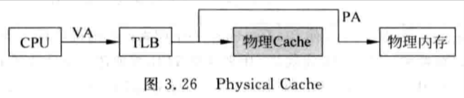

# 3.2 - 位址轉換

## 3.2.3 - Page Fault

- PTE (page table entry) 中包含：
    - `valid` bit：標記這個 PTE 是否有效，當作業系統設定好 page table 後，就需要將對應 PTE 的 `valid` bit 設成 1
    - `dirty` bit：當一個 page 內容被更新時 (e.g. 執行 store 指令)，硬體會自動將 `dirty` bit 設成 1，代表這個 page 如果被選中要被替換時，需要將 page 的內容 swap 回硬碟
    - `access` bit：當一個 page 被訪問 (load/store) 時，硬體會自動將 `access` bit 設成 1，作業系統則會定期的將 `access` bit 清為 0
    - 當要替換 page table 時，就可以根據 access bit 來得知最近 page 是否有被訪問過，進而實現近似 LRU (Least Recently Used) 的替換策略
- 當 page 要被 swapped out 前：
    - 要先將 D-Cache 的內容 flush 進 memory，以確保要被 swapped out 的 page 內容是最新的
    - 將 PTE 的 `valid` bit 設成 0，以避免其他 CPU 或 MMU 在接下來 swap out 期間誤讀這個 page
        - `valid` bit 為 0 時，代表該 page 並不存在記憶體中，當 MMU 存取時會觸發 page fault 讓作業系統從硬碟讀取 page 進記憶體
        - `valid` bit 是由作業系統在把 page 讀進記憶體後設為 `1` 的
    - 執行如 RISC-V 的 `sfence.vma` 指令，確保 TLB 中對應的 entries 被清空，以避免 MMU 錯誤存取到被 swapped out page 的 cache 內容

# 3.4 - 加入 TLB 和 Cache

## 3.4.1 - TLB 的設計

- TLB entry 中也會包含：
    - `valid` bit：標記這個 TLB entry 是否有效；當 TLB entry 被 swap in 時，`valid` bit 會被設為 1
    - `dirty` bit：當執行 store 指令時，如果 TLB hit，就不會再訪問 PTE，也就不會更新 PTE 中的 `dirty` bit；只有當 TLB entry 要被替換時，才會同步至 PTE
    - `access` bit：當執行 load/store 指令時，如果 TLB hit，就不會再訪問 PTE，也就不會更新 PTE 中的 `access` bit；只有當 TLB entry 要被替換時，才會同步至 PTE
    - P.S. RISC-V 中，TLB entry 並沒有包含 `dirty` 和 `access` bits，作業系統需要自己確保 PTE 的更新
        - `sfence.vma` 只會將 TLB 中對應的 entries 給 invalid 而已 (針對 TLB 的部份)
        - 如果 CPU 有支援 **Svadu** extension，那麼硬體就會自動更新 PTE 中的 `dirty` 和 `access` bit
            - 如果硬體支援 `access` 和 `dirty` bits 自動更新， 作業系統只需要讀取 PTE 即可獲得最新的 `access` 和 `dirty` bits 的狀態
        - 如果硬體不支援 `access` 和 `dirty` bits 自動更新，當 `access=0` 或 `dirty=0` 時：
            1. MMU 會觸發 page fault
            2. 作業系統在 page fault handler 中設置 `access=1` 或 `dirty=1`
                1. 作業系統得先透過設定 PTE 的 `valid` bit (追蹤 page 是否有被 accessed) 和 disable `write` permission (追蹤 page 是否有被 stored) 來當 page fault 發生時，在 page fault handler 更新 `access` 或 `dirty` bit
            3. 重新執行造成 page fault 的那道指令
            - 也就是讓作業系統來自行管理 PTE 中 `access` 和 `dirty` bits 的內容，效能較差，但硬體設計較簡單
            - RISC-V privilege spec:
                - If `pte.a=0`, or if the original memory access is a store and `pte.d=0`:
                    - If the **Svade** extension is implemented, stop and raise a page-fault exception corresponding to the original access type.
- 一般為了減少 TLB miss rate，會使用 `fully-associative` 來設計 TLB
    - 缺點：TLB 容量不能太大，不然會增加查找的時間
- 因此，有些架構也會使用 `set-associative` 來設計容量比較大的 TLB
- 因為是 `fully-associative` 或 `set-associative`，因此 TLB entry 中，還會包含 `tag` 欄位 (VPN，Virtual Page Number)，用來比對 TLB 是否 hit
    - P.S. TLB entry 中的 data 是 PFN (Page Frame Number)
- 現代處理器架構，通常都使用 2-level TLB
    - 1st level 採用 Harvard 架構，分為 I-TLB (指令) 和 D-TLB (數據)，一般採用 `fully-associative` 設計
    - 2nd level 採用 Von Neumann 架構，指令和數據共用，一般採用 `set-associative` 設計
- 現代處理器中因應程式的 size 越來越大，因此還會支持容量更大的 page
    - E.g. 128 entries 的 TLB，只能映射到 128 * 4KB = 512 MB 大小的程式，顯然不夠用
- 更大的 page：
    - 優點：
        - 降低 TLB miss rate
    - 缺點：
        - 當發生 page fault 的時候，需要花更多的時間才能將更大的 page 內容從硬碟搬至記憶體
        - 如果程式用不到這麼大的 page，那麼空間就被浪費了，且也會造成 page fragment，降低 page 的使用效率
- 總和以上原因，現代處理器都支持大小可變的 page，由作業系統負責管理，根據程式的特點選用不同大小的 page，最大程度地利用 TLB 有限的空間，並降低 page fragment
    - 在 TLB 中會有相對應的設定可以調整映射的 page 大小
- 因為記憶體的存取速度相對於 CPU 的執行速度來說非常慢，因此 TLB 通常只會採用 **Write-back** 的方式設計，且因為 TLB entry 中 `tag` 和 `data` 等欄位是不會變動的，因此當發生 TLB miss，需要將 TLB entry swap out 時，只需要將 `dirty` bit (執行 store 指令時會被更新) 和 `access` bit (執行 load/store 指令時會被更新) 寫回 PTE 中即可
- TLB miss 發生的情況：
    1. Page 並不在記憶體中，因此也不在 TLB 中
    2. Page 在記憶體中，page table 中也有對應的 PTE，但這個 PTE 並沒有被 cache 在 TLB 中
    3. Page 在記憶體中，page table 中也有對應的 PTE，這個 PTE 也曾經存在 TLB 中，但是因為先前的 TLB miss，因此被替換出來了
- TLB miss 時，TLB entry 的替換策略：
    - LRU (Least Recently Used)
    - Random：如同 cache，使用一個 counter，每個 cycle 都會 + 1，每次 TLB miss 要替換 TLB entry 時，就根據當下 counter 的值決定是哪個 entry 要被替換
    - LRU 比較難實現，所以通常會採用 Random 的替換策略，實做也比較簡單
- 如果 TLB 採用 **Write-back**，TLB entry 中的 `dirty` 和 `access` bits 就有可能跟 PTE 的內容不同步，如果 page 要被 swap out 的時候，作業系統會無法即時得知究竟 page 是否 dirty，以及是否有被 accessed 過
    - 直觀解法：每次發生 page fault 要 swap page 的時候，先將 TLB entries flush 至 PTE
        - 缺點：需要耗費額外的時間 flush TLB
    - 另類解法：作業系統可以認為，有在 TLB 中被 cached 對應的 pages 都是正在使用的，因此不能將其 swap out
        - 需要作業系統自行維護一張表，紀錄哪些 PTE 有被 cached 在 TLB 中，且為 valid 的
            - 不過這種設計並不常見
- 如果系統中有 D-Cache，page 也是 dirt 的，那麼 page 被更動的內容也有可能還存在 D-Cache 中，因此在 page swap out 前也必須先 flush D-Cache

## 3.4.2 - Cache 的設計

- 兩種 caches：
    - Physical cache：

        

    - Virtual cache：

        

- Virtual cache 會有 aliasing (synonyms，同義) 問題：
    - 多個 VA 對應到同一個 PA

        

    - 缺點：
        - 造成 cache 空間的浪費，因為可能會有兩個 cache sets (不同 VA) 都是對應到同一個 PA 的資料
        - 當執行 store 指令更新 cache 的內容時，只有一個 cache set 的內容會被更新，但實際上，所有對應到同一個 PA 的 cache sets 內容都應該被更新，否則其他 CPU 讀到的 cache 內容就會不同步
    - 並不是所有情況都會有 aliasing (synonyms) 問題，例如：
        - 當 page 為 4 KB，VA 轉成 PA 時，low 12 bits 的位址是不會發生變化的，因此當一個 direct-mapped 的 cache 容量 ≤ 4KB 時，由於 cache index 最多只會用到 page offset 內的 12 bits (i.e. cache sets 數量 ≤ page offset 可表達的範圍)，即使兩個不同 VA 對應到同一個 PA，還是會 mapping 到同一個 cache set，也就沒有 aliasing (synonyms) 問題
            - 只有在 cache 容量 > 4KB 時，才會導致 cache index bits > 12 bits (i.e. cache sets 的數量 > page offset 可表達的範圍，也就是 cache index bits 包含了 VPN 的部份)，造成兩個不同 VA 對應到同一個 PA，有可能會 mapping 到不同個的 cache sets，導致 aliasing (synonyms) 問題

                

                - E.g. 即使 VA：`0x800` 和 `0x1800` 都是對應到同一個 PA，但因為 VA 的 `bits[12]` 也是 cache index bits 的一部分，因此還是會被 mapping 到不同的 cache sets
    - 使用 bank 解決 aliasing 問題：
        - 最簡單的方式：在寫 cache 時，將 aliased 的 cache sets 都進行更新
            - 需要將 PA 的一部分作為 cache tag 來使用，並需要使用兩個 banks
            - 缺點：浪費 cache 使用空間
        - 如何在不浪費 cache 使用空間的情況下，透過 bank 的方式解決 aliasing 問題：

            

            - 範例：8 KB 切成兩個 4 KB 的 cache banks
                - 讀取 cache 時，使用 `VA[11:0]` 同時查詢兩個 banks，輸出的 cache sets 再透過 `PA[12]` 控制的 Mux 來選取是哪個 cache set 要被讀出
                    - 由於 PA 需要透過 TLB 轉換才能得知，處理時間較長，因此會增加 CPU 的 cycle time
                    - Cache tag 也必須是 PA，才能跟 TLB 轉換出來的 PFN 做比對
                - 寫 cache 時，因為只有被 retired 的指令才會把數據寫入 cache，此時 PA 已經得到了，所以直接拿 `PA[12]` 來判斷要寫入到哪個 bank 中即可
                - 缺點：
                    - 增加硬體的複雜度
                    - 由於讀取 cache 時必須同時查找所有的 banks，因此也會增加功耗
- Virtual cache 會有 homonyms (同名) 問題：
    - 一個 VA 對應到多個 PA
        - 不同 processes，同一個 VA 可能對應到的 PA 不同
    - 在 context switch 時，需要把 virtual indexed cache 的 cache 內容都 invalidate
    - 同樣的，在 context switch 時，也需要把所有的 TLB entries 都 invalidate，以避免存取到錯誤的 VA -> PA mappings
    - 可以透過 ASID (Address Space Identifier) 來只 invalidate 被 context switched 的 cache 內容和 TLB entries
    - 可以再透過引入 `global` bit 來標記該 page 是被多個 processes 共享的 (e.g. Linux kernel space)
- DMA 搬 memory 的資料前，必須先 flush D-Cache，確保記憶體中的內容是最新的
- CPU 在讀取 DMA 搬完的 memory 資料前，必須先 invalidate D-Cache，確保 CPU 一定會從 memory 讀取最新的資料
- 當發生 page fault，並需要將 page swap out 至硬碟前，如果該 page 是 `dirty` 的，那就需要先 flush D-Cache，確保要被 swapped out 的 page 內容是最新的
- 在執行完 self-modifying codes 的指令後，必須先 flush D-Cache，確保指令的修改有正確的寫進 memory；然後要再 invalid I-Cache，確保 CPU 可以讀取到 self-modified 完後最新的指令
- Cache 在上電時，大部分都是關閉的，所以起始程式通常都是放在 non-cacheable 的 memory region；等到初始化完 cache 後，cache 才可以被開啟及使用

## 3.4.3 - 將 TLB 和 Cache 放入流水線

- **PIPT Cache (Physically-indexed, Physically-tagged)：**

    

    - Cache index 和 tag 都是 PA
    - 缺點：
        - TLB lookup 需要消耗一定的時間，為了不影響 CPU 的 cycle time，可能會需要將 TLB lookup 獨立成一個獨立的 pipeline stage
            - 對 I-Cache 來說，branch mis-prediction 的 penalty 會增加
            - 對 D-Cache 來說，load 指令的 latency 會變長
                - 且 load 指令通常都是其他指令的 dependency，因此也會影響其他指令可以被 issued 的時間
        - 真實世界的 CPU 很少 L1 Cache 是採用 PIPT cache 的設計，因為這樣將 cache 訪問和 TLB lookup 給綁定在一起了，會影響 pipeline
            - 實際上也沒有必要，如果 page offset 就可以作為 cache 的 index，VA 的 page offset 和 PA 的 page offset 都是一樣的，可以直接使用 VA 的 page offset，沒有必要再透過 TLB 做轉換
            - 不過 L2/L3 Cache 通常就是使用 PIPT cache 的設計，因為 L2/L3 Cache 被訪問時，TLB lookup 有可能已經完成
- **VIPT Cache (Virtually-indexed, Physically-tagged)：**

    

    - Cache index 是 VA，tag 是 PA
    - VIPT 是目前最多被使用的 cache
    - 優點：
        - Cache 訪問和 TLB lookup 可以同時進行
    - 缺點：
        - Cache 的大小會有所限制，因為要避免 aliasing 的問題
    - 假設一 direct-mapped cache，cache line：2^`b` bytes，cache sets 個數：2^`L` ⇒ Cache size = 2^(`L + b`)；Page size：2^`k` bytes，會有以下三種情況：
        - Page size (`k`) > Cache size (`L + b`)：

            

        - Page size (`k`) = Cache size (`L + b`)：

            

        - Page size (`k`) < Cache size (`L + b`)：

            

        - 針對 Page size (`k`) > Cache size (`L + b`) 和 Page size (`k`) = Cache size (`L + b`)：
            - 有機會 cache 訪問和 TLB lookup 在同一個 stage 完成
            - 為了要避免 aliasing 的問題，因此 cache size 被限制最大只能是一個 page 的大小
            - 如果 cache size 要超過一個 page，就只能使用 set-associative 的設計：

                

        - 針對 Page size (`k`) < Cache size (`L + b`)：
            - 如果已經增加 ways 數 (ways 數不可能無限制的增加)，但還想再增加 cache 的 size，當 cache size > page size 時，就會造成 aliasing 的問題
            - 除了透過先前介紹 bank 的方式來解決 aliasing 的問題，還可以透過 inclusive L2 cache 來解決 aliasing 的問題：
                - L2 cache 包含所有 L1 I-Cache 和 L1 D-Cache 的內容

                

                - L2 Cache 中的 `a1` (VA) 是 VA1 的，所以如果跟 VA2 的 `a2` (VA) 部份不相同的話，就代表有 aliasing 的問題
                - 透過 `{a1, offset}` 的組合，可以找到 VA1 在 L1 Cache 中的 cache line：
                    - 如果是 `dirty`，將其 flush 回 L2 Cache 後，再 invalidate cache line
                    - 如果沒有 `dirty`，直接 invalidate cache line
                - 此時就可以將 VA2 的內容從 L2 Cache 讀回 L1 Cache 中，且因為只有 VA2 在 L1 Cache 的 cache line 是 valid 的，也就不存在 aliasing 的問題
- **VIVT Cache (Virtually-indexed, Virtually-tagged)：**
    - Cache index 和 tag 都是 VA

    

    - 優點：
        - Cache hit 的話，完全不用 TLB lookup
    - 缺點：
        - 同樣會有 aliasing 的問題
            - 可以同樣用跟 VIPT 的方式查找 VA1 在 L1 Cache 的 cache line，並將其 invalidate
            - 不過此時 L2 Cache 沒辦法只存 `a1` (VA)，必須存整個 `VA1` (VA)，因為 L1 Cache 是 virtually-tagged 的，會使用 VA 的一部分作為 tag，只用 `{a1, offset}` 是不夠的
                - L2 Cache 中的 `VA1` (VA) 是 VA1 的，所以如果跟 VA2 的 `VA2` (VA) 部份不相同的話，就代表有 aliasing 的問題
