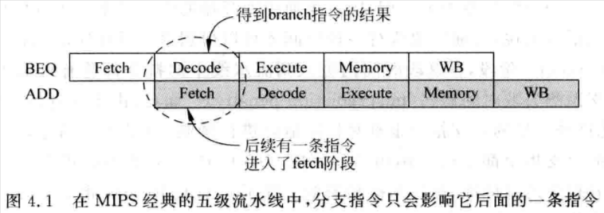

# 4.1 - 概述

- 分支預測和 Cache 左右著 CPU 的效能，對於 superscalar CPU 來說，準確度高的分支預測更為重要
- 在一般的 RISC 指令集中，分支指令包含兩個要素：
    1. **方向：**
        - 分支指令的方向只有兩種：跳轉 (taken)，或是不跳轉 (not taken)
        - 有些跳轉指令是無條件執行的 (e.g. `jmp` 指令)，有些跳轉指令則是需要根據指令中攜帶的條件是否成立來決定是否發生跳轉 (e.g. `beq` 指令)
    2. **目標位址：**
        - 對於一般的 RISC 指令集，目標位址在指令中有兩種形式：
            - **直接跳轉 (direct)：**
                - 目標位址 = 當前分支指令 (或分支指令的下一條指令) 的 PC 值 + immediate PC offset
                - 由於指令通常只有 32/64 bits，因此 immediate PC offset 的值範圍也就有限，因此也限制了直接跳轉能夠跳轉的範圍
                - 因為 immediate PC offset 值是 encode 在分支指令中，因此在 pipeline 的 **decode stage** 就可以直接將 immediate PC offset 給解析出來，因此這種類型的指令是很容易進行分支預測的
                - 這種跳轉指令的執行效能也比較好
            - **間接跳轉 (indirect)：**
                - 目標位址是來自於 register 的內容，由於 register 是 32/64 bits，因此可以跳轉到任何位址
                - 由於跳轉位址來自於 register，因此此類的分支指令的目標位址需要等待一段時間才能獲得 (e.g. 要等到 pipeline 的 **execute stage**)
                    - 在確認目標位址前進到 pipeline 的指令，有可能都會是無效的 (if taken)，因此增大了 mis-prediction penalty
                - 且由於 register 的內容是會動態變化的，因此這類的分支指令很難對目標位址進行預測
                    - 不過慶幸的是，這類指令通常都是 call 或是 return 類型的指令，這類指令都有很強的規律性，是容易被預測的
- MIPS R3000 只使用了 5 級的 pipeline，在第二個階段的 decode stage，就可以得到分支指令跳轉的目標位址，即使發生了跳轉 (taken)，也只需要丟棄一道仍在 fetch stage 的指令，misprediction penalty 並不高

    

    - MIPS CPU 甚至為了減少這一個 cycle 的浪費，還會特別找一條一定會被執行，不相關的指令放在分支指令之後；不論分支是否跳轉或不跳轉，該指令都一定會被執行
        - 分支指令後面的那個位置就被 MIPS 稱為分支延遲槽 (branch delay slot)，需要透過 compiler 或 programmer 找到一條不相關一定會被執行的指令，將其放置分支延遲槽中
        - 但當 CPU 的並行度提高，以及 pipeline 的加深，當發生 misprediction 的時候，pipeline 中已經有很多指令都錯誤地進到 pipeline 裡了；這些指令都必須被拋棄，此時技使使用 branch delay slot，也很難得到滿意的結果，因為已經無法從分支指令之前的程序中找到這麼多不相關的指令了
- 對於 superscalar CPU，要進行分支預測，首先要從 I-Cache 取出的指令組 (`fetch group`) 中，判斷哪些指令是分支指令：

    

    - 最容易的辦法是將 `fetch group` 中的指令，從 I-Cache 取出後，進行快速的 decode

        

        - 從 I-Cache 取出指令後，只需辨別目前的指令是否為一個分支指令，如果是的話，就可以直接將分支指令對應的 PC 值送到 branch predictor 中，就可以對分支指令進行預測了
        - 然而，當 cycle time 比較短的時候，I-Cache 的訪問可能需要好幾個 cycles 才能完成 (e.g. 可能需要訪問 L2 Cache、memory)；在這些 cycles 內由於無法獲得準確的預測結果，只能照順序讀取指令 (i.e. not taken)，降低的分支預測的準確度，進而影響 CPU 的效能
        - 此外，在指令從 I-Cache 讀出來後，fast decode 和 branch predict 是放在同一個 cycle 內的，會嚴重影響 CPU 的 cycle time
        - 為了解決以上的問題，可以在指令從 L2 Cache 寫入 I-Cache 之前進行快速的 decode，也就是 `pre-decode`，然後將指令是否是分支指令的資訊和指令一起寫進 I-Cache 中；雖然這樣會增加 I-Cache 的面積，但可以省略 fast decode 的電路，在一定程度上緩解 對 CPU cycle time 的影響
            - 但是 instruction fetch 到得到分支指令的預測結果這段的間隔時間還是過長的，無法透過以上的方式來解決
- 在 pipeline 中，分支預測越靠前面幾個 stages 是越好的，如果指令從 I-Cache 讀出後才進行分支預測，那麼由於 I-Cache 的訪問可能需要多於 1 個  cycle 才能完成，可能經過了好幾個 pipeline stages 了才能得到分支指令預測的結果，在此期間已經有很多的指令進入到了 pipeline，但如果發生 misprediction，這段期間進入到 pipeline 的指令都必須被 flushed，降低了CPU 的執行效能
    - 因此分支預測，最好是可以發生在一得到 instruction fetch 的 PC 值時，在 instruction fetch 的同時進行分支預測，這樣在下一個 cycle 的時候，根據分支預測的結果來 fetch instruction
        - 在同一個 process 內，PC 的 VA 值都是固定的，因此可以直接拿 PC 值來進行預測
        - 當發生 context-switch 時，需要將 branch predictor 的內容給清空，才能保證不同 processes 間的分支預測不會互相影響
            - 如果有使用 ASID，那麼可以將 ASID 和 PC 值一起進行分支預測，如此在發生 context-switch 時，就不用清空 branch predictor
- 在一得到 instruction fetch 的 PC 值時，根據 PC 值來預測當下 cycle 的 instruction fetch 中是否存在分支指令，以及分支指令的方向和目標位址：

    

- 分支預測是影響 CPU 效能的關鍵因素之一，需要在硬體面積及功耗、預測準確度和 latency 之間找到一個平衡點

# 4.2 - 分支指令的方向預測

- 最簡單的動態預測方法就是直接使用上一次分支的結果 (last-outcome prediction)：

    

    - 相比於靜態分支預測，使用 last-outcome prediction 在不同的情況下可以獲得更優的結果；然而當分支指令發生變化時，其準確度有可能比靜態分支預測還差：

        

        - 當分支每次都發生變化時，此方法的分支預測失敗率是 ~100%
- 因此，last-outcome prediction 的準確度在現在處理器是無法被接受的，因此也沒有被現代處理器所採納
- 現代處理器用得最廣泛的分支預測方法，都是基於 `2-bit saturating counter` 為基礎而衍生出的不同實做

## 4.2.1 - 基於兩位飽和計數器的分支預測

- `2-bit saturating counter` 分支預測方法不會馬上使用分支指令上一次的結果，而是根據一條分支指令前兩次的執行結果來預測本次分支的方向，通常有四種 FSM 狀態：
    - Strongly taken (編碼：`11`)：Counter 處於飽和狀態，預測此次分支會發生跳轉 (taken)

    - Weakly taken (編碼：`10`)：Counter 不處於飽和狀態，預測此次分支會發生跳轉 (taken)
    - Weakly not taken (編碼：`01`)：Counter 不處於飽和狀態，預測只次分支不會發生跳轉 (not taken)
    - Strongly not taken (編碼：`00`)：Counter 處於飽和狀態，預測此次分支不會發生跳轉 (not taken)

    

    - 當分支指令總是朝著一個方向的時候，FSM 就會處於飽和狀態，此時預測的正確率會比較高
    - 當分支指令的方向總是發生變化時，FSM 無法處於飽和狀態，此時預測的準確率比較低
- 其他 `2-bit saturating counter` 的實現方式：

    

    - 上：Weakly not taken 只要分支指令一跳轉 (taken)，就將 FSM 設為 Strongly taken
    - 下：Weakly taken 只要分支指令一不跳轉 (not taken)，就將 FSM 設為 Strongly not taken
    - 不過實務上，這樣的設計並不會讓 benchmark 結果變得比較好，因此這種兩實做並沒有很常使用
- 一般來說，都是使用 Strongly not taken 或 Weakly not taken 作為 FSM 的起始狀態
- 可以使用 Gray code 將 FSM 的狀態編碼，保證在狀態轉換時，只有一個 bit 會發生變化
- 考慮以下 for-loop：

    ```c
    for (i = 0; i < m; i++) {
        ...
    }
    ```

    - 假設初始狀態是在 Weakly not taken：
        - `i = 0`：Weakly not taken ⇒ 預測**失敗**，FSM 切換到 Weakly taken
        - `i = 1`：Weakly taken ⇒ 預測b，FSM 切換到 Strongly taken
        - `i = 2` ~ `i = m - 1`：Strongly taken ⇒ 預測**成功**，FSM 保持在 Strongly taken
        - `i = m`，離開迴圈：Strongly ⇒ 預測**失敗**，FSM 切換到 Weakly taken
    - 整個迴圈失敗的比例：`2 / m`，如果 m 很大，那麼這樣的預測結果就是可以接受的
- 對於絕大數的程式來說，使用 `2-bit saturating counter` 就可以獲得比較高的準確率了；增加 counter 的 bits 數 (e.g. 使用 `3-bit saturating counter`)，會讓硬體的複雜度上升和更多的空間需求，這些額外的開銷所帶來的負面影響可能大於實際可以獲得預測準確度的提高，因此主流 CPU 都是使用 `2-bit saturating counter`
- 分支預測都是基於 PC 值為基礎運行的，正常來說，每一個 PC 值都應該對應一個 2-bit 的 saturating counter，因此 32-bit CPU 就需要 `2^30 * 2` 個 bits (假設 PC 值都是 32 bits，所以最低 2 bits 不考慮)，顯然實務上不可能使用一個這麼大的硬體空間
- 由於不是所有指令都是分支指令，因此一般都使用以下的方法來紀錄 2-bit saturating counters：

    

    - `PHT (Pattern History Table)` 是一個表格，用來存放每個 `k-bit` PC 值所對應的 `2-bit saturating counters`
    - 這個 PHT 總共儲存了 `2^k` 個 saturating counters，因此 PHT 的大小為：`2^k * 2 bits`；PHT entry 是透過 `k-bit` 的 PC 來索引的
    - 使用 `k-bit` PC 來索引 PHT，必然就導致了有相同 `k-bit` 的 PC 都會索引到同一個 saturating counter，如果這些有相同 `k-bit` 的 PC 對應到的指令不只一條是分支指令，那麼這些分支指令彼此間就會相互影響，也就是造成 `aliasing` 的問題
        - Neutral aliasing：多條 aliasing 的指令跳轉的方向都相同
        - Destructive aliasing：多條 aliasing 的指令跳轉方向不相同
    - 雖然這樣的實做方法會有 aliasing 的問題，但考量到這樣的方法實做起來比較簡單，且佔用的硬體空間也不大，因此輕微的預測準確度下降也是可以接受的
- PHT 的大小對分支預測準確度的影響：

    

    - PHT 的大小是 2 KB，準確度已經達到 93% 以上
        - k = log(2 * 1024 * 8 bits) / 2 bits = 13，也就是使用 PC 中的 13 bits 來索引 PHT entry
- 避免 PHT aliasing 的方法：
    - 將 PC 做 hash 後，再拿 `k-bit` 的 hash 值去索引 PHT entry：

        

    - hash 的實做方法可以很簡單，例如使用普通的 XOR 運算，或是設計得更複雜以取得更好的 hash 結果
- `2-bit saturating counters` 需要根據跳轉指令的結果，更新對應的 PHT entry，有三個時間點可以更新 PHT：
    1. 在 Fetch stage，分支預測時，更新 PHT entry
    2. 在 Execution stage，分支指令的方向被實際運算出來時，更新 PHT entry
    3. 在 Commit stage，當分支指令要離開 pipeline 時，更新 PHT entry
- 第一種方法，在 Fetch stage 根據分支預測的結果，直接更新 PHT entry，是否不可靠的，因為分支預測的結果有可能是錯誤的
- 第二、第三種方法，由於 superscalar CPU 的 pipeline stages 都很深，且每個 cycles 會執行多條指令，導致一條分支指令可能在 PHT entry 被更新前就被 fetched 過很多次了 (e.g. 很小的 for-loop body)，這條分支指令在進行分支預測時，就沒有利用到它之前被執行的分支結果
    - 但考量到 saturating counter 的特性，只要 saturating counter 處於飽和的狀態，其分支預測的結果就會比較固定，即使更新 PHT entry 的時間點較晚，也不會改變 saturating counter 的狀態，所以對分支預測準確度並不會造成太大的負面影響
    - 此外，雖然第二種在 Execution stage 更新 PHT entry 比第三種在 Commit stage 才更新 PHT entry 的時間點早，但在 out-of-order CPU，即使在 Execution stage 得到分支指令的結果，也不能保證它一定會被執行 (有可能這個分支指令是在 mis-prediction 的路徑上)，有可能會被 flushed 掉，因此不能利用這個分支指令在 Execution stage 的結果來更新 PHT entry
    - 所以，只有第三種在 Commit stage 更新 PHT entry 的方式，才是萬無一失的
- 這種基於 `2-bit saturating counter`  的分支預測方法，其預測準確度有一定的上限，很難達到 98% 以上的準確度，因此現代處理器都**不會直接**使用此方法

## 4.2.2 - 基於局部歷史的分支預測

- 針對以下的情境，`2-bit saturating counter` 並不會有比較高的準確度：

        

    - 針對這樣的情境，`2-bit saturating counter` 並沒辦法達到飽和的狀態，始終在 Weakly not taken 和 Weakly taken 之間做切換
        - 假設 FSM 的起始狀態是 Weakly not taken，此時的分支預測準確率是 0%
        - 假設 FSM 的起始狀態是 Strongly not taken，此時的分支預測準確率是 50%
    - 不論是哪一種情況，這樣的分支預測準確度都是無法接受的
- 可以使用 `BHR (Branch History Register)` 來紀錄一條分支指令過去的歷史狀態，這種預測方法稱為**基於局部歷史 (Local History)** 的預測方法
    - 透過將每次分支的結果 (1: Taken，0: Not taken)，從右 shift 進 BHR，就可以紀錄這條分支指令的歷史狀態了

    

    - 一個寬為 `n` 位的 BHR 可以紀錄一條分支指令過去 `n` 次的分支預測結果 (taken or not taken)，並使用 BHR 去索引 PHT 的 entry
    - PHT 仍是一個表格，大小為 `2^n * 2` bits，每個 PHT entry 都存儲了 saturating counter 的值
        - FSM Update Logic 硬體仍是獨立於 PHT 之外，每個 PHT entry 都是透過這個 FSM Update Logic 來更新其 counter 值
    - 當一條分支指令得到其分支結果時，就將對應 PHT entry 的 counter 值讀出來，並根據其分支結果進行更新，然後將結果寫回 PHT entry
- 假設有一條分支指令，其 BHR 的寬度為 **2 bits**，也就是這條分支指令的**前 2 次**分支歷史結果會被紀錄在 BHR 中：
    - BHR 的值總共四種可能：
        - `00`：此分支指令前兩次都是 not taken
        - `01`：此分支指令前兩次分別是：not taken → taken
        - `10`：此分支指令前兩次分別是：taken → not taken
        - `11`：此分支指令前兩次都是 taken
    - 假設這條分支指令有如下的執行順序：taken → not taken → taken → not taken → taken…，則此 BHR 的值依執行順序分別會是 (從右 shift 進 BHR，BHR 的初始值為 `00`)：
        - taken：`01`
        - not taken：`10`
        - taken：`01`
        - not taken：`10`
            - 可以統整出：
                - 當 BHR 的值為 `01` 時，下次 shift 進 BHR 的值一定會是 `0`，i.e. 下次是 not taken
                - 當 BHR 的值為 `10` 時，下次 shift 進 BHR 的值一定會是 `1`，i.e. 下次是 taken
            - BHR 值：`10` → 對應到 PHT **entry 2**，此 PHT entry 的 saturating counter 會是 Strongly taken 的飽和狀態 (因為每次都是 taken)
            - BHR 值：`01` → 對應到 PHT **entry 1**，此 PHT entry 的 saturating counter 會是 Strong not taken 的飽和狀態 (因為每次都是 not taken)
            - BHR 值：`00` 和 `11`，沒有用到，因此 PHT **entry 0**，**entry 3** 也就不會被使用到，也就是 4 個 PHT entries 中，只有 2 個 entries 是有起作用的
    - 假設執行順序是：TTNNTTNNTTNN...，BTN 的序列值會是：`110011001100`
        - `11` 之後必接 `0`
        - `10` 之後必接 `0`
        - `00` 之後必接 `1`
        - `01` 之後必接 `1`
        - 也就是說，序列中每 2 位數後跟著的值都是唯一的，稱這個序列的循環週期為 2
            - **entry 3**、**entry 2** 最終會是 Strongly not taken
            - **entry 0**、**entry 1** 最終會是 Strongly taken
    - 對於一個最小循環週期為 `n` 的序列來說，任何`大於 n` 的值都可以作為這個序列的循環週期
        - 例如：`110011001100`
            - `n = 2`：
                - `11` 之後必接 `0`
                - `10` 之後必接 `0`
                - `00` 之後必接 `1`
                - `01` 之後必接 `1`
            - `n = 3`：
                - `110` 之後必接 `0`，與 `n = 2`，`10` 相同
                - `100` 之後必接 `1`，與 `n = 2`，`00` 相同
                - `001` 之後必接 `1`，與 `n = 2`，`01` 相同
                - `011` 之後必接 `0`，與 `n = 2`，`11` 相同
    - 如果一個序列中，連續相同的 taken 或 not taken **最多**有 `p` 個，那麼這個序列的循環週期就為 `p`
    - 例如，假設執行順序是：TTTNTTTN...，BTN 的序列值會是：`11101110`，其循環週期為 3

        

- 更寬的 BNT：
    - 優點：
        - 可以紀錄到分支指令越多的歷史分支結果，提高分支預測的準確度
    - 缺點：
        - 要讓此 BNT 達到飽和，需要更長的訓練時間；在達到飽和狀態前，分支預測的準確度是比較低的
        - 需要的 PHT entries 數也更多，佔用硬體空間
- 將所有分支指令的 BHR 組合起來稱作 `BHT (Branch History (Register) Table)`
- 在實務中，BHT 不可能照顧到所有的 PC (一個 `n` 位的 BHR，需要的 PHT 空間為 `2^n * 2`)
- 一般都是採用 `k-bit` PC 來索引 BHT 中的 BHR，`t-bit` PC 來索引 PHT，再根據 BHR (寬度為 `n-bit`) 的值，索引 PHT entry：

    

    - BHR = `n` bits
    - BHT = `2^k * n` bits
    - PHT = `2^n * 2` bits
    - PHTs = `(2^n * 2) * 2^t` bits
    - 一般來說：`t < k`
- 由於使用了 PC 的一部分來索引 BHT 和 PHTs，有可能會碰到 aliasing 的問題；這些 aliased 的分支指令會使用同一個 BHR 及 PHT，彼此之間會互相影響，使分支預測的準確度下降
- 以下兩種情況會造成 PHT aliasing：
    1. 兩條分支指令的 `k-bit` PC 相同，因此索引到同一個 BHR，也就對應到同一個 PHT entry
    2. 兩條分支指令的 `k-bit` PC 不同，索引到不同的 BHR，但 BHR 的內容相同，因此對應到w同一個 PHT entry
- 為了避免上述的兩種狀況，可以將 PC 值和對應的 BHR 值進行一定的處理，使用處理後的值來索引 PHT：

    

    - 將 BHR 的值和分支指令的 PC 值的一部分拼接，用得到的新的值索引 PHT 來得到分支預測結果
        - 這種方法將分支指令的 PC 值也考慮進來，一定程度上避免了 PHT aliasing 的問題，因此可以提高分支預測的準確度
- 上述 BHR 的值和分支指令的 PC 值的拼接方法其實效果並不是很理想，還有其他的方式可以對 BHR 的值和分支指令的 PC 值做處理，獲得的效果會更好一點，例如使用 XOR：

    

- 現實處理器會使用更複雜的演算法，盡量避免 PHT aliasing 的情況發生
- 現實情況中，當一條分支指令的循環週期太大時 (e.g. 比較大的 for-loop body)，就需要一個寬度很大的 BHR，這會導致過長的訓練時間，並且 PHT 也會隨之佔用更大的硬體空間，這在現實處理器是無法接受的
    - 現實處理器只能用有限寬度的 BHR，寬度不夠，就會導致就算是很有規律的分支指令 (e.g. 999 次的 taken → 1 次的 not taken)，也無法獲得最完美的分支預測結果
- 基於 `2-bit saturating counter` 的分支預測方法可以稱為**基於局部歷史 (Local History) 的分支預測**，因為都是根據同一條分支指令過去的執行結果來預測，並沒有考量到其他條分支指令的執行結果對預測結果造成的影響
    - 有時候一條分支指令的執行結果並不取決於自身在過去的執行結果，而是和它前面的分支指令的結果息息相關，因此需要採用**基於全局歷史 (Global History) 的分支預測**方法

## 4.2.3 - 基於全局歷史的分支預測

- 當對一條分支指令進行分支預測時，如果同時考慮到它前面分支指令的執行結果，則稱這種分支預測方法為：**基於全局歷史 (Global History) 的分支預測**
- 一條分支指令什麼時候會和它前面的分支指令的執行結果相關呢?

    ```c
    if (aa == 2)    // b1
        aa = 0;
    if (bb == 2)    // b2
        bb = 0;
    if (aa != bb) { // b3
        ....
    }
    ```

    - 如果 `b1` 和 `b2` 都 taken 了，`b3` 一定是 not taken
    - 只依靠 `b3` 分支指令的預測，是一定不會發現這樣的規律的
    - 因此需要在預測 b3 時，將前面 b2 和 b1 的執行結果也考慮進去，這就是**基於全局歷史 (Global History) 的分支預測**
- 基於全局歷史分支預測方法也需要一個暫存器，用來記錄程式中所有分支指令在過去的執行結果，這個暫存器稱為：`GHR (Global History Register)`
- 現實中，GHR 不可能記錄所有分支指令的執行結果，因為 GHR 的寬度是不可能無限大的，因此一般都是使用一個有限 bits 的 GHR，來紀錄最近分支指令的執行結果
    - 每當執行一條分支指令時，就將其分支結果 (1: Taken，0: Not taken)，從右 shift 進 GHR
- 使用基於全局歷史分支預測時，每當要對一條分支指令進行預測，就會根據當前 GHR 的值來預測，此時仍需要借助 PHT (i.e. `2-bit saturating counter`)，e.g.
    - 當 `b3` 分支要執行時，如果 GHR 最低 2 bits 的值是 `11` (i.e. `b1` 和 `b2` 都是 taken, `b3` 一定會是 not taken)，其對應的 PHT 在經過一段訓練的時間後就會達到飽和狀態 (e.g. Strongly not take)，之後就可以準確的預測 `b3` 的分支結果為 not taken 了
    - 但當 `b3` 分支要執行時，如果 GHR 最低 2 bits 的值不是 `11`，那麼 `b3` 有可能會跳轉 (e.g. `aa = 2` → `aa = 0`, `bb = 3`)，也可能不會跳轉 (e.g. `aa = 2` → `aa = 0`, `bb = 0`)，這種並沒有規律的情況，分支預測的準確度就沒辦法保證了
- 基於全局歷史分支預測最理想的方法，就是所有的分支指令都對應一個 PHT，並根據 GHR 的值來索引 PHT entry：

    

    - 由於每個分支指令都有自己的 PHT，因此即使 GHR 的值相同，不同條的分支指令也不會索引到同一個 PHT
    - 但很顯然的，這種設計方法太佔硬體空間，在現實中是不可能使用的
- 一般都會使用 hash 將 PC 值進行處理後，得到較小 bits 數的 hash 值後，再用來索引 PHT：

    

    - P.S. 當 BHT 中的 BHR 個數減少到只有一個 BHR 時，基於局部歷史 (Local History) 的分支預測法就跟基於全部歷史 (Global History) 的分支預測法一樣了
        - i.e. 此時 BHR 跟功能跟 GHR 一樣
- 上述方法中，其實有很多的 PHT entry 都沒有被使用到，因此可以採用一種更為簡單的設計方式：

    

    - 缺點：
        - 如果兩條分支指令在執行時的 GHR 值相同，那麼就會對應到同一個 PHT entry，造成衝突
            - 如果兩條分支指令的跳轉結果是不相同的，那就會對分支預測造成負面影響
- 為了解決這個問題，可以同樣將分支指令部份的 PC 值和 GHR 值做拼接或 XOR，得到的值再拿來索引 PHT entry，就不會對應到同一個 PHT entry 了：

    

    - 同樣的，現實處理器會使用更複雜的演算法，盡量避免 PHT aliasing 的情況發生
- 使用基於全局歷史的分支預測法，並無法對分支指令：TNTNTN… 進行完美的預測
    - 因為此時分支指令反而會受到其他分支指令的影響
    - 且每次遇到這條分支指令時，都需要重新對 PHT 進行訓練，進而降低了分支預測的準確度
- 造成這樣的現象，就是因為有些分支指令適合使用基於局部歷史的分支預測法，但另外一些分支指令適合使用基於全局歷史的分支預測法，如果能根據實際狀況，對不同的分支指令使用不同的分支預測法，那就可以得到更高的預測準確度

## 4.2.4 - 競爭的分支預測

- 由於有些分支指令適合使用基於局部歷史的分支預測法，但另外一些分支指令適合使用基於全局歷史的分支預測法，因此可以設定一種自我調整 (self-adapting) 的分支預測方法，根據不同的分支指令執行情況自動選擇是要基於局部歷史或是全局歷史的分支預測法，稱為**競爭的分支預測** (`Tournament Predictor`)，就像兩種分支預測方法在進行競爭一樣：

    

    

- `CPHT (Choice PHT)` 是由分支指令 PC 值來索引的一個表格，類似於 PHT，也是由多個 `2-bit saturating counter` 所組成
    - 將分支指令部份的 PC 值，和 GHR 的值，做一定的處理 (e.g. XOR)，用來索引 CPHT
- CPHT 中每個 `2-bit saturating counter` 的 FSM 如下：

    

    - P1 (Global) 預測正確，且 P2 (Local) 預測錯誤時，i.e. `1/0`，counter 值 **- 1**
    - P1 (Global) 預測錯誤，且 P2 (Local) 預測正確時，i.e. `0/1`，counter 值 **+ 1**
    - 當 P1 (Global) 和 P2 (Local) 預測的結果一樣時，i.e. `0/0` 或 `1/1`，不管預測正確與否，counter 值都**保持不變**
    - `00` / `01`：使用 P1 (Global) 的預測結果
    - `11` / `10`：使用 P2 (Local) 的預測結果
    - 同一條分支指令，根據 CPHT 的值，有可能有時候使用基於局部歷史的分支預測法，有時候使用基於全局歷史的分支預測法
- 考慮以下的程式：

    ```c
    if (aa == 0)  // b1
        a = 0;
    if (bb == 0)  // b2
        b = 1;
    if (aa == bb) // b3
        c = 3;
    ```

    - 如果 `b1` 和 `b2` 都 taken 了，`b3` 一定是 taken
        - 此時 `b3` 使用基於全局歷史的分支預測法較為合適
    - 如果 `b1` 和 `b2` 中只有一個 taken，`b3` 一定是 not taken
        - 此時 `b3` 使用基於全局歷史的分支預測法較為合適
    - 如果 `b1` 和 `b2` 都 not taken 了，此時 `b3` 是否 taken 很難預測 (i.e. `aa == bb` 是否成立無法預測)
        - 此時 `b3` 使用基於局部歷史的分支預測法較為合適

## 4.2.5 - 分支預測的更新

- 在實際的 superscalar CPU 中，對於 branch predictor 的更新需要考量到對 pipeline 的影響
    - 對於基於局部歷史和基於全局歷史兩種分支分支預測法，什麼時候更新 branch predictor 對分支預測的準確度是會有所影響的
- 對分支指令的方向預測，需要更新的內容包含兩個方面：
    1. 歷史暫存器：
        - 基於局部歷史的分支預測法：BHR
        - 基於全局歷史的分支預測法：GHR
    2. `2-bit saturating counter`：
        - 不論是哪種分支預測法，都需要更新 PHT 中的 `2-bit saturating counter` (i.e. PHT entry)
- 更新歷史暫存器：
    - GHR：
        - 有三個時間點可以更新 GHR：
            1. Commit stage：當分支指令 commit，要準備 retire 時，根據分支結果更新 GHR
                - 最保守，但也是最正確的，此時更新 GHR 一定沒有問題
                - 但 superscaler CPU 的 pipeline 都很深，等分支指令 commit 並準備 retire 時，該分支指令後面已經有很多條指令已經進入 pipeline 了，這些指令都沒辦法享受到正確的分支預測結果

                

                - 分支指令 Br2 ~ Br5 都使用同一個 GHR 值，沒辦法享受到 Br1 的分支執行結果
            2. Execution stage：當分支指令方向被計算出來後，根據分支結果更新 GHR
                - 對於普通的 CPU 而言，其 pipeline 並不會很深 (e.g. IF, DC, EX, MEM, WB)，因此，在 execution stage 更新 GHR，大部分後續的分支指令都可以享受到此分支指令的執行結果
                - 但對於 superscalar CPU 而言，在 EX 和 IF stages 之間會存在很多的指令
                - 此外：
                    - 如果是 in-order CPU，如果發生了 exception，在 execution stage 的分支指令是需要被 flushed 的
                    - 如果是 out-of-order CPU，在 execution stage 的分支指令有可能是處在 mis-prediction 的錯誤路徑上
                - 因此，分支指令在 execution stage 的更新 GHR 並不一定是正確的，有可能該分支指令實際上根本不會被執行到
            3. Fetch stage：在 fetch instruction 時，直接進行分支預測並更新 GHR
                - **綜合 1. 和 2. 的結果來說，在 fetch stage，直接進行分支預測並更新 GHR，是一個不錯的方法**
                    - 可以使後續的分支指令都用到最新的 GHR 內容
                    - 當一條分支指令預測錯誤時，即使後續的分支指令都使用到了錯誤的 GHR，其實也是沒關係的，因為後續分支指令也會在 mis-prediction 的路徑上，都應該從 pipeline 中被 flushed 掉
                    - 在 fetch stage 進行分支預測是 **speculative** 的，當分支預測失敗時，需要有一種機制可以將 GHR 進行修復，使 GHR 可以恢復到正確的值
        - GHR 的修復，有兩種方法：
            1. Commit stage 修復法：
                - 在 pipeline 中的 comit stage 也放一個 GHR，每當一條分支指令 commit / retire 時，就將正確的分支結果，更新到這個 GHR 中，這個 GHR 稱為：`Retired GHR`
                - 因此，在 pipeline 中就有兩個 GHRs：
                    - Fetch stage 的 `Speculative GHR`，採用 speculative 分支預測並更新 GHR
                    - Commit stage 的 `Retired GHR`，每當一條分支指令 commit / retire 時，就將正確的分支結果，更新到這個 GHR 中
                - 當一條分支指令發生 mis-prediction 時，Speculative GHR 的內容一定是錯誤的，因此需要等到該分支指令進到 commit stage，並更新 Retired GHR 後，將 Retired GHR 的內容，覆蓋掉 Speculative GHR 的內容，就完成了 Speculative GHR 的修復；然後再根據這條分支指令所跳轉的位址，重新 fetch instruction 即可

                

                - 缺點：
                    - 會增大 mis-prediction 的 penalty，因為必須等到該分支指令 commit / retire 時，才能重新 fetch instruction
                        - 尤其是當該分支指令前有 D-cache miss 的 load 指令時，penalty 會更為嚴重，並降低處理器的性能
            2. Checkpoint 修復法：
                - 在 fetch stage 進行 GHR 更新前，其實就可以先將”舊的” GHR 值給保存起來，這個保存內容就稱為：`Checkpoint GHR`
                - 一旦該分支指令的結果被計算出來後 (e.g. 在 execution stage)，就可以檢查是否發生 mis-prediction；如果發生 mis-prediction，就可以直接用 Checkpoint GHR 的內容，覆蓋掉 Speculative GHR 的內容，並 flush pipeline；然後再根據這條分支指令所跳轉的位址，重新 fetch instruction 即可

                

                - 有一個暫存器專門用來儲存 Checkpoint GHR 的內容
                - 由於新的分支結果是從右邊 shift 進 GHR 的，因此只需將 speculative 的預測結果反轉 (taken → not taken / taken → not taken)，從右邊 shift 進 Checkpoint GHR，即為”舊的” Speculative GHR 的值
                - 當 mis-prediction 發生時，就可以用 Checkpoint GHR 的內容，覆蓋掉 Speculative GHR 的內容，即完成 Speculative GHR 的修復
                - 由於分支預測發生在 fetch stage，此時指令仍是 in-order 的，所以 Checkpoint GHR 的值只要使用 FIFO 的方式，寫進暫存器即可
                - 但如果是 out-of-order CPU，在 execution stage 的時候，指令已經是亂序執行了，因此就無法直接照 FIFO 的順序讀取這個暫存器，增加了此暫存器的設計難度
                - 甚至，對於 out-of-order CPU，分支指令的執行結果也有可能是 mis-predict 的，因為該分支指令有可能是在 mis-prediction 的路徑上 (i.e. 更早之前有條分支指令發生 mis-prediction 了，該分支指令根本不應該被執行)
                    - 所以依舊需要在 commit stage 時，對分支預測的結果進行檢查
                - 因此，在 commit stage，還是需要使用 `Retired GHR`，當分支指令 commit / retire 時，如果發現分支預測錯了，那就需要將 Retired GHR 的內容，覆蓋掉 Speculative GHR 的內容，並 flush pipeline；然後再根據這條分支指令所跳轉的位址，重新 fetch instruction
                - Checkpoint 方法除了在 execution stage 可以修復 Speculative GHR，也可以在 commit stage 修復 Speculative GHR，這樣就可以加快分支指令在發生 mis-prediction 時的修復時間，提高處理器的執行效率
    - BHR：
        - BHR 的更新也可以是 speculative 的，也可以是 non-speculative 的
        - 不過跟 GHR 不一樣的是，BHR 儲存的是當前分支指令自身在過去的執行情況，通常只有在循環體很短的情況下，才有可能出現一條分支指令在 pipeline 的 commit stage 更新 BHR 時，pipeline 中又已經出現這條分支指令並使用 BHR 進行分支預測

            

            

            - 假設 `bne` 指令對應的 BHR 和 PHT 都已經訓練好，也就是現在是 taken，且分支位址也已經存在 BTB 中
            - 在第一個 `bne` 指令在 commit (retire) stage 更新 BHR 前，所有後續的 `bne` 指令都使用不到第一個 `bne` 指令的分支預測結果
                - 但這並不會對性能造成太大的影響，因為經過一段的訓練時間後，branch predictor 對於 `bne` 這個指令都是預測 taken 的，只有在 for-loop 最後一個迴圈結束時會預測錯誤，其他預測結果都是正確的
    - 綜合起來：
        - **在 fetch stage 更新 GHR 是最合適的**，GHR 使用了指令間的相關性
        - **在 commit (retire) stage 更新 BHR 是最合適的**，可以簡化設計，又不會對處理器的性能造成太大的影響
- 更新 PHT 的 saturating counter：
    - 當一條分支指令比較有規律時，其對應的 saturating counter 總是處在飽和狀態，因此即使是在該分支指令 commit / retire 時更新 PHT 的 saturating counter，也不會對分支預測的準確度造成太大的影響
        - 因此，不論是基於局部歷史的分支預測法，或是基於全局歷史的分支預測法，一般都是**在 commit stage (指令 retire 時) 更新 PHT 的 saturating counter**
