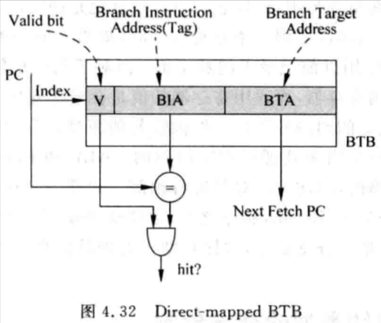

# 4.3 - 分支指令的目標位址預測

- 分支指令的目標位址可以分為兩種：
    - **直接跳轉 (direct)：**
        - 對於直接跳轉指令 (e.g. RISC-V 的 `beq`、`jal`、`lui` 指令)，它的跳轉 offset 是以 immediate value 的方式 encode 在 opcode 中 (有可能是 PC-relative，也有可能不是)，所以它的目標位址是固定的，只要記錄這條分支指令目標位址即可
        - 當再次遇到這條分支指令時，如果分支預測結果是 taken，那麼目標位址就可以直接使用先前所記錄的值
    - **間接跳轉 (indirect)：**
        - 對於間接跳轉指令 (e.g. RISC-V 的 `jalr` 指令)，由於它的目標位址來自於暫存器，而暫存器的值是有可能一直變化的，所以對間接跳轉指令來說，要預測目標位址並不是一件容易的事情
        - 然而慶幸的是，程式中大部份的間接跳轉指令都是用來呼叫函式的，也就是 call 和 return；這種目標位址是有規律的，因此可以對其進行預測

## 4.3.1 - 直接跳轉類型的分支預測

- 對於直接跳轉類型的分支指令 (假設是 PC-relative)，其目標位址有兩種情況：
    1. 當分支指令 not taken 時：
        - 目標位址 =  當前分支指令的 PC 值 + sizeof(fetch group)
            - e.g. PC + 4
    2. 當分支指令 taken 時：
        - 目標位址 = 當前分支指令的 PC 值 + signed extended offset
- e.g. PC + offset
- 由於直接跳轉的分支指令，其跳轉的 offset 以 immediate value 的方式 encode 在 opcode 中的，所以 offset 是不會發生變化的，因此對於此類型的指令進行分支預測是很容易的
    - 只需使用一個表格，記錄下每條分支指令的目標位址即可；當一條分支指令執行且預測為 taken 時，直接查詢該表格即可得知該分支指令的目標位址
- 此表格也就是所謂的 `BTB (Branch Target Buffer)`，本質上就是一種 cache，使用 PC 值的一部分作為 index，PC 值的另外一部份作為 tag (i.e. partial-tag)

    

    - BTB 中存放多條的 `BTA (Branch Target Address)`
    - 因為 index 部份相同的分支指令會 index BTB 中同一條 BTA，因此還需要使用 tag 來判斷是否 hit 或 miss
    - 同樣的，由於 BTB 大小有限，當發生 conflict 時，就需要將原本的 BTA 給 evict 出去，然後將新的 BTA 寫入 BTB
- BTB 也可以採用 set-associative 的設計，當有多條 index 相同的分支指令時，可以將它們的 BTA 寫到不同的 ways 中

    

- Set-associative 的 BTB 會增加硬體設計的複雜度，使 BTB 的佔用的硬體面積變大，同時降低了 BTB 的訪問速度，因此現實的處理器中，BTB 的 way 數通常都會比較小
- 除了使用 PC 值的一部分作為 partial-tag，也可以採用其他的方法 (如：XOR) 來 encode tag，降低 tag 的 bits 數：

    

    - 此方法將 28 bits 的 PC 值，每相鄰的 4 個 bits 做 XOR，最後得到 14 bits 的 tag 值
- 一般情況下，為了最大限度的利用 BTB 有限的空間，只會將發生 taken 的分支指令的目標位址存入 BTB 中；對於 not taken 的分支指令，其目標位址就是下一條指令的位址，因此不需要特別做處理
- 當一條分支指令發生 BTB miss 或是 BTB conflict 時，可以採用以下兩種方式來處理：
    1. 停止執行：
        - 當發生 BTB miss 或是 BTB conflict 時，暫停 instruction fetch (i.e. 產生 bubbles，也就是 pipeline stall)，直到這條分支指令的目標位址被算出來為止

            

            - 在 Cycle *i* (fetch stage) 的時候發現分支指令的 PC，但在 BTB 中找不到對應的 BTA，發生 BTB miss，那麼就得暫停後續的 instruction fetch，直到分支指令從 I-Cache 中讀取出來並 decode (Cycle *i + 2*)，因此會引入兩個 bubbles，在 Cycle *i + 3* 才可以再根據預測目標位址 fetch 下一道指令
                - 如果對 I-Cache 的訪問需要比較多的 cycles，就會引入更多的 bubbles
            - 對於直接跳轉的分支指令，其目標位址可以在 decode stage 就得知其跳轉的 offset，此時就可以將目標位址給計算出來：

                

    2. 繼續執行：
        - 發生 BTB miss 的時候，不將 pipeline 給停下來，而是直接繼續使用下一道指令的位址來 fetch instruction (e.g. PC + 4)
        - 當最後分支指令的目標位址計算出來後，如果發現目標位址跟下一道的指令位址不同，則將所有分支指令之後的指令都從 pipeline 中給 flush 掉，並重新使用計算出來後的目標位址來 fetch instruction
        - 由於分支指令也有可能是 not taken，所以直接繼續使用下一道指令的位址來 fetch instruction，而不停下 pipeline，也是有可能是正確的
        - 但從功耗的觀點來看，這樣做是更浪費功耗的，所以如果是採用此方法，對於功耗比較敏感的設計並不是一個好的選擇

## 4.3.2 - 間接跳轉類型的分支預測

- 對於間接跳轉的分支指令來說，其目標位址是存在暫存器中的，且是經常變化的，所以無法透過 BTB 的方式來對目標位址進行準確的預測
- 所幸的是，大部分的間接跳轉的分支指令都是用來呼叫函式的，也就是 call 和 return；這種目標位址是有規律的，因此可以對其進行預測
1. Call 和 return 指令的分支預測：
    - 對於程式中一條 call 指令，其每次呼叫的函式都是固定的，也代表其目標位址都是固定的，因此可以透過 BTB 來對 call 指令來進行預測：

        

    - 但對於 return 指令而言，有可能會 return 到不同的目標位址
        - E.g. `printf()` 被不同的函式呼叫

        

    - 根據 return 指令的特點，可以設計一個暫存器，保存最近執行的 call 指令的下一條指令的位址；這個暫存器是 LIFO 的，也就符合函式呼叫和返回的特點
        - 這個暫存器的工作原理和 stack 是一樣的，稱為：`RAS (Return Address Stack)`

            

    - 綜合起來，可以使用 **BTB** 對 **call 指令**進行預測，而使用 **RAS** 對 **return 指令**進行預測：

        

        - 要使 RAS 能夠正確工作，需要符合下面兩個條件：
            1. 當遇到 call 指令時，需要能夠將 call 指令的 return address 寫進 RAS，而這需要識別出哪條指令是 call 指令
                - 正常狀態下，只有到了 pipeline 的 decode stage 才能得知指令是否為 call 指令
                - 但是現代處理器都需要好幾個 cycles 才能從 I-Cache 中取得指令，因此當指令達到 pipeline 的 decode stage 時，在這條指令後面已經有很多條指令進到 pipeline 內了，如果當中包含 return 指令 (e.g. 假設函式很短)，那麼這個 return 指令將無法從 RAS 中取得正確的 return address，造成分支預測失敗，降低處理器的執行效率
                - 如果能在分支預測階段 (e.g. [fetch stage](../superscalar-overview-ch4-part1/#41---概述)) 就可以得知一條指令是否為 call 指令，也就是透過 PC 值就可以知道是否為 call 指令，那麼就可以即時將 call 指令的 return address 寫進 RAS；即使 call 指令後面馬上接著一條 return 指令，這條 return 指令也可以透過 RAS 來預測正確的目標位址
                - 要實現這個功能依舊需要借助 BTB，BTB 中保存了所有發生跳轉的指令，且 call 和 return 指令總是會跳轉的，因此它們都會被保存在 BTB 中
                    - 需要在 BTB 中新增一個欄位，用來標記分支指令的類型

                        

                    - 而後只需要透過查詢 BTB，就可以得知這條分支指令是否為一個 call / return 指令了
            2. 當預測 return 指令的目標位址時，需要能夠選擇 RAS 中的輸出作為目標位址，而不是選擇 BTB 的輸出值，因此仍需要在分支指令預測階段 (e.g. fetch stage) 就知道指令的類型
                - 使用 1. 的方法，透過 BTB 中新增的指令類型欄位，得知該分支指令是否是一個 recall 指令
    - 但如果一個 recursive 函式有很多層，導致 RAS 的空間不夠存放所有 retrun 指令的目標位址時，要如何處理?

        

        - 當 call SHR 的時候，RAS 已經沒有空間可以存放其 return address 了：

            

    - 有兩種方法可以處理這種情況：
        1. 不對 call 指令進行處理：
            - 不修改 RAS，新的 call 指令的 return address 會被直接拋棄，這樣在下一次執行 return 指令時，就一定會發生 mis-prediction
            - 除此之外，這樣的作法還要求 RAS 的 pointer 不能改變，否則後續的 return 指令都無法對應到自己的目標位址
            - 顯然這是一個**較差**的作法
        2. 繼續按照順序將 call 指令的 return address 寫入 RAS，最舊的 return address 會從 RAS 中被 evicted：

            

            - 這樣的方式，當要執行被 evicted 的 return address 對應的 return 指令時，勢必一定會發生 mis-prediction，但這樣的方式比 1. 要來得好的原因在其存在一定的正確性：

                

                - 針對這樣的 recursive function，其實寫入到 RAS 和被 evicted 的 return address 都是同樣的：

                    

                - 這樣即使較舊的 return address 被 evicted，RAS 還是有可能給出正確的 return address
                    - P.S. 這邊假設 RAS 應該是一個 circular buffer
            - 不過像這樣 RAS 都被同一個 call 指令的 return address 所佔用，是非常浪費空間的；對於連續執行的同一條 call 指令來說，其 return address 可以只保留一份，並透過新增一個 counter 來標記 call 指令被執行的次數
                - E.g. 使用一個 8 bits counter，就可以紀錄到最多 256 次的 recursive call 了
            - RAS 的 pointer 只有在執行 return 指令，counter 值減 1 後為 0 時，才會將 RAS 的 pointer 指向下一個 return address
2. 其他預測方法：
    - 對於其他 call 和 return 指令以外的間接跳轉類型的分支指令，雖然其目標位址理論上可以有很多種可能性，不過實際上只會有幾個固定的位址而已，例如：

        ```c
        switch (a) {
            case 1: /* Jump to address 1 */
            case 2: /* Jump to address 2 */
            case 3: /* Jump to address 3 */
            ...
            case 9: /* Jump to address 9 */
        }
        ```

        - 以這個例子為例，目標位址最多就 9 種而已 (address 1 ~ address 9)，也就有機會預測其目標位址
    - 對於間接跳轉類型的分支指令，其目標位址也可能是和過去的執行情況有關，因此可以利用基於局部歷史預測的分支預測方法中的 BHR 對目標位址進行預測：

        

        - 跟之前 `2-bit saturating counter` 分支預測方法唯一的差別在於將 PHT 換成了 `Target Cache`
- 總結：
    - 使用 **BTB** 對**直接跳轉類型的分支指令**，和 **call 指令**進行預測
    - 使用 **RAS** 對 **return 指令**進行預測
    - 使用 **BHR** + **Target Cache** 對**其他間接跳轉類型的分支指令**進行預測
- 尤其是 **BTB** 和 **RAS**，幾乎是現代 superscalar CPU 必備的元件

## 4.3.3 - 小結

- 預測分支指令的**方向**：使用 **BHR (多個 BHRs 組成 BHT)**、**GHR** 和 **PHT** (`2-bit saturating counter`)
- 預測分支指令的**目標位址**：使用 **BTB**、**RAS** 和 **BHR** + **Target Cache**
- 綜合到目前為止，完整的分支預測方法如下：

    

- 在 superscalar CPU 中，有很多階段都可以得到分支指令的結果，例如：
    - **Fetch stage** 可以得到直接跳轉分支指令的結果
    - **Execution stage** 可以得到間接跳轉分支指令的結果
- 在得到分支指令結果後，就可以跟分支預測是否正確做檢查，如果發生 mis-prediction，就需要將在這條分支指令之後 fetch 進 pipeline 的指令都給 flush 掉，也就會造成多個 bubbles，降低處理器的性能，i.e. mis-prediction penalty
- 此外，這些要被 flushed 的指令有可能已經更改了 pipeline 中的元件的內容 (e.g. register renaming 的 mapping table 被更新)，因此需要一個機制來恢復被 mis-prediction 更改的內容

# 4.4 - 分支預測失敗時的恢復

- 在 pipeline 中，有很多 stages 可以對分支預測**是否正確**進行檢查：
    - Decode stage：
        - 可以得到一個 PC 值對應的指令是否為分支指令，以及這條分支指令的類型
        - 如果是直接跳轉 (direct) 類型的指令，還可以在這個階段得到其目標位址
            - 例如：RISC-V 的 `jal` 指令，在 decode stage 就可以由 offset 得知其目標位址，如果這條指令是預測 not taken，那就代表發生 mis-prediction
        - 在 decode stage 發現預測失敗的 mis-prediction penalty 最小，可以馬上進行恢復
        - 然而，由於間接跳轉 (indirect) 類型指令的目標位址是存在暫存器中，在 decode stage 仍無法得知其目標位址，因此如果發生 mis-prediction，CPU 也沒辦法在這個 stage 取得下一個 fetch 指令的位址
            - **只能暫停 instruction fetch**
    - 讀取暫存器的 stage (有可能是在 register renaming stage 之後，也有可能在 issue stage 之後，取決於 CPU 的設計)：
        - 如果此時讀到了暫存器的值，那麼就可以對間接跳轉的分支指令的目標位址進行檢查，如果發現目標位址預測錯誤，那麼就可以用正確的目標位址來 fetch instruction
            - 此時仍需在將該分支指令之後進入到 pipeline stage 的指令給 flushed 掉
                - 但這並不容易實現，因為這些指令有可能已經進到 Issue queue 中了；Issue queue 中也包含了分支指令之前的指令，這些指令不應該被 flushed，因此需要**有條件的 flush 在 Issue queue 中的指令**
    - Execution stage：
        - 不管是什麼類型的分支指令都可以在這個 execution stage 取得其正確的目標位址，可以對分支指令是否正確 (包含方向和目標位址) 進行檢查
        - 但此時發生 mis-prediction 的 penalty 也是最大的
        - 當發生 mis-prediction 時，所有在此分支指令之後的指令都要被 flushed 掉
            - 然而，針對 out-of-order CPU，在此分支指令之前的指令，有可能在 execution stage，也有可能還在 Issue queue 中，這些指令不應該被 flushed
        - 指令之間的順序是被記錄在 **ROB (Re-Order Buffer)** 中的，因此可以透過 ROB 來恢復發生 mis-prediction 時 CPU 的狀態
        - 當發生 mis-prediction 時，將此訊息記錄在此分支指令對應的 ROB entry 中，並**暫停 instruction fetch**；**當這條分支指令在 pipeline 中變成最老的指令時，就代表在 pipeline 中，剩餘的指令都比這條分支指令還新，可以直接將整個 pipeline stage 中的指令都 flush 掉，並從正確的目標位址 fetch instruction**

            

            - 缺點：
                - 需要分支指令在 pipeline 中一定時間後才能進行處理
                - 如果在此分支指令之前有一道 D-cache miss 的 load 指令，這個等待的時間就會變得非常長，i.e. mis-prediction 的 penalty 很大，降低了處理器的性能
                    - 這段時間內都沒辦法 fetch 新的指令來執行
            - 優點：
                - 這種方法容易實現，是在硬體複雜度和執行效率之間一個比較折衷的方案
- 除了基於 ROB 的方法來恢復 mis-prediction 的狀態，現在很多處理器都採用了基於 **Checkpoint** 的方法來恢復 mis-prediction 的狀態
    - 在分支指令之後的指令更改 CPU 的狀態前，先將 CPU 的狀態保存下來，包含：
        - Register renaming 的 mapping table
        - 預測 taken 的分支指令其對應的下一條指令的 PC… etc
- 通常在分支指令進入到 register renaming stage 時，就需要保存 CPU 的狀態
- 相比於使用 ROB 的方式，使用 Checkpoint 的方式需要消耗更多的硬體資源，但是這種方式可以快速地將 CPU 的狀態給恢復，並馬上從正確的 PC 值開始 fetch instruction，因此執行效率更高
- 當發生 mis-prediction 時，只有在該分支指令之後的指令才能被 flushed，在分支指令之前的指令要保留下來，因此需要一個機制來正確地識別哪些指令處在 mis-prediction 的路徑上
    - 可以透過對每一條分支指令都分配一個編號，所有在分支指令之後的指令都會給予同一個編號，直到碰到下一個分支指令為止；該編號會被記錄在 ROB entry 中

        

        - 當發生 mis-prediction 時，就可以利用分支指令所分配到的編號，將所有在該分支指令之後的指令都 flushed 掉，而不需要等到分支指令變成 pipeline 中最老的指令
- 分支指令的編號個數決定了最多可以存在 pipeline 中分支指令的個數
    - 例如：假設一 CPU 支援最多 128 條指令在流水線中，假設每 5 條指令就有 1 個分支指令，最多會有 128 / 5 = 26 條分支指令存在 pipeline 中，也就是說需要 26 個編號，因此需要 5 個 bits (2^5 = 32) 來存放編號
- 這些編號值會被保存在一個 FIFO (**tag list**) 中，一旦這個 FIFO 滿了，就沒辦法再向 pipeline 中送入分支指令
    - 當 tag list 滿時，如果又 decode 出一條分支指令，就得暫停 decode stage 之前的 pipeline，直到 tag list 有空間為止
    - Tag list 中的 entries 是 in-order 的
- 其中一個設計方法：

    

    - Free tag list：用來存放還沒有被分配的編號
    - Tag list：用來存放已經被分配的編號
    - 在 decode stage 解析出一條新的分支指令時，就從 free tag list 中取得一個編號，指定給該分支指令，並編號加入 tag list 中
    - 當發生 mis-prediction 時，就可以透過這個編號來識別所有在分支指令後面的指令，並從 pipeline 中給 flushed，最後再將這些編號加回 free tag list 中
- 對於 superscalar CPU 而言，當一條分支指令發生 mis-prediction 時並需將在其之後的指令都從 pipeline 中給 flush 掉，實際上包含了以下兩個部份：
    - 在 issue stage 前的指令：
        - 在 issue stage 前，指令都還是 in-order 的，因此當在 issue stage 中發現一條 mis-prediction 的分支指令時，只需將直接將在 issue stage 前的指令給 flush 掉即可
            - 可以在 1 個 cycle 內完成
    - 在 issue stage 及 issue stage 之後的指令：
        - 從 issue stage 開始，指令就是 out-of-order 了，一部分的指令可能是在 mis-prediction 的路徑上的，因此需要透過上述的 tag list 的方式，找出在 mis-prediction 分支指令之後的指令並從 pipeline 中給 flush 掉
            - 在 1 個 cycle 內無法完成
        - Flush ROB 中的指令：
            - ROB 中有每個指令的編號，因此可以透過 tag list 找出 mis-prediction 分支指令之後所有指令的編號，並透過 broadcast 的方式通知 ROB，並將對應的 ROB entry 給 invalidate：

                

                - 這無法在 1 個 cycle 內完成，因為如果想要在 1 個 cycle 內比較所有的 ROB entries (最慘的情況下)，會需要非常大的硬體面積和增加 latency
        - Flush Issue queue 中的指令：
            - 可以採用類似 ROB 的方式，將 Issue queue 中相關的指令給 flush 掉
        - Flush issue stage 之後的指令：
            - 可以採用類似 ROB 的方式，將 issue stage 之後的指令給 flush 掉
        - 其實並不一定要在 1 個 cycle 內將相關指令給 flushed 掉，因為在 execution stage 發現 mis-prediction 後並開始從正確的位址開始 fetch instructions，這些新指令需要經過好幾個 stages 才會進到 dispatch stage (到了 dispatch stage 才需要使用到 ROB 和 Issue queue)，因此只要在這些新的指令進到 dispatch stage 前來得及將相關的指令給 flush 掉即可，就不需要 stall pipeline 了
        - 因此，一個折衷的方式就是每個 cycle 只從 tag list 中 broadcast 一個或幾個編號，這樣當編號個數不是很多時 (大部分情況是如此)，使用幾個 cycles 就可以將相關的指令給 flush 掉，也就不用 stall pipeline
        - 只有在少數的情況下，當編號個數很多時，才需要花費多個 cycles 來 flush 相關的指令
            - 新的指令在進入 issue stage 前，必須等待所有在 mis-prediction 路徑上的指令都被 flushed 並恢復 CPU 狀態後，才可以進入 issue stage
- 在把 pipeline 中相關的指令給 flush 掉後，就可以使用 Checkpoint 的方式回覆 CPU 的狀態
    - 主要是將 register renaming 的 mapping table 給恢復
- 什麼時候對分支指令分配一個編號呢?
    - Fetch stage：
        - Fetch stage 只有 PC 值，對於一個指令是否為分支指令只能用推測的方式，因此此時分配編號並不合適
    - Decode stage：
        - 只有在 decode stage 才可以真正判斷一條指令是否為分支指令，此時就可以對分支指令分配一個編號
- 由於 superscalar 一個 cycle 內會解析多個分支指令，因此最差的情況就是 N-ways 的 CPU，會有 N 條分支指令，也就代表 free tag list 和 tag list 都需要在一個 cycle 內提供 N 個編號，也就需要使用 multi-port FIFO 的設計，對硬體面積和功耗會有所影響
    - 實際上，絕大部分情況下，每個 cycle decode 的指令最多只會有一、兩條分支指令，如果使用 multi-port FIFO 的設計，大部分的 ports 都會是閒置狀態的，因此實際上並不會採用 multi-port FIFO 的設計
    - 一種折衷的作法是限制每個 cycle 最多只能處理一條分支指令
        - 如果在 decode stage 讀出來的 N 條指令中，有超過一條的分支指令，那麼只會從 free tag list 拿出一個編號，第二條以後的分支指令都必須 stall 到下一個 cycle 才能被處理
        - 對大部分的程式來說分支指令都並不密集，因此這種方法不會對性能造成太大的負面影響
- 在 execution stage 檢查分支指令預測正確性時，要如何得知該分支指令之前所預測的值?
    - 可以將每條分支指令的預測值，存在 `PTAB (Prediction Target Address Buffer)` 中，且此分支指令在 PTAB 的 index 會隨著分支指令在 pipeline 中流動，等到分支指令進入 execution stage 時就可以用來跟實際的跳轉結果做比較
        - 在實際的處理器中，可以優化為**只存預測為 taken 的分支指令**預測值即可

        

    - 分支指令預測值與實際的結果有以下的可能性：
        - 實際結果為 **not taken**，並在 PTAB 中沒有找到對應的內容 (i.e. **not taken**) ⇒ 預測正確
        - 實際結果為 **not taken**，但在 PTAB 中有找到對應的內容 (i.e. **taken**) ⇒ 預測錯誤，需要使用 **Next PC** 來作為正確的目標位址
        - 實際結果為 **taken**，但在 PTAB 中沒有找到對應的內容 (i.e. **not taken**) ⇒ 預測錯誤，需要使用**實際的目標位址**
        - 實際結果為 **taken**，但在 PTAB 中有找到對應的內容 (i.e. **taken**) ⇒ 預測方向正確，但此時仍需要比較 predict address 是否與實際的目標位址相符：
            - 相符：預測正確
            - 不相符：需使用**實際的目標位址**
    - 寫 PTAB 的過程可以在 **fetch stage** 完成，只要在 [fetch stage 預測到](../superscalar-overview-ch4-part1/#41---概述)一條發生跳轉的分支指令，就可以將其寫進 PTAB 中

# 4.5 - 超標量處理器的分支預測

- 對於 superscalar CPU，在 fetch stage 給一個 PC 值，可以透過 I-Cache 同時取出多條的指令並組成 fetch group，CPU 亦會根據 fetch group 中的指令個數，調整下一個 cycle instruction fetch 的位址，因此 superscalar CPU 的 instruction fetch PC 值並不會是連續的，且每次送到 I-Cache 的 fetch address 也只會是 fetch group 中第一條指令的位址而已
    - 因此，如果只是根據第一條指令的位址做分支預測是不夠的
- 如果對 instruction fetch 的位址進行限制，例如針對一個 4-way issue 的 CPU，每個 cycle fetch 的 instructions 都是 4-word aligned (共 4 條指令) 的，那麼就可以使用 fetch group 中所有指令共同的部份：`PC[31:4]` 來做 branch predict；對於 branch predictor 而言，它也只需要記下每個 4-word aligned 的指令中，第一條預測跳轉分支指令資訊即可
    - 在大多數的情況下，4-word aligned 的指令只會有一條分支指令
    - 不過仍需在 BTB 中記錄下該分支指令在這 4 條指令中的 index：

        

        - 此範例中，分支指令的 index 在這四條指令的 index 為 `01`，但此 cycle 的 instruction fetch 的 PC 值在 `10`，因此在進行分支預測時，由於分支指令並不在 instruction fetch 的範圍內，因此不會使用其預測值
    - 如果這 4-word aligned 的指令中，包含超過一條分支指令，那麼這些分支指令就會忽相干擾，影響分支預測的準確度，不過在大部分的程式中，分支指令出現的頻率並不會這麼高
- 但實際上，每個 cycle fetch 的 instructions 是可以不侷限於 N-word aligned 的 (參考：[2.4 - 超標量處理器的取指令](../superscalar-overview-ch2/#24---超標量處理器的取指令))
    - 如一個 4-way issue 的 superscalar CPU，其每個 cycle fetch 的 instructions 是可以不侷限於 4-word aligned 的範圍內的，那麼要達到最理想的結果，就需要對一個 cycle 內 fetch group 內的指令都進行分支預測，如果當中存在 taken 的分支指令，那麼變需要並將第一個預測為 taken 的分支指令目標位址作為下一個 cycle 的 PC 值
    - 實務上，要在一個 cycle 對 fetch group 內的指令都進行分支預測是不可接受的，因為這代表需要 BTB 支援 multi-port (參考：[2.3.1 - True Multi-port](../superscalar-overview-ch2/#231---true-multi-port))，才能在一個 cycle 內同時讀出多條指令的目標位址；即使採用 interleaving (參考：[2.3.3 - Multi-banking](../superscalar-overview-ch2/#233---multi-banking) ) 的方式來避免使用 multi-port，但考慮到在使用過程中，最多只會使用一個 port 的值 (i.e. 第一個預測為 taken 的分支指令)，所以這種方式對硬體使用效率是非常低的
- 如果可以在分支指令的方向預測完畢後，再進行目標位址的預測，就可以避免 multi-port BTB 使用的需求
    - 但是這樣變成分支方向和目標位址的預測是 serialized 的，有可能就沒辦法在一個 cycle 內完成，也就無法”連續地”預測每個 cycle 的 instruction fetch 的位址
- 不過大部分的分支指令都是直接跳轉類型的，其分支指令的目標位址是可以很快地被計算出來；對於此類的指令，其實並不需要進行目標位址的預測，而是直接在 instruction fetch 的階段，就馬上進行目標位址的計算
    - 雖然不一定能在一個 cycle 內完成分支預測 (還有分支方向需預測)，但不一定會比 serialized 的方式來得慢，而且還可以取得分支指令正確的目標位址
    - 要實現此功能，必須在指令進入 I-Cache 之前，就先進行 pre-decode，並馬上識別出分支指令，從而進行快速的分支位址的計算
    - 但對於間接跳轉類型的指令 (除了 return 指令外)，就無法採用此方式了
- 對於 superscalar CPU，由於需要一個 cycle 內對多條指令進行方向預測，從而找到第一條 taken 的分支指令：
    - 基於局部歷史的分支預測：
        - 需要 PHT 和 BHT 都支援 multi-port，可以透過 interleaving 的方式來避免 multi-port 的設計 (參考：[2.3.3 - Multi-banking](../superscalar-overview-ch2/#233---multi-banking) )
            - 例如將 PHT 改成 interleaving：

                

                - `Addr[1:0]` 用來作為 multi-bank 的 index
                - `Addr[6:2]` 用來作為 bank 中 (sub-)PHT 的 index
    - 基於全局歷史的分支預測：
        - 並無法簡單地將 PHT 改成 multi-port 即可，因為多條指令對應的 GHT 有可能是不同的，需要進行特殊的處理
- Interleaving 在 superscalar CPU 中是經常被使用的，大部分需要 multi-port 設計的元件，如 ROB、Issue Queue、Instruction Buffer… etc，都可以採用 interleaving 的方式來設計
