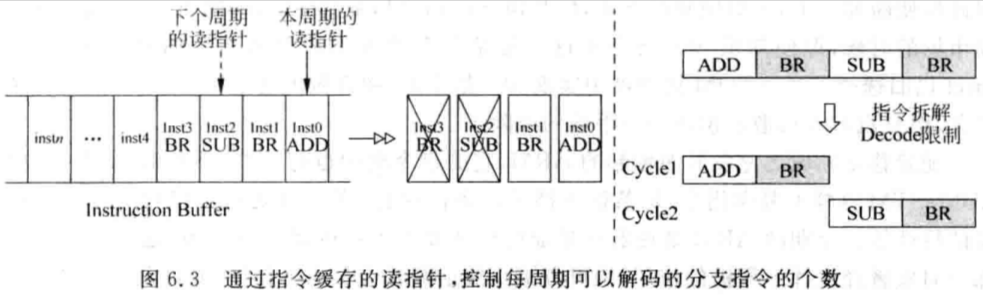

- 在 pipeline 中，decode stage 的任務是將指令中的資訊提取出來，CPU 使用這些資訊控制後續的 pipeline 來執行這條指令
- 影響 decode 的複雜度因素有：
    - 指令集的複雜度：
        - CISC vs. RISC
    - 每個 cycle 可以 decode 的指令個數：
        - 每個 cycle 可以 decode *N* 條指令，那就需要 *N* 個 decode 電路

# 6.1 - 指令緩存

- 現代處理器可以在 fetch stage 從 I-Cache 讀出大於每個 cycle 可以 decode 指令個數的指令，因此需要在 fetch stage 和 decode stage 之間加一個 buffer，用來將 I-Cache 讀出的所有指令保存起來，這個 buffer 就稱為 `Instruction Buffer`
- Fetch stage 最終會輸出兩個主要的內容給 Instruction Buffer：
    - 從 I-Cache 讀出的 *N* 條指令 (並非所有指令都是有效的)
    - 有效的指令個數
        - 1 instruction fetch 位址不是 cache aligned 時，或是 fetch group 中包含預測為 taken 的指令，會導致 fetch stage 沒辦法寫入 *N* 條指令進 Instruction Buffer
        - 此時需要告知 Instruction Buffer，有效的指令個數
- 現在 superscalar CPU 需要 Instruction Buffer 的原因：
    - Superscalar CPU 可以每個 cycle 可以 fetch 的指令個數大於每個 cycle 可以 decode 的指令個數，這樣即使在發生 I-Cache miss 時，Instruction Buffer 中仍有可能還有保存尚未 decode 的指令，因此不需要 stall pipeline，可以繼續 decode 指令，增加 CPU 的性能
    - Superscalar CPU 中即使每個 cycle 可以 decode 的指令個數與每個 cycle 所 fetch 的指令個數相等，在 decode stage 仍會有一些特殊的指令需要處理，導致在 fetch stage 所 fetch 的指令沒有辦法全部被 decode
        - 如 ARM 的 multiply-accumulate 指令 (`UMAAL RdLo, RdHi, Rn, Rm`)，會有兩個 destination registers，為了減少對 register renaming 的影響，會將其拆分成兩條普通的指令，每條指令只有一個 destination register
        - 因此，如果在 decode stage 沒有特別的處理，會導致 decode 的指令個數大於 fetch 指令的個數，但後續的 pipeline 都是依照原先的指令個數來設計的，不可能因為這些不常見的指令而增加後續 pipeline 的處理能力 (因為會增加硬體面積，且使用率也不高)
        - 為了解決此問題，就需要加入 Instruction Buffer，讓 multiply-accumulate 後面的指令，可以等到下一個 cycle 再 decode
- 由於 Instruction Buffer 可以在一個 cycle 內寫入多條的指令，也可以讀出多條的指令，因此也是一個 multi-port 的 FIFIO；但在實際設計上，並不會使用真的 multi-port 的 SRAM 來實現這樣的 FIFO，而是會採用 interleaving 的方式 (參考：[2.3.1 - True Multi-port](../superscalar-overview-ch2/#231---true-multi-port))，使用多個 single-port 的 SRAM 來實現，從而避免使用 multi-port SRAM 所導致的硬體速度上的限制

# 6.2 - 一般情況

- ARM 的 CPSR，只有 4 個 bits (N、C、Z、V)，但其他的暫存器都是 32 bits 的；如果將 CPSR 跟其他的暫存器統一對待，會造成很多暫存器無法有效的被利用，因為 32 bits 的暫存器，只存了 4 bits 的資料
    - 因此，一般都是將 CPSR 單獨處理，對 CPSR 單獨使用一套 register renaming 的流程，這樣就可以根據 CPSR 的特性來訂製 register renaming 的流程
    - 且考慮到條件執行的指令只是少部份，所以所使用的 register file 可以很小，例如只需只用 16 個 physical registers 就足夠了
    - 指令所攜帶的 source registers 和 destination registers 的個數直接決定了 register renaming 電路在實現上的難易度：
        - 像是 register renaming mapping tables 的 ports 數、指令間相關性檢查電路的複雜度
    - 由於 RISC 架構的指令比較整齊劃一，很容易解析出指令中的 opcode 和 operands，在 decode stage 產生的 pipeline 控制訊號也比較少，因此 RISC 架構的 instruction decoding 通常都可以在 1 個 cycle 完成
    - 一般情況下，RISC 處理器在 decode stage 完成的任務可以概括為：
        - What type：例如指令是算術指令還是分支指令
        - What operation：例如當指令是算術指令時，是進行什麼運算；是分支指令時，它的跳轉條件是什麼樣的
        - What resource：例如對算術指令時來說，其 source 和 destination registers 是哪些，有沒有 immediate value

# 6.3 - 特殊情況

- 即使在 RISC 指令集中，也存在一些特殊的指令；這些指令不能按照一般的方法處理
    - 例如：ARM 的 `LDM` / `STM` 指令，需要多個 cycles 才能完成；而且它們的 source 和 destination registers 有多個，如果在 superscalar CPU 中對它們跟普通指令一樣來處理的話，會需要增加 register renaming mapping table、issue queue 和 ROB 所需的 ports 數，增加硬體的面積，並降低處理效能
- 因此在 superscalar CPU 中，並不會直接處理 `LDM` / `STM` 這樣的指令，而是會將其轉換為多條普通的指令 (`µops`)，每條普通的指令就是一般的 load / store 指令，這樣就可以用普通指令的方式來處理

## 6.3.1 - 分支指令的處理

- 先前提到，採用 checkpoint 的方式對 mis-prediction 的分支指令恢復 CPU 的狀態，為了減少分支指令編號分配電路的複雜度，需要限制每個 cycle 能 decode 的分支指令個數，例如每個 cycle 只能 decode 一條分支指令 (參考：[4.4 - 分支預測失敗時的恢復](../superscalar-overview-ch4-part2/#44---分支預測失敗時的恢復))
- 但是，每個 cycle 從 Instruction Buffer 讀取的指令中，有可能存在多條的分支指令，需要在 decode stage 做特別的處理
    - 簡單的作法：
        - 遇到分支指令時，就不在同個 cycle decode 這條分支指令後面的指令，而是將它們 stall 到下個 cycle
        - 這個功能只需更新 Instruction Buffer 的 pointer 即可實現

        

        - 原本從 Instruction Buffer 中讀取指令：`ADD` → `BR` → `SUB` → `BR`
        - *Cycle 1* 只 decode `ADD` 和 `BR`，Instruction Buffer pointer + 2
        - `SUB` 和 `BR` stall 到 *Cycle 2* 才被 decoded，Instruction Buffer pointer + 2
    - 限制每個 cycle 最多只能 decode 一條分支指令，降低了分支指令編號分配電路的複雜度
        - 雖然效能會下降一點，但是比較容易實現，是一種折衷的方法
    - P.S. 採用 ROB 來恢復發生 mis-prediction 時 CPU 的狀態，就不再需要分支指令編號分配電路了，因此也不用限制每個 cycle 最多只能 decode 一條分支指令
- 在 decode stage 還有另外一項重要的任務，就是位分支預測是否正確進行初步的檢查
    - 越早發現 mis-prediction，penalty 越小
    - 對於直接跳轉類型的指令，由於在 decode stage 就可以計算出其要跳轉的位址，因此可以在 decode stage 對這些分支指令的目標位址是否預測正確進行檢查
        - 如果發現 mis-prediction，可以直接使用正確的位址來 fetch instruction
- 分支指令在 decode stage 是無法得到實際跳轉的方向的 (除了如：`jmp` 這種 unconditional branch 的指令)，因此在 decode stage 無法對分支預測的方向進行檢查，需要等到後續的 pipeline stage 階段才能完成

## 6.3.2 - 乘累加/乘法指令的處理

- 乘法和乘累加指令在 MIPS 架構中是一種特殊的指令；指令中包含兩個 destination registers (`Hi register`、`Low register`)
    - 這兩個暫存器並不屬於通用暫存器，因此需要特別處理
- 在 superscalar CPU 中，需要對每條指令都進行 register renaming：
    - 將指令的 source registers 變為對應的 physical registers
    - 並為 destination register 分配一個 physical register
- 大部分的指令都只有一個 destination register，但這種指令確有兩個 destination registers；此外，如果直接將此乘累加/乘法指令直接加進 ROB 中，則 ROB 也需要能夠存放兩個 destination registers，增加了 ROB 的面積，但這些增加的部份大部分都是沒有被使用的，造成了資源的浪費
- 可以採用下列的兩種方式來處理：
    1. 將 `Hi register`、`Low register` 分配為 MIPS CPU 的第 33、34 個通用暫存器，這種分配過程只在 CPU 內部進行，register renaming mapping table 也同樣要支援新的通用暫存器
    2. 將乘法/乘累加指令拆成兩條指令：
        - 乘法指令：`{Hi, Lo} = Rs x Rt`
            - 可以拆解為如下的兩條指令：
                - `Hi = Rs x Rt`
                - `Lo = Rs x Rt`
            - 這兩條指令經過 register renaming 並寫進 ROB 中時，會佔用兩個 ROB entries
            - 實際上，這兩條指令只使用一個乘法器就足夠了，只要這個乘法操作在 pipeline 的 execution stage 計算完畢，這兩條指令就同時完成了
        - 乘累加指令：`{Hi, Lo} = {Hi, Lo} + Rs x Rt`
            - 需要讀取四個 source registers (`Rs`, `Rt`, `Hi`, `Lo`)，同時也有兩個 destination registers (`Hi`, `Lo`)，正好是兩倍的普通指令，則可以將乘累加指令拆分成兩條普通指令：
                - `Lo = {Hi, Lo}`
                - `Hi = Rs x Rt`
            - 在 CPU 內部，乘累加指令仍然是以一個完整的指令來完成運算，因此指令的拆分只是更有利於 register renaming，以及便於在 ROB 中的存放，每條被拆分的指令並不是單獨進行運算的
- 此外，也需要對 **issue queue** 做特殊的處理，將乘法指令和乘累加指令使用一個 **FU (Function Unit)**，這個 FU 的 issue queue 和其他的有所不同，它包含了四個 source registers、兩個 destination registers
- 在 decode stage 拆分的兩條指令，經過 register renaming 後，就要寫入 ROB 和 issue queue 中 (i.e. Dispatch)，此時：
    - 寫進 ROB 中依舊是以**兩條指令**的方式寫入，佔據 ROB 兩個 entries
    - 寫進 issue queue 時則是將兩條指令進行**融合 (fusion)**，這兩條指令在 issue queue 中又變為了**一條完整的乘累加或乘法指令**，這樣就能夠保證 FU 在執行時，能夠執行一個完整的乘累加或乘法指令
- 在 *N-way* 的 superscalar CPU 中，每個 cycle 可以 decode 和 register rename *N* 條指令，但如果 decode 的 *N* 條指令中包含乘法和乘累加指令，那麼就會 decode 出 > *N* 條的指令，register renaming 不可能特別為了極少出現的情況而浪費其硬體面積，此問題可以透過下列兩種方法來解決：
    1. 在 decode stage 和 register renaming stage 新增一個 buffer，暫存 decode stage 所產生的指令；在 register renaming stage，每個 cycle 都從此 buffer 讀取指令來處理即可
        - 指令經過 decode 後會得到很多的資訊，例如 pipeline 的控制訊號等，導致這個 buffer 需要的 bits 數會很大，在一定程度上增加了硬體的面積
    2. 限制每個 cycle decode 的指令數，一旦在 decode stage 發現乘累加指令 (e.g. `MADD` 指令，會被拆分為 `MADD1` 及 `MADD2` 指令)，那麼只有 `MADD1` 以及在其之前的指令可以進行 decode，`MADD2` 以及在其之後的指令需要等到下個 cycle 才可以被 decoded

        

        - Cycle 1：`ADD`、`MADD1` (`MADD` 被拆分，因此`MADD2` 必須等待)
        - Cycle 2：`MADD2`、`SUB、MSUB1` (`MSUB` 被拆分，因此`MSUB2` 必須等待)
        - Cycle 3：`MSUB2`
        - 這樣的作法雖然會降低 CPU 的性能，但考慮到乘累加指令的使用頻率並不高，這種方式易於實現，因此是一種可以接受的折衷方案

## 6.3.3 - 前/後變址指令的處理

- ARM 指令集中還有一種前/後變址 (pre-index/post-index) 指令，能夠在一條指令中完成兩個任務
    - 例如：`ldr $r2, [$r1, #4]!`
        - Load `mem[$r1 + 4]` to `$r2`
        - `$r1 = $r1 + 4`
    - 相當於此 load 指令有兩個 destination registers，會給 register renaming 以及後續的過程帶來麻煩
    - 因此在 superscalar CPU 實現時，仍舊會在 decode stage 將這條 load 指令，拆成兩條普通的指令：
        - `ldr $r2, [$r1, #4]`
        - `add $r1, $r1, 4`
    - 經過拆分後，一樣會導致在 decode stage 得到的指令個數 > *N* 條的指令，可以參考 [6.3.2 節](#632---乘累加乘法指令的處理)的解決方法

## 6.3.4 - LDM/STM 指令的處理

- ARM LDM/STM 指令：
    - `LDM/STM <Rn>{!}, <register list>`
        - `STM`：將多個暫存器的值，存到記憶體的一段連續位址
        - `LTM`：將記憶體一段連續位址的值，載入到多個暫存器
    - 例如：`ldm $r5!, {$r0 ~ $r3}`
        - 這條指令在 superscalar CPU 內部中，會被拆成四條普通的 `load` 指令和一條普通的 `add` 指令

            

## 6.3.5 - 條件執行指令的處理

- ARM 的條件執行指令，會檢查 CPSR 的值決定該條指令是否執行；在 ARM CPU 中，本質就是將 CPSR 也當作一個 source / destination registers 來看待
    - 當一條指令會更新 CPSR 時，CPSR 就會被當作為一個 destination register
        - E.g. `subs` 指令
    - 當一條指令需要條件執行時，CPSR 就會被當作為一個 source register
        - E.g. `addeq` 指令

    

- 對於 out-of-order CPU 來說，由於指令是亂序執行的，在條件執行指令被執行的當下，CPSR 的值有可能不是最新的；如果不加以處理，就會發生錯誤，例如：

    

    - `inst4` 被提前到 `inst2` 之前執行並更新了 CPSR，那麼當 `inst2` 和 `inst3` 執行並讀取 CPSR 時，就會錯誤的使用到 `inst4` 所更新的狀態了
    - `inst6` 被提前到 `inst4` 之前執行，此時讀取的 CPSR 值內容有可能是來自 `inst1`，而不是 `intn4`
- 因此，當一條指令要更新 CPSR 時 (e.g. 上述範例中的 `inst1` 和 `inst4`)，需要使用一個新的 CPSR 來保存這條指令的狀態，並給這個 CPSR 一個新的名字；與之對應的指令 (e.g. 上述範例中的 `inst2`, `inst3` 與 `inst5`, `inst6`)，都會使用新的 CPSR 來作為其 source register
    - 透過 register renaming 的方法，就可以消除 ARM CPU 中條件執行指令所帶來的問題
