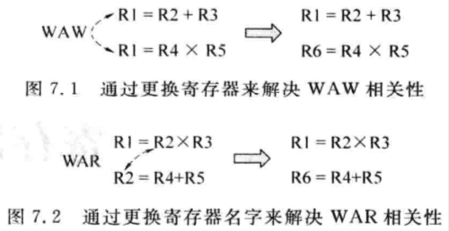

# 7.1 - 概述

- 程式中不同指令的相關性 (dependency) 可以分類為：
    1. 數據相關性 (data dependency)，包含以下幾種類型：
        - `WAW (Write After Write)` dependency，i.e. output dependence：
            - 兩條指令都將結果寫到同一個 destination register 中
        - `WAR (Write After Read)` dependency，i.e. anti-dependence：
            - 一條指令的 destination register 和它前面某條指令的 source register 相同
        - `RAW (Read After Write)` dependency，i.e. true dependence：
            - 一條指令的 source register 和它前面某條指令的 destination register 相同
        - 只有 `RAW` 是真的相關性， `WAR` 和 `RAW` 可以透過 register renaming 來解決
            
            
            
    2. 記憶體數據相關性 (memory data dependency)：
        - Load 和 store 指令之間的相關性，代表 load 和 store 指令都存取到同一個位址
        - 同樣也分為 `WAW`、`WAR`、`RAW` dependencies
    3. 控制相關性 (control dependency)：
        - 由於分支指令所引起的相關性，可以透過分支預測來解決
    4. 結構相關行 (structure dependency)：
        - 指令必須等到 CPU 中某些元件可以使用的時候才可以繼續執行
            - 例如要等到 Issue Queue 和 ROB 中有空閒的 entry，或是 FU 計算資源是有空的
- `WAW` 和 `WAR` dependencies 雖然可以透過 register renaming 來解決，但這兩個 dependencies 仍然存在的原因為：
    - 暫存器個數有限，導致在某些地方重複地使用暫存器
        - 需要透過 register renaming 並引進更多的 physical registers 來彌補
    - Loop 的存在，如果 loop body 中重複的向某個暫存器寫值，那麼就會產生大量的 `WAW` dependencies
        - 雖然可以透過 loop unrolling 的方法來解決這個問題，但由於暫存器的個數有限，在 unloop 到某一個時刻就會把所有的暫存器給用完，此時 `WAW` dependency 就是不可避免的了
        - 此外，loop unrolling 也會導致程式的 size 變大，佔用更多的記憶體空間，並導致 I-Cache miss rate 的升高
    - Code reuse，如 recursive call；如果 function 中會向某個暫存器寫值，並被 recursively called，那麼就會產生大量的 `WAW` dependencies
        - 同樣可以採用 inline function 的方式來解決這個問題，但也會碰到跟 loop unrolling 同樣的問題
- CPU 中實際存在的暫存器個數會比指令集定義的通用暫存器的個數還來得多：
    - CPU 內部實際存在的暫存器被稱為**物理暫存器** (**Physical registers**)
    - 指令集定義的暫存器被稱為**邏輯暫存器** (**Logical registers** 或是 **Architecture registers**)
- CPU 在做 register renaming 時，會動態的將 architecture registers 映射到 physical registers，這樣可以解決 `WAW` 和 `WAR` dependencies 的問題：
    
    
    
- Register renaming table (RAT)：用來保存已經存在的映射關係，i.e. architecture register → physical register)
    - 可以基於 SRAM 實現
    - 也可以基於 CAM 實現
    - 甚至可以採用 SRAM + CAM 來實現
- Free register list：用來保存目前還沒被映射的 physical registers
    - 在做 register renaming 時，會透過 free register list 來取得目前可以被映射的 physical register 編號

# 7.2 - 暫存器重命名方式

- Register renaming 有三種實做方式：
    1. 使用 **ROB** 來實做 register renaming
    2. 擴充 **Architecture Register File (ARF)** 來實做 register renaming
    3. 使用**統一的 Physical Register File (PRF)** 來實做 register renaming
- 在實做 register renaming 時，一般都要考慮以下的內容：
    1. 什麼時候佔用一個 physical register? 這個 physical register 來自於哪裡?
    2. 什麼時候要釋放一個 physical register? 這個 physical register 要被釋放到哪裡?
    3. 當發生 mis-prediction 時要如何處理?
    4. 當發生 exception 時要如何處理?

## 7.2.1 - 使用 ROB 來實做暫存器重命名

- 這種方法把 ROB 當做了 physical registers，在其中儲存了*推測*的結果，而 ARF 則儲存了*正確*的結果；使用此種方法，ROB 和 ARF 都可以儲存暫存器的結果，相當於是使用了 ROB 來擴充 ARF
- 當一個指令執行完後，其計算結果會被更新到 ROB 中對應的 entry 中，但是由於有可能會發生 mis-prediction 或是 exception，因此這些暫存器的狀態為推測 (speculative) 的；該條指令在被 retired 前都會一直存在 ROB 中，直到該指令變成 pipeline 中最舊的指令，且沒有發生 mis-prediction 或 exception，才會離開 pipeline，並使用其結果更新 CPU 的狀態 (e.g. 將結果寫到 ARF 中)
    - 這種方式相當於將 PRF 和 ROB 整合了在一起：
        
        
        
- 使用此方法可以簡化 register renaming 的流程，只要 ROB 中還有空間，register renaming 就可以持續地進行
- 一個 architecture register 的值有可能會同時存在 ROB 或是 ARF 中
    - E.g. 一條指令 retire 時更新了 `$r1`，其 architecture register 的計算結果會被記錄在 ARF 中；隨後又有另外一條指令被執行，也同樣更新了 `$r1`，其 architecture register 的計算結果會被記錄在 ROB 中
        - 因此，需要使用 RAT 來標記每個 architecture register 的計算結果是存在 ROB 或是 ARF 中：
            
            
            
            - 在一條指令 retire 前，其 architecture register 的計算結果會被存在 ROB 中，register renaming table 的 pointer 會指向 ROB；當這條指令 retire 時，其 architecture register 的計算結果會從 ROB 移到 ARF，RAT 的 pointer 也會一併更新指向 ARF
    - 因為一個暫存器在它的”生命週期”內會有兩個可以被存放的位置 (ROB 或是 ARF)，這會對指令 operands 的讀取造成影響，因此在實際的 CPU 中，都會搭配 [**data-capture**](../superscalar-overview-ch8-part1/#data-capture) 的 issue 方式，並採用 payload RAM 來儲存所需的 operands (參考：[link](../superscalar-overview-ch10/#1031---使用-rob-管理指令集定義的狀態))
        - 當一條指令的結果被 FU 計算出來後，會透過 bypassing network 將其結果寫進 payload RAM；Issue Queue 中所有等待這個結果的指令在被 select 電路選中時，就可以直接從 payload RAM 中得到 source registers 的值，而不用關心這些 source registers 的值是存在 ROB 或是 ARF 中
- 使用 ROB 做 register renaming：
    - 優點：
        - 實做容易，設計複雜度不高，且便於管理
    - 缺點：
        
        
        - 很多指令並不會更新 destination register，因此也就不用對 destination register 做 renaming，但每條指令仍然會佔用 ROB entry 中 destination register 的 physical register renaming 的空間，無法省略，浪費硬體空間
        
        - 對於一條指令而言，它既可以從 ROB 中讀取 operands，也可以從 ARF 中讀取 operands，所以 ROB 和 ARF 最壞的情況就是一個 cycle 內，所有的指令都需要同時讀取 ROB 或 ARF，會增加 ROB 和 ARF 的 read ports 所需的數量
            - 例如：4-way issue CPU，指令最多需要 2 個 source registers，那麼 ROB 和 ARF 都需要準備 2 x 4 = 8 個 read ports，對硬體面積和延遲造成負面的影響
            - 如果 CPU 有支援 multiple destination registers 的指令，那麼同樣也會對 ROB 和 ARF 的 write ports 數量造成影響

## 7.2.2 - 擴充 **ARF** 來實做暫存器重命名

- 這種方法是基於使用 ROB 來實做暫存器重命名方法的延伸；由於很多指令並沒有 destination register，例如：store 指令、分支指令和比較指令… etc，且這些指令佔了約 25% 的比例，使用 ROB 來實做暫存器重命名方法會造成 ROB 空間的浪費
- 因此，可以使用一個獨立的元件取代 ROB 來儲存 architecture register 對 physical register 的映射關係，這個元件被稱為 **PRF (Physical Register File)** (可以使用 FIFO 來實做)，它可以被視為 ARF 的擴充
- 在做 register renaming 時，architecture register 的計算結果被存在 PRF 中，等到這條指令 retire 時，才會將該計算結果從 PRF 搬進 ARF
    - 如果 PRF 中沒有空間了，那就必須 stall register renaming 之前的 pipeline stages，直到有指令 retire，PRF 的空間被釋放後，才可以繼續執行
    
    
    
- 缺點：
    - Architecture register 的計算結果仍然可能存在 PRF 及 ARF 兩個地方，因此仍然會對後面的指令使用這個暫存器作為 operands 的過程造成影響

## 7.2.3 - 使用統一的 PRF 來實做暫存器重命名

- 這種方法將上述方法的 ARF 和 PRF 合併，合併後同樣稱為 **PRF (Physical Register File)**，在其中同時儲存了 speculative 和 retire 的暫存氣值
- 這種統一的 PRF，所有沒有和指令產生映射關係的暫存器都是 free 的，並會使用一個 **free list** (可以使用 FIFO 來實做) 來記錄目前仍為 free 狀態的 physical registers
    - 在做 register renaming 時，architecture register 的計算結果會一直被存在 PRF 中，因此在 register renaming 的過程並不需要將 architecture register 的計算結果進行搬移，方便後續的指令讀取 operands
    - 這種方法同樣需要使用一個 RAT 來記錄每個 architecture register 對 physical register 的映射關係
    
    
    
- Superscalar CPU 在一個 cycle 內可以 retire *N* 條指令，因此每個 cycle 會有多個 physical registers 的編號會被寫進這個 FIFO 中，因此這個 FIFO 也要支援多個寫入，可以採用 interleaving 的方式來實現，避免 multi-port 的設計
- 當程式讀取暫存器時，由於很多 physical registers 仍處在 speculative 的狀態，是不能夠被程式所看到的，因此只使用一個 RAT 並沒辦法滿足這樣的要求；此時還需要使用另一個 RAT 來記錄所有 retired 的指令和 architecture register 對 physical register 的映射關係
    - 當指令 retire 時，其 architecture registers 對 physical registers 的映射關係就會被寫進這個 RAT
    - 外部透過查詢這個 RAT，就可以找到 architecture register 此時對應的 physical register，避免程式讀取到 CPU 內部一些可能錯誤的狀態
- 當一個 physical register 被佔用時，何時才可以再改為 free 狀態並加回 free list 中?
    - 當一個 physical register 不會再被後面的指令使用時，這個 physical register 就可以改為 free 狀態並加回 free list 中了
        - i.e. 當最後一條使用到這個 physical register 的指令要被 retired 時，就可以將此 physical register 改為 free 狀態
    - 但要在 CPU 中識別這個 physical register 最後一道使用到它的指令並不是一件容易的事情，CPU 可以採用一種很簡單也很保守的方法來辨別：
        - 當一條指令和其後面的指令都寫到同一個 destination register 時，當後面的指令 retire 時，前面指令的映射關係就沒有用處了，此時就可以將前面指令的 physical register 改為 free 狀態，並加回 free list 中
        
        
        
        - 例如：指令 (a) 和指令 (b) 都使用到了 `$r1`，如果有任何指令使用到指令 (a) 的 `$p1`，那麼這些指令一定是存在指令 (a) 和指令 (b) 之間的，因此當指令 (b) retire 時，代表不會再有任何指令會使用指令 (a) 的 `$p1`，此時便可以將 `$p1` 改為 free 狀態，並加回 free list 中了
            - 為了實現此功能，在 **ROB** 中還需要記錄指令 (如指令 (b)) 的 destination register 之前所對應的 physical register (如指令 (a) 的 `$r1` 所對應的 physical register - `$p1`)，以便在指令 retire 時 (如指令 (b))，將其舊的映射關係 (`$r1` → `$p1`) 給釋放掉 (i.e. 將 `$p1` 改為 free 狀態，並加回 free list 中)
- 總結：
    - 使用 ROB 來實做 register renaming
        
        
        - 優點：
            - Register renaming 流程簡單，在指令寫入 ROB 時，將 architecture register 和 physical register 的映射關係一併記錄到 ROB 即可，不須增加複雜的硬體控制邏輯電路
        
        - 缺點：
            - 暫存器的值需要被搬移 (ROB → ARF)，功耗較大
            - 由於暫存器的值有可能存在 ROB 或是 ARF，當指令 retire 時，需要額外的電路同步所有有使用到該暫存器的指令來告知該暫存器已經從 ROB 搬移到 ARF，功耗較大
    - 擴充 ARF 來實做 register renaming
        - 優點：
            - 如同使用 ROB 來實做 register renaming，只需將 architecture register 和 physical register 的映射關係記錄到 PRF 即可，其中 PRF 可以使用 FIFO 來實做，不須增加複雜的硬體控制邏輯電路
        - 缺點：
            - 暫存器的值需要被搬移 (PRF → ARF)，功耗較大
            - 由於暫存器的值有可能存在 PRF 或是 ARF，當指令 retire 時，需要額外的電路同步所有有使用到該暫存器的指令來告知該暫存器已經從 PRF 搬移到 ARF，功耗較大
    - 使用統一的 PRF 來實做 register renaming
        
        
        - 優點：
            - 暫存器的值只需寫入一次，不需要再被搬移，功耗較小
            - 暫存器的值只會存在一個地方，不需要
        
        - 缺點：
            - 需要使用一個 free list 以及兩個 RAT，因此需要使用複雜的硬體控制邏輯電路

# 7.3 - 重命名映射表

- (以下皆採用統一的 PRF 來實做 register renaming 的方式)
- RAT 的實做有以下幾種方式：
    - 基於 SRAM 來實做 (**sRAT**)
    - 基於 CAM 來實做 (**cRAT**，實際上是基於 SRAM + CAM 來實做的)
- 範例：32 個 architecture registers (`$r0` ~ `$r31`)，64 個 physical registers (`$p0` ~ `$p63`)
    
    
    
    - sRAT：
        - 使用 architecture register 來 index，共 32 個
        - 每個 RAT entry 記錄了 architecture register 所對應的 physical register (共 6 bits)
    - cRAT：
        - CAM 是使用**內容**來 index 的，CAM 會將內容與每個 entry 做比較 (類似 fully-associative cache)，並回傳與內容相符的 entry indexes
        - 因此 cRAT 是透過 architecture register 來 index (共 5 bits)，CAM 會回傳與其對應的 physical register index
- 雖然 SRAM 的存取速度比 CAM 來得快，而且 sRAT 比 cRAT 更省空間 (architecture registers 數量都是固定的，physical register 所佔的空間只為 log2 bits)，但是在現實的 CPU 中，仍然存在使用 cRAT 的設計
    - 這是因為 cRAT 在做 checkpoint 時，**只需保存 valid bits 及 free list 的 read pointer (sRAT 同樣也需保存 free list 的 read pointer)，不需將整個 cRAT 做保存**，大大減少 checkpoint 所需的電路面積
        - 因此相較於 sRAT，cRAT 不會隨著 checkpoint 的數量增加而增加大量的硬體面積
            - 當 checkpoints 的數量超過一定值，cRAT 就比 sRAT 有更大的優勢
        - 只需保存 free list 的 read pointer：
            - Write pointer + 1 代表有指令 retire，將 physical register 加回 free list 中
                - Write pointer 在 restore checkpoint 的時候不需要恢復，因為在 checkpoint restore 時，分支指令之前的指令有可能已經 retired 了，因此我們要保留其已經 free 掉的 physical registers
            - Read pointer + 1 代表有新的指令被執行，並使用 physical register 來映射 architecture register
                - Read pointer 在 checkpoint 的當下需要被保存，因為會從 free list 中拿 physical register 來建立映射關係的指令，都是分支指令之後的指令，restore checkpoint 後這些指令也需要被 flushed，因此需要恢復 read pointer
    - 現代處理器通常有較深 pipeline stages 及更多的 issue ways (可以處理的指令越多，代表一個 cycle 內出現的分支指令個數有可能也會增加)，因此需要更多的 checkpoints，此時 cRAT 就是一個比較好的選擇

## 7.3.1 - 基於 SRAM 的重命名映射表

- 當需要對分支指令狀態進行 checkpoint 時，需要備份整個 sRAT，因此這個實做方法每個 checkpoint 會佔用大量的硬體面積，因此限制了 checkpoints 的個數
    
    
    
- 對於一個 4-way 的 superscalar CPU 來說，每個 cycle 需要對 4 條指令做 register renaming，也就是 sRAT 需要支援 8 個 read ports 和 4 個 write ports (假設每條指令包含 2 個 source registers 和 1 個 destination register)；此外，還需要一個 free list 來記錄有哪些 physical registers 是 free 的
- 當有新的指令做 register renaming 時，有可能會發生 RAT entry 被蓋掉的問題，例如：
    - 此時不能直接把 RAT entry 給蓋掉，因為：
        - 一條指令在 retire 時，要將其對應的 physical registers 改為 free 狀態，並加回 free list 中，如果其 RAT entry 被覆蓋，就沒辦法更新 physical register
            - 例如：當發生 `WAW` 時，前後指令同樣的 destination register 會對應到不同的 physical registers，此時前面指令的 RAT entry 就會被後面指令的 RAT entry 給覆蓋
        - 當一條指令在 exception 或是 mis-prediction 的路徑上，這條指令最終會需要被 flushed 掉，同時也需要將該指令對 RAT 的修改給復原
            - 如果舊的映射關係沒有被保存下來，就無法將該指令對 RAT 的修改給復原
    - 因此，在一個 destination register 對 physical register 的映射關係被寫進 RAT 前，需要將其所覆蓋的 RAT entry (i.e. 舊的映射關係) 給寫進 **ROB** 中
- sRAT 相較于 cRAT，讀寫速度會快一點，設計複雜度也不會隨著 physical registers 的增加而變大，但其最大的缺點就是：**Checkpoints 的數量有上限**
    - 但隨著處理器的並行度的提高，會有更多的分支指令存在 pipeline 中，也就需要使用更多個 checkpoints
    - 不過當分支指令的預測正確時，checkpoint 是不會被使用的
        - 因此可以對分支指令的預測正確度也進行預測，對於那些預測準確度很高的分支指令，可以不使用 checkpoint，可以把 sRAT 的 checkpoints 留給那些預測準確度較低的分支指令
        - 但當這些未使用 checkpoint 的分支指令發生 mis-prediction 時，就需要使用速度較慢的方式來恢復 RAT
            - 如果發生頻率的很低，就不會對性能造成影響

## 7.3.2 - 基於 CAM 的重命名映射表

- 在 cRAT 中，architecture register 就是每個 CAM entry 所保存的內容，physical register 則是最後的結果
- cRAT 使用 architecture register 來索引 CAM，所有的 CAM entries 都會與欲索引的 architecture register 做比較，只有 CAM entry 內容與欲索引的 architecture register 相同時，其所對應的 physical register 才會被回傳；由於一個 architecture register 只會有一個對應的 physical register，因此只會有一個 CAM entry 相符
    - 相符的 entry 可以用 valid bit 來表示，i.e. `V = 1`
- 對 cRAT 做 checkpoint 時，只需 checkpoint valid bits 即可
    
    
    
- 由於 cRAT 所需的 checkpoint 資源很少，因此可以將 checkpoints 個數做得很大
    - E.g. Alpha 21264 使用 cRAT 做 register renaming，總共包含了 80 個 checkpoints，也就是最大允許 80 條分支指令存在 pipeline 中
- 對於一個 4-way superscalar CPU 而言，使用 cRAT：
    - cRAT 需要支援 8 個 read ports (2 source registers * 4) 及 4 個 write ports (4 destination registers)
- 基於 cRAT 進行 register renaming 仍然需要使用 free list 來記錄哪幾個 physical registers 是 free 狀態的
    - 要等指令 retire 時，才可以將其 architecture register 所對應的 physical register 改為 free 狀態並加回 free list 中
    - 因此，在 cRAT 中，並不是一個 physical register 的 valid bit 為 0 時，就代表其為 free 狀態，有可能是其映射關係剛被覆蓋而已
        - 例如：
            
            ```asm
            addi $r7, $r0, 2
            addi $r7, $r3, 3
            ```
            
            - 第一條指令：`$p11` → `$r7` ⇒ `V = 1`
            - 第二條指令： `$p12` → `$r7` ⇒ `V = 1`；`$p11` → `$r7` ⇒ `V = 1` → `0`
                - `$p11` → `$r7` 的映射關係被 `$p12` → `$r7` 取代，因此 `V = 1` → `0`，但不代表 `$p11` 就是 free 狀態的
        - 指令實際在 pipeline 中的運算還是使用**當初所被分配的 physical register**，所以只有等到指令 retire 後，其 physical register 才可以被改為 free 狀態
            - i.e. 第一條指令 `$r7` 所使用的 physical register 依然是 `$p11`，RAT 只是記錄**最新的映射狀態**
- 當一條指令 retire，其 physical register 改為 **free 狀態**後，該 physical register 在 RAT 中的映射關係的 **valid bit 也會被設為 0**
    - 也就是說，`V = 0` 同時表示了：
        - 映射關係被取代
        - Physical register 已經被改為 free 狀態
- cRAT checkpoint & restore 範例 (只針對 destination register 的部份)：
    
    ```asm
    指令 A：addi $r5, $r0, 1
    指令 B：addi $r7, $r0, 2
    指令 C：addi $r6, $r7, 3
    指令 D：add  $r7, $r7, $r1
    指令 E：add  $r7, $r7, $r2
    指令 F：beq  $r7, $r3, #TARGET1
    指令 G：add  $r9, $r5, $r6
    指令 H：add  $r5, $r9, $r9
    ```
    
    - 當分支指令 F 做 register renaming 時，需要對 cRAT 做 checkpoint，此時 cRAT 的內容如下：
        
        ```
        +--------------------------------------------+-------------------------------+
        |                   cRAT                     |          Checkpoints          |
        +---------+-------------+-----------+--------+-------+-------+-------+-------+
        |  Inst   |  Phys Regs  | Arch Reg  |   V    |  GC0  |  GC1  |  GC2  |  GC3  |
        +---------+-------------+-----------+--------+-------+-------+-------+-------+
        |         |    $p0      |           |        |   0   |       |       |       |
        +---------+-------------+-----------+--------+-------+-------+-------+-------+
        |   ...   |     ...     |    ...    |  ...   |  ...  |       |       |       |
        +---------+-------------+-----------+--------+-------+-------+-------+-------+
        |    A    |    $p10     |    $r5    |   1    |   0   |       |       |       |
        +---------+-------------+-----------+--------+-------+-------+-------+-------+
        |    B    |    $p11     |    $r7    | 1 -> 0 |   0   |       |       |       |
        +---------+-------------+-----------+--------+-------+-------+-------+-------+
        |    C    |    $p12     |    $r6    |   1    |   0   |       |       |       |
        +---------+-------------+-----------+--------+-------+-------+-------+-------+
        |    D    |    $p13     |    $r7    | 1 -> 0 |   0   |       |       |       |
        +---------+-------------+-----------+--------+-------+-------+-------+-------+
        |    E    |    $p14     |    $r7    |   1    |   0   |       |       |       |
        +---------+-------------+-----------+--------+-------+-------+-------+-------+
        |         |    $p15     |           |        |   0   |       |       |       |
        +---------+-------------+-----------+--------+-------+-------+-------+-------+
        |         |    $p16     |           |        |   0   |       |       |       |
        +---------+-------------+-----------+--------+-------+-------+-------+-------+
        |         |    $p17     |           |        |   0   |       |       |       |
        +---------+-------------+-----------+--------+-------+-------+-------+-------+
        |         |     ...     |           |        |  ...  |       |       |       |
        +---------+-------------+-----------+--------+-------+-------+-------+-------+
        |         |    $p63     |           |        |   0   |       |       |       |
        +---------+-------------+-----------+--------+-------+-------+-------+-------+
        ```
        
        - 當指令 D 做 register renaming 時，由於指令 D 和指令 B 都存取 `$r7`，因此指令 B 的映射關係會被 invalid (`V = 0`)
        - 當指令 E 做 register renaming 時，由於指令 E 和指令 D 都存取 `$r7`，因此指令 D 的映射關係會被 invalid (`V = 0`)
        - 分支指令 F 做 register renaming 時：
            - Checkpoint - GC0 的內容會被更新為：`1`, `0`, `1`, `0`, `1`
    - 在指令 G、指令 H 也做完 register renaming 後，指令 F 發生 mis-prediction，因此需要使用 GC0 來恢復 cRAT；在使用 GC0 來恢復前的 cRAT 內容如下：
        
        ```
        +--------------------------------------------+-------------------------------+
        |                   cRAT                     |          Checkpoints          |
        +---------+-------------+-----------+--------+-------+-------+-------+-------+
        |  Inst   |  Phys Regs  | Arch Reg  |   V    |  GC0  |  GC1  |  GC2  |  GC3  |
        +---------+-------------+-----------+--------+-------+-------+-------+-------+
        |         |    $p0      |           |        |   0   |       |       |       |
        +---------+-------------+-----------+--------+-------+-------+-------+-------+
        |   ...   |     ...     |    ...    |  ...   |  ...  |       |       |       |
        +---------+-------------+-----------+--------+-------+-------+-------+-------+
        |    A    |    $p10     |    $r5    |   1    |   1   |       |       |       |
        +---------+-------------+-----------+--------+-------+-------+-------+-------+
        |    B    |    $p11     |    $r7    | 1 -> 0 |   0   |       |       |       |
        +---------+-------------+-----------+--------+-------+-------+-------+-------+
        |    C    |    $p12     |    $r6    |   1    |   1   |       |       |       |
        +---------+-------------+-----------+--------+-------+-------+-------+-------+
        |    D    |    $p13     |    $r7    | 1 -> 0 |   0   |       |       |       |
        +---------+-------------+-----------+--------+-------+-------+-------+-------+
        |    E    |    $p14     |    $r7    | 1 -> 0 |   1   |       |       |       |
        +---------+-------------+-----------+--------+-------+-------+-------+-------+
        |    G    |    $p15     |    $r9    |   0    |   0   |       |       |       |
        +---------+-------------+-----------+--------+-------+-------+-------+-------+
        |    H    |    $p16     |    Rr7    |   1    |   0   |       |       |       |
        +---------+-------------+-----------+--------+-------+-------+-------+-------+
        |         |    $p17     |           |        |   0   |       |       |       |
        +---------+-------------+-----------+--------+-------+-------+-------+-------+
        |         |    ...      |           |        |  ...  |       |       |       |
        +---------+-------------+-----------+--------+-------+-------+-------+-------+
        |         |    $p63     |           |        |   0   |       |       |       |
        +---------+-------------+-----------+--------+-------+-------+-------+-------+
        ```
        
        - 當指令 H 做 register renaming 時，由於指令 H 和指令 E 都存取 `$r7`，因此指令 E 的映射關係會被 invalid (`V = 0`)
        - 當恢復 GC0 後，`$p10` ~ `$p16` 的 `V` 值會被恢復成：`1`, `0`, `1`, `0`, `1`, `0`, `0`
            - 在分支指令 F 之前的指令有可能在恢復 checkpoint - GC0 的當下已經 retired 了，此時有以下可能：
                - Physical register 改為 free 狀態，並加入 free list 中 ⇒ `V = 0`
                    - `V` 被 restored 回 `0` (如指令 B)
                        - 不會造成影響，因為本來 `V = 0` 本來也就可以表示 free 狀態
                    - `V` 被 restored 回 `1` (如指令 C)
                        - 被恢復的指令已經 retired 了，其 physical register 已經被加入 free list 中，因此只要在存取 RAT 時有一併檢查 physical register 是否在 free list 中，就算 `V` 被 restored 回 `1` 也沒關係
                - Physical register 被其他指令重新映射 ⇒ `V = 1`
                    - `V` 被 restored 回 `0` (如指令 B)
                        - 不會造成影響，因為重新映射的指令是分支指令之後的指令，本來就應該被 flushed 掉 ⇒ `V = 0`
                    - `V` 被 restored 回 `1` (如指令 C)
                        - 重新映射的指令也應該被 flushed ⇒ `V = 0`，不過由於被恢復的指令已經 retired 了，其 physical register 已經被加入 free list 中，因此只要在存取 RAT 時有一併檢查 physical register 是否在 free list 中，就算 `V` 被 restored 回 `1` 也沒關係
- 一般情況下，pipeline 中允許存在的最多的分支指令數，和處理器最大可以支援的 checkpoints 數量是一樣的 (假設只有分支指令使用 checkpoint)
- 如果分支預測正確，就可以將分支指令對應的 checkpoint 給釋放掉，變成 free 狀態，後續分支指令可以繼續使用它
- 分支預測失敗，restore checkpoint 後，也會一併將該 checkpoint 給釋放掉，變成 free 狀態，後續分支指令也可以繼續使用它
- cRAT checkpoint & restore 兩條分支指令範例 (只針對 destination register 的部份)：
    
    ```asm
    指令 A：addi $r7, $r0, 3
    指令 B：add  $r6, $r7, $r1
    指令 C：add  $r7, $r7, $r2
    指令 D：beq  $r7, $r3, #TARGET1
    指令 E：add  $r9, $r5, $r6
    指令 F：add  $r9, $r9, $r8
    指令 G：beq  $r9, $r3, #TARGET2
    指令 H：addi $r7, $r0, 1
    指令 H：addi $r6, $r0, 2
    指令 H：sub  $r9, $r1, $r0
    ```
    
    - 當分支指令 D 做 register renaming 時，需要對 cRAT 做 checkpoint，此時 cRAT 的內容如下：
        
        ```
        +--------------------------------------------+-------------------------------+
        |                   cRAT                     |          Checkpoints          |
        +---------+-------------+-----------+--------+-------+-------+-------+-------+
        |  Inst   |  Phys Regs  | Arch Reg  |   V    |  GC0  |  GC1  |  GC2  |  GC3  |
        +---------+-------------+-----------+--------+-------+-------+-------+-------+
        |         |    $p0      |           |        |   0   |       |       |       |
        +---------+-------------+-----------+--------+-------+-------+-------+-------+
        |   ...   |     ...     |    ...    |  ...   |  ...  |       |       |       |
        +---------+-------------+-----------+--------+-------+-------+-------+-------+
        |    A    |    $p10     |    $r7    | 1 -> 0 |   0   |       |       |       |
        +---------+-------------+-----------+--------+-------+-------+-------+-------+
        |    B    |    $p11     |    $r6    |   1    |   0   |       |       |       |
        +---------+-------------+-----------+--------+-------+-------+-------+-------+
        |    C    |    $p12     |    $r7    |   1    |   0   |       |       |       |
        +---------+-------------+-----------+--------+-------+-------+-------+-------+
        |         |    $p13     |           |        |   0   |       |       |       |
        +---------+-------------+-----------+--------+-------+-------+-------+-------+
        |         |    $p14     |           |        |   0   |       |       |       |
        +---------+-------------+-----------+--------+-------+-------+-------+-------+
        |         |    $p15     |           |        |   0   |       |       |       |
        +---------+-------------+-----------+--------+-------+-------+-------+-------+
        |         |    $p16     |           |        |   0   |       |       |       |
        +---------+-------------+-----------+--------+-------+-------+-------+-------+
        |         |    $p17     |           |        |   0   |       |       |       |
        +---------+-------------+-----------+--------+-------+-------+-------+-------+
        |         |     ...     |           |        |  ...  |       |       |       |
        +---------+-------------+-----------+--------+-------+-------+-------+-------+
        |         |    $p63     |           |        |   0   |       |       |       |
        +---------+-------------+-----------+--------+-------+-------+-------+-------+
        ```
        
        - 當指令 C 做 register renaming 時，由於指令 C 和指令 A 都存取 `$r7`，因此指令 A 的映射關係會被 invalid (`V = 0`)
        - 分支指令 D 做 register renaming 時：
            - Checkpoint - GC0 的內容會被更新為：`0`, `1`, `1`
    - 當分支指令 G 做 register renaming 時，需要對 cRAT 做 checkpoint，此時 cRAT 的內容如下：
        
        ```
        +--------------------------------------------+-------------------------------+
        |                   cRAT                     |          Checkpoints          |
        +---------+-------------+-----------+--------+-------+-------+-------+-------+
        |  Inst   |  Phys Regs  | Arch Reg  |   V    |  GC0  |  GC1  |  GC2  |  GC3  |
        +---------+-------------+-----------+--------+-------+-------+-------+-------+
        |         |    $p0      |           |        |   0   |   0   |       |       |
        +---------+-------------+-----------+--------+-------+-------+-------+-------+
        |   ...   |     ...     |    ...    |  ...   |  ...  |  ...  |       |       |
        +---------+-------------+-----------+--------+-------+-------+-------+-------+
        |    A    |    $p10     |    $r7    | 1 -> 0 |   0   |   0   |       |       |
        +---------+-------------+-----------+--------+-------+-------+-------+-------+
        |    B    |    $p11     |    $r6    |   1    |   1   |   0   |       |       |
        +---------+-------------+-----------+--------+-------+-------+-------+-------+
        |    C    |    $p12     |    $r7    |   1    |   1   |   0   |       |       |
        +---------+-------------+-----------+--------+-------+-------+-------+-------+
        |    E    |    $p13     |    $r9    | 1 -> 0 |   0   |   0   |       |       |
        +---------+-------------+-----------+--------+-------+-------+-------+-------+
        |    F    |    $p14     |    $r9    |   1    |   0   |   0   |       |       |
        +---------+-------------+-----------+--------+-------+-------+-------+-------+
        |         |    $p15     |           |        |   0   |   0   |       |       |
        +---------+-------------+-----------+--------+-------+-------+-------+-------+
        |         |    $p16     |           |        |   0   |   0   |       |       |
        +---------+-------------+-----------+--------+-------+-------+-------+-------+
        |         |    $p17     |           |        |   0   |   0   |       |       |
        +---------+-------------+-----------+--------+-------+-------+-------+-------+
        |         |     ...     |           |        |  ...  |  ...  |       |       |
        +---------+-------------+-----------+--------+-------+-------+-------+-------+
        |         |    $p63     |           |        |   0   |   0   |       |       |
        +---------+-------------+-----------+--------+-------+-------+-------+-------+
        ```
        
        - 當指令 F 做 register renaming 時，由於指令 F 和指令 E 都存取 `$r9`，因此指令 E 的映射關係會被 invalid (`V = 0`)
        - 分支指令 G 做 register renaming 時：
            - Checkpoint - GC1 的內容會被更新為：`0`, `1`, `1`, `0`, `1`
    - 當所有指令都完成 register renaming 後，cRAT 的內容如下：
        
        ```
        +--------------------------------------------+-------------------------------+
        |                   cRAT                     |          Checkpoints          |
        +---------+-------------+-----------+--------+-------+-------+-------+-------+
        |  Inst   |  Phys Regs  | Arch Reg  |   V    |  GC0  |  GC1  |  GC2  |  GC3  |
        +---------+-------------+-----------+--------+-------+-------+-------+-------+
        |         |    $p0      |           |        |   0   |   0   |       |       |
        +---------+-------------+-----------+--------+-------+-------+-------+-------+
        |   ...   |     ...     |    ...    |  ...   |  ...  |  ...  |       |       |
        +---------+-------------+-----------+--------+-------+-------+-------+-------+
        |    A    |    $p10     |    $r7    | 1 -> 0 |   0   |   0   |       |       |
        +---------+-------------+-----------+--------+-------+-------+-------+-------+
        |    B    |    $p11     |    $r6    | 1 -> 0 |   1   |   1   |       |       |
        +---------+-------------+-----------+--------+-------+-------+-------+-------+
        |    C    |    $p12     |    $r7    | 1 -> 0 |   1   |   1   |       |       |
        +---------+-------------+-----------+--------+-------+-------+-------+-------+
        |    E    |    $p13     |    $r9    | 1 -> 0 |   0   |   0   |       |       |
        +---------+-------------+-----------+--------+-------+-------+-------+-------+
        |    F    |    $p14     |    $r9    | 1 -> 0 |   0   |   1   |       |       |
        +---------+-------------+-----------+--------+-------+-------+-------+-------+
        |    H    |    $p15     |    $r7    |   1    |   0   |   0   |       |       |
        +---------+-------------+-----------+--------+-------+-------+-------+-------+
        |    I    |    $p16     |    $r6    |   1    |   0   |   0   |       |       |
        +---------+-------------+-----------+--------+-------+-------+-------+-------+
        |    J    |    $p17     |    $r9    |   1    |   0   |   0   |       |       |
        +---------+-------------+-----------+--------+-------+-------+-------+-------+
        |         |     ...     |           |        |  ...  |  ...  |       |       |
        +---------+-------------+-----------+--------+-------+-------+-------+-------+
        |         |    $p63     |           |        |   0   |   0   |       |       |
        +---------+-------------+-----------+--------+-------+-------+-------+-------+
        ```
        
        - 當指令 H 做 register renaming 時，由於指令 H 和指令 C 都存取 `$r7`，因此指令 C 的映射關係會被 invalid (`V = 0`)
        - 當指令 I 做 register renaming 時，由於指令 I 和指令 B 都存取 `$r6`，因此指令 B 的映射關係會被 invalid (`V = 0`)
        - 當指令 J 做 register renaming 時，由於指令 J 和指令 F 都存取 `$r9`，因此指令 F 的映射關係會被 invalid (`V = 0`)
    - 如果指令 D 發生 mis-prediction，就需要使用 GC0 來恢復 cRAT，並在恢復完 cRAT 後將 GC0 給釋放掉
        - 如果是 in-order core，則在 restore checkpoint 時，分支指令一定會是最後一條指令，GC1 一定會是在 mis-prediction 的路徑上，因此 GC1 也可以被釋放掉
    - 如果指令 D 預測正確，但指令 G 發生 mis-prediction，就需要使用 GC1 來恢復 cRAT，並在恢復完 cRAT 後將 GC1 給釋放掉
    - cRAT 並不負責管理哪些 physical registers 是 free 狀態的，這個功能是透過 ROB 和 free list 來實現的
    - 基於 CAM 的重命名映射表最大的弊端就是其硬體面積會隨著 CPU 中 physical registers 的個數增大而變大，因為 CAM 的 entry 個數，就是 physical registers 的個數
        - 隨著處理器並行度的增加，需要更多的 physical registers，此時 cRAT 就需要更多的比較電路，進而拖慢 CPU 的速度
        - 但是由於 cRAT checkpoint 時只需保存 valid bits (以及 free list 的 read pointer) 即可，大大降低了對硬體的需求，尤其是現在處理器中，會有更多的指令在 pipeline 中，需要更多的 checkpoints 配合，這時 cRAT 的優勢就體現出來了
        - 因此在設計時需要權衡使用 cRAT 的優缺點

# 7.4 - 超標量處理器的暫存器重命名

- RAT 在初始化時，architecture registers 就已經有對應的 physical registers，因此 source register 可以直接讀取 RAT 取得對應的 physical register，例如：
    
    ```
    $r0 -> $p0
    $r1 -> $p1
    $r2 -> $p1
    ...
    $r31 -> $p31
    ```
    
    - 剩餘沒映射關係的 physical registers 會被加進 free list 中
- 對於一條：`Dest = Src1 op Src2` 的指令，register renaming 的過程如下：
    1. 從 RAT 找到 `Src1` 和 `Src2` 對應的 physical registers：`Psrc1`、`Psrc2`
        
        
        
    2. 從 free list 中找到一個 free 狀態的 physical register：`Pdest`
        
        
        
    3. 將 `Dest` → `Pdest` 的映射寫進 RAT 中
        
        
        
- 由上述範例可以知道：
    - RAT 需要支援 2 個 read ports (source registers) 和 1 個 write port (destination register)
    - (對於 sRAT) 為了將 physical register 釋放回 free list，因此還需要將每條指令之前的對應關係保存到 ROB 中 (參考：[link](#previous-physical-register-mapping-in-rob))，因此 RAT 還需要 1 個額外的 read port 來讀取 destination register 所對應的 physical register
    - 對於 superscalar CPU 而言，N-way CPU 的 RAT 就提供 N 倍的 read ports 和 write ports：
        
        
        
- 除了 multi-port RAT 外，register renaming 還需考慮到每個 cycle 同時 rename 多條指令之間所存在的 dependencies，例如：
    
    
    
    - 指令 A 和指令 B 有 `RAW` dependency
        - 為 true dependency
    - 指令 A 、指令 B 和指令 D 有 `WAW` dependency
        - 可以透過 register renaming 解決，但實際上仍無法忽略其存在：
            1. 在一個 cycle 內多條指令發生 `WAW`，只需將最新那條指令的映射關係寫進 RAT 即可
                
                
                - 舊的指令還是會被分配 physical registers，後續在 pipeline 中的運算也是使用被分配的 physical registers，只是不需要將其映射關係給寫進 RAT，不然只是浪費 RAT 的空間
            2. 在將每條指令的舊映射關係寫進 ROB 時，如果發現一個 cycle 內有多條指令都使用同一個 destination register，那麼此時寫進 ROB 的舊映射關係，就不是來自 RAT，而是來自於與其發生 `WAW` 的那條指令 (參考：[link](#previous-physical-register-mapping-in-rob))
                - 例如：
                    - 指令 B 的 `$r0` → `$p31`，`$r0` 舊的映射關係是來自指令 A 的 `$p30`，而不是來自於 RAT 所讀出的結果
                    - 指令 D 的 `$r0` → `$p33`，`$r0` 舊的映射關係是來自指令 B 的 `$p31`，而不是來自於 RAT 所讀出的結果
                - 因此 superscalar CPU 在做 register renaming 時，仍需對指令間的 `WAW` dependency 做檢查
    - 指令 B 和指令 D 有 `WAR` dependency
        - 可以透過 register renaming 解決
- 因此，superscalar CPU 在做 register renaming 時，需檢查 `RAW` 和 `WAW` 的 dependencies

## 7.4.1 - 解決 RAW 相關性

- 對 4-way superscalar CPU 來說，每個 cycle 可以處理 4 條指令，如果這 4 條指令之間不存在 RAW，則 register renaming 過程就相對單純，例如：
    
    
    
    ```asm
    $r1 = $r1 + $r2    => $p31 = $p10 + $p11
    $r3 = $r3 + $r4    => $p40 = $p12 + $p13
    $r5 = $r6 x $r7    => $p8  = $p20 x $p21
    $r8 = Load 9[$r9]  => $p5  = Load 9[$p22]
    ```
    
- 但當這 4 條指令有 RAW 時：
    
    
    
    ```asm
    $r1 = $r1 + $r2    => $p31 = $p10 + $p11
    $r3 = $r3 + $r4    => $p40 = $p12 + $p13
    $r5 = $r6 x $r1    => $p8  = $p20 x $p25
    $r8 = Load 9[$r9]  => $p5  = Load 9[$p22]
    ```
    
    - 對於 `$r5 = $r6 x $r1` 這條指令而言，`$r1` 的 physical register 應該來自於 `$r1 = $r1 + $r2` 中的 `$r1` destination register 所對應的 physical register，也就是：`$p31`，而非 RAT 所輸出的 `$p25`
        - 如果不加以處理，運算結果就會有誤
- 需要有一個檢查機制，對 1 個 cycle 內的所有做 register renaming 的指令進行 `RAW` 的檢查
    - 在 register renaming stage，指令之間還是 in-order 的，因此只需要將所有指令的 source registers 與它前面所有指令的 destination registers 做比較，如果 registers 相同，那麼這個 source register 的 physical register 來源就不是 RAT，而是來自 free list
        - 如果多個 registers 皆相同，則使用最新指令的 physical register
    - 硬體設計如下圖：
        
        
        
        - 第一條指令的 source registers 所映射的 physical registers 一定只能來自於 RAT，也不需要進行 RAW 的檢查
        - 第二條指令的 source registers 所映射的 physical registers 有可能來自於 RAT，或是第一條指令的 destination physical register
        - 第三、第四條指令也是類似的
        - 此外，最後一條指令的 destination physical register 一定不會作為前面指令的 source register
        
        
        

## 7.4.2 - 解決 WAW 相關性

- `WAW` 影響 RAT 和 ROB 的寫入過程，因此也需要在 register renaming stage 對其進行檢查：
    1. 對寫 RAT 進行檢查：
        - 如果 1 個 cycle 內有多條指令的 destination registers 都相同，那麼只有**最新的那條指令的映射關係會被寫入 RAT**
        - 每條指令都必須比較其 destination register 與所有在其後面的指令的 destination registers，如果發現有相同的 destination registers，則代表該條指令的 destination register 映射關係就不該被寫進 RAT
            - 例如：
                - 4 條在同一個 cycle 進行 register renaming 的指令，destination registers 分別為 `dst0`, `dst1`, `dst2`, `dst3`：
                    - `dst0` 需要與 `dst1`、`dst2`、`dst3` 比較
                    - `dst1` 需要與 `dst2`、`dst3` 比較
                    - `dst2` 需要與 `dst3` 比較
                    - `dst3` 由於是最後一條指令，因此此 `dst3` 的映射關係一定會被寫進 RAT
                    
                    
                    
    2. 對寫 ROB 進行檢查：
        - 為了能夠釋放那些不再使用的 physical register，同時又可以恢復處理器的狀態，每條指令的 destination register 都必須在做 register renaming 時，將舊的映射關係寫進 ROB 當中 (參考：[link](#previous-physical-register-mapping-in-rob))；如果在 1 個 cycle 內，有兩條以上的指令存在 `WAW`，那麼比較新的指令的 destination register 舊的映射關係就直接來自比較舊的那條指令，而不是來自於 RAT
            
            
            
            - 指令 D 的 `$r0` 之前的 physical register 應該來自於指令 B 的 `$p31`，而不是 RAT 讀出的值
        - 每條指令都必須比較其 destination register 與所有在其前面的指令的 destination registers，如果發現有相同的 destination registers，則該條指令的 destination register 舊的映射關係就是與其最相近指令的 destination register 所對應的 physical register
        
        
        
        - 第一條指令由於前面沒有其他的指令，其 destination register 舊的映射關係只能是來自於 RAT
        - 第二條指令必須和第一條指令的 destination register 比較
        - 第三條指令必須和第二條、第一條指令的 destination registers 比較
        - 第四條指令必須和第三、第二、第一條指令的 destination registers 比較

# 7.5 - 暫存器重命名過程的恢復

- 當發生 mis-prediction 或 exception 時，需要把在錯誤路徑上的指令給 flushed 掉；如果這些要被 flushed 的指令已經經過了 register renaming stage，就代表這些指令也佔據了 RAT、ROB、Issue Queue 等資源；當指令被 flushed 時，也需要將這些被佔據的資源給恢復，這樣才能保證後續的指令可以在一個正確的 pipeline 中開始執行
- Register renaming 的恢復包含了：
    - ROB 的恢復
    - Issue Queue 的恢復
    - RAT 的恢復
        - 以下方法對前面介紹的三種 register renaming 的方式 (使用 ROB 來實做暫存器重命名、擴充 ARF 來實做暫存器重命名、使用統一的 PRF 來實做暫存器重命名) 都適用：
            - 使用 Checkpoint 來恢復 RAT
            - 使用 WALK 來恢復 RAT
            - 使用 Architecture State 來恢復 RAT

## 7.5.1 - 使用 Checkpoint

- 對於一個實現了 Checkpoint 的 RAT 來說，在 SRAM 的每個最小儲存單元：MBC (Main Bit Cell) 周圍都加入同樣的儲存單元：CBC (Checkpoint Bit Cell)，這些 CBC 就實現了 Checkpoint 的功能，可以快速的完成 RAT checkpoint & restore
    - 當要保存 RAT 狀態時，就將 MBC 的內容複製到 CBC
    - 當要恢復 RAT 狀態時，就將 CMC 的內容複製到 MBC
- cRAT 只需要保存 valid bits
- sRAT 則需要將整個 SRAM 都保存下來，checkpoint 所需的電路面積很大，對處理器的速度和面積都會造成不小的負面影響，在設計時需要有所權衡

## 7.5.2 - 使用 WALK

- Checkpoint 電路會增加硬體的開銷，因此，還有一種比較廉價的方式來保存和恢復 RAT 狀態，那就是使用 **ROB**
    - 在 ROB 中保存每條指令之前 architecture registers → physical registers 的映射關係，利用這個資訊，就可以將 RAT 的狀態逐步地”倒回去”，使那些在錯誤路徑上的指令，一個一個恢復其對 RAT 的修改
    - 這種方式稱為 WALK
- WALK 對 RAT 的恢復是比較慢的，它首先需要 flush 錯誤路徑上的指令，同時還需要逐個指令恢復 RAT，消耗非常多的時間
    - 對於分支指令而言，這樣的方法會增加分支預測失敗時的 mis-penalty
- WALK 的優點就是消耗的硬體資源比較少，因此在某些 CPU 中，例如 MIPS R10000，就使用這種方法來恢復發生 exception 時的狀態
    - Exception 發生的頻率比分支預測失敗的頻率來得低，因此這種相對比較慢的方式在某些情況下也是可以接受的

## 7.5.3 - 使用 Architecture State

- 當需要從 CPU 外部存取一個 architecture register 時 (e.g. debugger)，直接使用 register renaming stage 的 RAT 是很難做到的，因為它仍處在 speculative 的階段，因此一般都會在 pipeline 的 commit stage 也使用一個 RAT，所有正確 retire 的指令都會將其對應的 physical registers 更新到這個 RAT，因此這個 RAT 所記錄的映射狀態肯定是正確的；這個 RAT 稱為 **aRAT (Architecture RAT)**
    - 只有從 aRAT 才可以找到 architecture registers 對應的正確狀態的 physical registers
- 利用 aRAT 也可以用來恢復 register renaming stage 的 RAT
    - 舉例來說，當一條分支指令發生 mis-prediction 時，並不馬上進行 RAT 的恢復，而是讓 pipeline 繼續執行 (分支指令之前的 pipeline 必須 stall)，當這條分支指令變成 pipeline 中最舊的指令時，此時 aRAT 即表示了分支指令所對應的正確狀態的 RAT，因為分支指令之前的指令都已經順利 retired，並更新了 CPU 的狀態了
        - 此時，便可以將 aRAT 內容，直接複製到 register renaming stage 的 RAT，就完成了 RAT 的恢復
- 但當在 execution stage 發現分支指令 mis-prediction 時，可能 pipeline 中還存有很多比這條分支指令還舊的指令；如果這些指令中包含了 D-cache miss 的 load 指令，那麼這條分支指令就可能得等待一段時間才能變為最舊的指令，這會增大 mis-penalty，一定程度上影響了處理器的效能
- 使用 aRAT 的好處：
    - 在 superscalar CPU 中，在分支指令之前的指令，如果有指令發生了 exception，那麼就必須等到這條指令變為 pipeline 中最舊的指令時，將 pipeline 中的指令給全部 flush 掉，其中也包含了分支指令；由於這條分支指令並不會被執行，因此即使在 register renaming stage 做了 checkpoint 也是浪費，使用 aRAT 在這種情況下就不會白作工

# 7.6 - 分發

- Pipeline 中的 **Dispatch stage** 就是 in-order execution 和 out-of-order execution 的分界點；指令經過 register renaming stage 後，就會進到 dispatch stage
    - 在這個階段，經過 register renaming 後的指令會被寫到不同的 buffers 中，為 out-of-order execution 做好準備
- Buffers 主要分為三大類：
    - Issue Queue (out-of-order)
        - 大部分的 FU (Function Unit) 都可以 out-of-order 來執行指令
        - 當指令進到 Issue Queue 中時，其 operands 有可能還沒完全準備好，那麼就必須先在 Issue Queue 中等待
        - 只要有任一條指令的 operands 都準備好了，就可以將其送到 FU 來執行，不用理會這條指令在程式中原先的執行順序 (i.e. out-of-order)
        - 由於 out-of-order execution 的關係，Issue Queue 中的 empty entries 分佈是沒有規律的，需要有特別的設計方法
    - Issue Queue (in-order)
        - 即使在 out-of-order core 中，也是有部份的指令是照著程式中的執行順序來執行的，例如分支指令和 store 指令
            - 這些指令如果按照 out-of-order 的方式來執行，會帶來不少的硬體消耗，且在性能上也不一定能提昇多少，因此對這些指令一般採取 in-order 的方式來執行
        - Issue Queue 本質上就是一個 FIFO，透過調整 write pointer 就可以找到 free entries，將 register renaming 過的指令放到其中
            - 可以透過 interleaving 的方式來實現這種 Issue Queue
    - ROB
        - ROB 可以將 out-of-order execution 的指令拉回程式的執行順序；指令經過 register renaming 後會按照程式的執行順序寫到 ROB 中
            - 即使有些指令很早就完成執行了，它仍必須等到 ROB 中在它前面的指令執行完成後，才能被 retired 並更新 CPU 的 architecture state (程式可見)
        - ROB 本質上也是一個 FIFO，透過調整 write pointer 就可以找到 free entries，將 register renaming 過的指令放到其中
- Pipeline 中的 **dispatch stage** 就是將 register renaming 後的指令寫到 Issue Queue 和 ROB 的過程，指令被 dispatched 到 Issue Queue 後，就可以以 out-of-order 的方式來執行了，而透過 ROB 可以將 out-of-order execution 的指令拉回程式的執行順序
- Dispatch 可以跟 register renaming 放在同一個 cycle 內完成，但當 Issue Queue 和 ROB 的容量比較大時，向它們寫入資料會變得很慢，嚴重影響 CPU 的 cycle time，因此很多 CPU 都會將 dispatch 獨立為一個 stage
