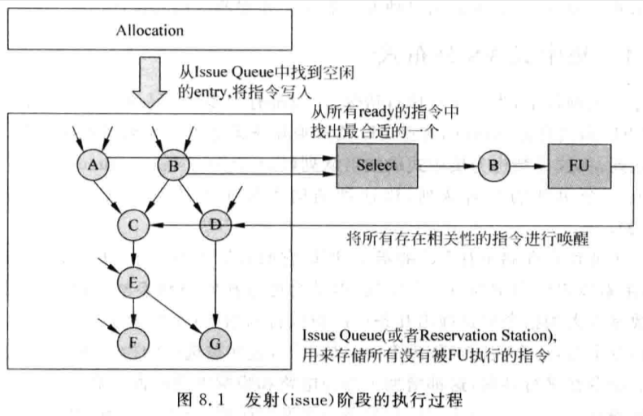

# 8.1 - 概述

- Issue 就是將符合一定條件的指令從 `Issue Queue` 中選出來，並送到 FU (Function Unit) 中執行的過程
    - Issue Queue 會依照一定的規則，選擇那些 source registers 都已經準備好的指令，將其送到 FU 中執行，這個過程就稱為：`Issue`
- Issue Queue 也被稱為 `Reservation Station`
- 對於 in-order core，指令會按照程式原始順序加進 Issue Queue 中，此時 Issue Queue 就相當於一個 FIFO
- 對於 out-of-order core，只有少數指令，如 store 及分支指令，才會採用 in-order 的方式執行，對其他大部分的指令，都是採用 out-of-order 的方式執行
- 指令到了 Issue Queue 後，只要 Issue Queue 中任一條指令的 operands 都準備好了，且滿足 issue 的條件，就可以將其送到 FU 中執行
- Issue Queue 設計的好壞，會直接影響處理器的 concurrency
- Issue stage 的硬體比較複雜，一般它都在 critical path 上，直接影響 CPU 的 cycle time
    - 因此這個 stage 的設計需要一定的折衷，才能在性能和複雜度之間找到一個可以接受的平衡點
- Issue stage 同時也是 in-order 和 out-of-order 的分界點
    - Issue stage 之前的指令都是 in-order 的
    - Issue stage 之後的指令都是 out-of-order 的，直到到了 commit stage 才會透過 ROB 的資訊來將指令重排回 in-order 的順序
- Issue stage 除了 Issue Queue 外，還有：

    

    - Allocate 電路：用來從 Issue Queue 中找到 free 的 entries，將 register renamed 完的指令加入進 Issue Queue 中
    - Select 電路 (也稱為 Arbiter 電路)：如果在 Issue Queue 中有多條指令已經準備好了，Select 電路會依照一定的規則，選出最適合的指令送到 FU 中去執行
        - Select 電路是 issue stage 中比較關鍵的元件，會直接影響到 CPU 的執行效率
    - Wake-up 電路：當一條指令經過 FU 而得到結果時，會通知給 Issue Queue 中所有等待此結果的指令；這些指令對用的 source operands 會被設為 valid 的狀態，這就稱為 wake-up
        - 如果一條指令所有的 source operands 都已經準備好了，那該指令就處於 ready 狀態，Select 電路就有可能選擇該指令來 issue

## 8.1.1 -  集中式 (Centralized) vs. 分佈式 (Distributed)

- 在 superscalar CPU 中，為了並行執行指令，一般都會有很多的 FU，如有些 FU 負責 integer 的運算，有些 FU 負責乘法與除法運算，有些 FU 負責 memory access
    - 如果這些 FU 都共用同一個 Issue Queue，那麼這種架構就稱為 `Centralized Issue Queue`
    - 如果每個 FU 都有一個獨立的 Issue Queue，那麼這種架構就稱為 `Distributed Issue Queue`
- Centralized Issue Queue 因為要儲存所有 FU 的指令，因此它的容量需要很大
    - 優點：
        - 有最大的利用效率，不會浪費 Issue Queue 中任何的空間
    - 缺點：
        - Select 電路和 Wake-up 電路會比較複雜，因為需要從龐大數量的指令中選擇幾條可以被 issued 的指令；這些被選中的指令執行完後還需要 wake up 所有 Issue Queue 中相關的指令，增加了 Select 電路和 Wake-up 電路的面積和 latency
- Distributed Issue Queue 由於為每個 FU 都配一個 Issue Queue，因此每個 Issue Queue 的空間可以很小
    - 優點：
        - 簡化了 Select 電路的設計 (每個 Issue Queue 都有自己的 Select 電路)
    - 缺點：
        - 但 Issue Queue 使用率較低，當一個 Issue Queue 滿了以後，即使其他 Issue Queue 還有空間，也無法繼續向其寫入新的指令
            - 此時就需要將 pipeline stall，直到這個 Issue Queue 有空出新的空間為止
                - 例如：
                    - 一段時間內執行了大量的 add / sub 指令，則可能由於 add / sub 指令 FU 對應的 Issue Queue 已經滿了而無法處理新的 add / sub 指令
                        - 這會阻礙新的指令做 register renaming，因為 register renaming stage 仍然是 in-order 的
                        - 即使此時別的  FU 的 Issue Queue 仍有空間，也仍需 stall issue stage 之前的 pipeline，降低 Issue Queue 的使用率
        - 由於 Issue Queue 是分散的，因此也會增加 Wake-up 電路的複雜度
- 由於上述兩種設計各有優缺點，因此現代處理器一般都會結合使用上述兩種方法，使某些 FU 共用一個 Issue Queue，某些 FU 有自己獨立的 Issue Queue

## 8.1.2 - 數據捕捉 (Data-capture) vs. 非數據捕捉 (Non-data-capture)

- 對於 superscalar CPU 而言，還需要考慮在哪個 pipeline stage 讀取 registers 的值
    - 何時讀取 registers 對於整個處理器架構有著直接的影響
- 一般來說，有兩個時間點可以讀取 registers：
    - **在 issue stage 之前讀取 registers：**
        - 這種方法也被稱為**數據捕捉 (Data-capture)** 的架構
        - 被 register renamed 後的指令首先會讀取 physical register file，然後將 source registers 的**編號**寫進 Issue Queue，讀到的 source registers 的**值**寫進 [**payload RAM**](#payload-ram)
            - 如果有 source register 的值在指令寫進 Issue Queue 中時還沒有被計算出來，則該 register 會被標記為 non-available
            - 在之後的 wake-up stage，可以根據 Issue Queue 中所記錄 source registers 編號，透過 bypassing network 取得結果，不需要再讀取 physical register file
        - 在 Issue Queue 中，儲存指令 operands 的元件稱為 **payload RAM**：

            

            - Payload RAM 儲存了指令 source registers 的值，當指令從 Issue Queue 中被 select 電路選中時，可以直接從 payload RAM 中對應的 entry 將 source registers 的值給讀出來，並送到 FU 中執行
            - 當一條指令從 Issue Queue 中被選中的同時，它會 broadcast 其 destination register 的編號，Issue Queue 中的其他的指令的 source registers 都會被比較，一旦發現相等時，就會在 payload RAM 中進行標記，等到被選中的指令被計算完畢後，就會透過 bypassing network 將其結果寫進 payload RAM 對應的 entries 中
            - Payload RAM 負責”捕捉” FU 計算的結果，因此稱為 **data-capture** 架構
            - Issue Queue 負責比對 registers 編號是否相等，payload RAM 負責儲存 source registers 的值並捕捉對應 FU 的計算結果
        - 在 superscalar CPU 中，使用 `machine width` 來表示每個 cycle 實際可以 decode 和 register rename 的指令個數，使用 `issue width` 來表示每個 cycle 可以被 issued 的指令個數
            - 考慮到由於指令間存在 dependencies，很多時候，沒辦法每個 cycle 都將 machine width 個數的指令 issue 到 FU 中執行，只有使 `issue width` 大於 `machine width`，才能最大限度地使用 FU
                - 因此，現代高性能處理器都會採用多個 FU，盡可能增加每個 cycle 可以被 issued 的指令個數
        - Data-capture 架構需要在 issue stage 前讀取 physical register file，因此 physical register file 需要的 `read ports 數量 = machine width x 2` (假設每條指令只有兩個 source registers)，是直接與 `machine width` 相關的：

            

    - **在 issue stage 之後讀取 registers：**
        - 這種方法也被稱為**非數據捕捉 (Non-data-capture)** 的架構
        - 在 non-data-capture 架構中，register renamed 後的指令並不會去讀取 physical register file，而是直接將 source registers 的編號寫進 Issue Queue 中
            - 當指令從 Issue Queue 中被 select 電路選中，會使用 source registers 的編號來讀取 physical register file，將讀到的 source registers 的值一併送到 FU 中執行
            - 由於不需要 payload RAM，因此可以增加執行的速度
        - 由於指令在 issued 後才會讀取 physical register file，因此 physical register file 所需的 `read ports 數量 = issue width x 2`，是直接與 `issue width` 相關的，因此所需 physical register file 的 read ports 數量通常比較多

            

- **Data-capture 架構：**
    - 優點：
        - 需要的 physical register read ports 數量較少
    - 缺點：
        - 需要額外的 payload RAM，硬體面積較大，執行速度較慢
        - source register 需要經過兩次 reads 和一次 write 的過程，功耗較高
            - 如果 source register 的值在指令寫進 Issue Queue 中時已經有被計算出來，那麼就需要將 register 的值從 physical register file 中讀出來，寫進 Issue Queue，然後再從 Issue Queue 中將值讀出來，送到 FU 中
- **Non-data-capture 架構：**
    - 優點：
        - 在 Issue Queue 中不需要儲存 registers 的值，也不需要使用 payload RAM，硬體面積較小，執行速度較快
        - Source register 只需要經過一次 read 即可，功耗較低
            - 從 physical register file 讀出來送進 FU 中
    - 缺點：
        - Physical register file 需要比較多的 read ports
- 這兩種架構的選擇，決定了 ROB 的實做方式：
    - 當[使用 ROB 做 register renaming](../superscalar-overview-ch7/#721---使用-rob-來實做暫存器重命名) 時 (i.e. **使用 ROB 當作 PRF**)，一般都會配合使用 [**data-capture**](#data-capture) 的架構

        - 在一條指令 retire 前，其 architecture register 的計算結果會被存在 ROB 中，register renaming table 的 pointer 會指向 ROB；當這條指令 retire 時，其 architecture register 的計算結果會從 ROB 移到 ARF，RAT 的 pointer 也會一併更新指向 ARF
        - 採用 data-capture 架構在讀取 source register 的值寫進 Issue Queue 時，可以直接透過 RAT 找到對應的 physical register，因此不用考慮位置的變化
        - 反之，採用 non-data-capture 的架構，當指令從 Issue Queue 中被 select 電路選中，要讀取 PRF 來將 source registers 的值送到 FU 中執行時，並沒辦法直接使用 Issue Queue 中記錄的 source register 的編號 (physical register number) 來讀取 ROB 取得 source register 的值 (因為計算結果有可能已經被搬進 ARF 中了），因此需要額外的處理

## 8.1.3 - 壓縮 vs. 非壓縮

- 根據 Issue Queue 的工作方式，又可將其分為**壓縮 (Compressing)** 和**非壓縮 (Non-compressing)** 兩種架構
- **Compressing Issue Queue：**
    - 每當一條指令被選中並從 Issue Queue 中移除時，會出現一個”空格”，這條指令上面的所有指令都會下移一格，將這條指令的空格給補上：

        

    - 透過這種方式，可以保證 Issue Queue 中的 empty entries 都是在 Issue Queue 中的 tail
        - 當有新的指令寫入時，只需將其寫入 Issue Queue 中的 tail 即可
    - 要實現這樣的架構，需要在每個 Issue Queue 的 entry 前面加上 multiplexer，用來移動一個 entry 的內容

        

    - 優點：
        - Allocation 電路較簡單，Issue Queue 中的 empty entries 都是在 Issue Queue 中的 tail，只需使用 Issue Queue 的 write pointer 即可得知指令寫入 Issue Queue 的位置
        - Select 電路設計比較簡單
            - 通常為了讓處理器可以最大限度的同時執行多條指令，一般都是從所有準備好的指令中，優先選擇最老的指令到 FU 執行，也就是 `oldest-first` 方法
                - 最老的指令通常會與其他指令之間有更多的 RAW dependencies，因此可以 wake up 更多的指令

                

            - Compressing Issue Queue 中的指令已經是照著 oldest → newest 的順序排好的，因此 select 電路可以很容易依照 oldest-first 的方法選出指令來執行
    - 缺點：
        - Issue Queue 的設計較複雜
            - 需要額外加入 multiplexer 用來移動一個 entry 的內容
        - Select 電路的 latency 與 Issue Queue 的容量成正比， 如果 Issue Queue 容量越大，就會使 select 電路的 latency 越長
            - 雖然可以很容易的找出最老的指令，但因為要跟所有的 Issue Queue entries 比較才能找出要被 issue 的指令，因此 Issue Queue 容量越大，select 電路的 latency 越長
        - 同時間會有多個指令需要被移動，因此功耗也會比較高
- **Non-compressing Issue Queue：**
    - 每當一條指令被選中並從 Issue Queue 中移除時，Issue Queue 中的其他指令並不會被搬移，而是會停留在原本的位置，i.e. 沒有壓縮的過程
        - 無法根據指令在 Issue Queue 中的位置來決定指令的新舊
    - 實務上沒辦法把所有 Issue Queue 的指令都掃過一遍，找出最老已經準備好的指令；因此可以採用折衷的方式，從 Issue Queue 的 head 開始尋找，直到找到一條已經準備好的指令就直接選擇它
        - 這種 select 電路的實做相對簡單，但由於沒辦法找出 oldest-first 的指令，因此沒辦法獲得最好的效能
    - 優點：
        - 指令不用每個 cycle 都需要移動，功耗較低
        - 少了 multiplexer，硬體面積較小
    - 缺點：
        - 如果真的要實做 oldest-first 的功能，就需要更複雜的 select 電路設計 (參考：[8.4 - 仲裁 (Arbitration)](#84---仲裁-arbitration))，會增加 latency
        - Allocation 電路設計較複雜，需要掃過 Issue Queue 中所有的 entries，才能找到 empty 的 entry 來將指令寫入；尤其 superscalar CPU 每個 cycle 都會寫入多條的指令到 Issue Queue 中，allocation 的電路設計會更為複雜
- **Compressing Issue Queue** 和 **Non-compressing Issue Queue** 設計各有優缺點，在現實世界的 superscalar CPU 中都有採用

# 8.2 - 發射過程的流水線

## 8.2.1 - 非數據捕捉 (Non-data-capture) 架構的流水線

- 一條在 Issue Queue 中的指令需等到以下條件都成立後，才可以被 issued 到 FU 中執行：
    - 這條指令所有的 source registers 都準備好了
    - 這條指令能從 Issue Queue 中被選中，也就是需要被 select 電路選中才能被 issued
    - 需要能從 registers、payload RAM 或 bypassing network 中獲得 source registers 的值
- 對於一個 source register 來說，如果被寫到 Issue Queue 時，還是 not-ready 的狀態，等到之後的某個時間，它變成 ready 的狀態，這個過程便稱為 **Wake-up**
    - 需通過 bypassing network 才可以通知到 Issue Queue 中每個 source registers
- Wake-up 的過程：
    - 最簡單的作法：當一條指令在 FU 得到其運算的結果時，將 Issue Queue 中使用到這個計算結果的所有 source registers 都設為 ready 的狀態：

        

        - Issue 被分為了 **wake-up** 和 **select** 兩個 stages
            - 在 wake-up stage，Issue Queue 中所有得到計算結果的 source registers 都會被改為 ready 狀態
            - 在 select stage，select 電路會從 Issue Queue 中選擇一條最合適的指令 issue 到 FU 中
        - 然後，這樣 RAW 相關的兩條指令，並沒辦法 back-to-back 的執行，中間間隔了 3 個 cycles，執行效率不佳
        - 這種指令執行完才 wake up 相關的指令的方法便是：**Tomasulo**
- 為了提高執行效率，可以將 wake-up 的過程提前，以便可以 back-to-back 執行指令：

    

    - 需要透過 bypassing network 才能 back-to-back 執行指令
        - 當指令 B 到 execute stage 時，就可以透過 bypassing network 得到指令 A 的執行結果，便可以被 issued 到 FU 中執行了
- 實際上，指令 A 的 select 和指令 B 的 wake-up 這兩個操作是在同一個 cycle 中接續執行的
    - 只有當 select 電路選出可以 issue 的指令後，才可以對 Issue Queue 中相關的 source registers 進行 wake up，只有兩個操作是在**同一個 cycle 內完成**，才可以 back-to-back 執行兩條 RAW 的指令：

        

    - 如果 select 和 wake-up 分為 2 個不同的 cycles，那麼就無法 back-to-back 執行兩條 RAW 的指令：

        

        - 指令 A 被選中，但要等到下一個 cycle 才能 wake up 指令B，那麼指令 A 和指令 B 之間的執行就會相差一個 cycle
- Select 電路和 wake-up 電路都是相對比較複雜的，將它們放在同一個 cycle 內執行，肯定會使 cycle time 變長，降低 CPU 的頻率；而將這兩個電路分成兩個不同的 cycles，可以降低 cycle time，提昇 CPU 的頻率，但會降低 CPU 的 IPC
    - 將 select 和 wake-up 分成兩個不同的 cycles，IPC 約會下降 10% ~15%
        - 此外，由於增加了一個 cycle，因此也會帶來其他的負面影響：
            1. Miss-prediction penalty 的增加
            2. Cache 存取 cycles 數的增加
                - Cache 存取的時間是固定的，cycle time 變短，cache 存取需要的 cycles 數就變多了
            3. 增加了一個 cycle，需要更多的硬體資源，功耗變大
- Superscalar CPU 中存在多個 FU，每個 FU 的執行時間都是不同的；即使是同一個 FU，不同指令所需的執行時間也不一定相同
    - 當一條指令的 FU 沒辦法在一個 cycle 內完成，pipeline 的 execute stage 的執行就需要超過一個 cycle，有可能就來不及 bypass 結果給 RAW 的指令

        

        - 指令 A 是乘法指令，在 FU 中需要 2 個 cycles 才能計算出結果，如果仍在指令 A 被 selected 時同時 wake up 指令 B，等到指令 B 進到 execute stage 時，由於指令 A 的結果在那個時候還沒有被計算出來，指令 B 就沒辦法執行
        - 因此，需要將指令 B 的 wake-up delay 一個 cycle，才可以讓指令 B 進到 execute stage 時，透過 bypassing network 得到指令 A 的計算結果

            

- 除此之外，像是 load/store 指令，其 execute 所需要的 cycles 是取決於 D-Cache 或 Store buffer 是否 hit/miss 的，都需要做特別的處理

## 8.2.2 - 數據捕捉 (Data-capture) 架構的流水線

- Data-capture 跟 non-data-capture 架構最大的差異就是使用了 payload RAM 來儲存所有指令的 source registers 的值，當指令被 issued 時，可以直接得到 source registers 的值，而不須再去讀取 physical register file
    - 相比於 non-data-capture 架構少了 `Regfile read` 的 stage
- Data-capture 架構同樣需要分為 select 和 wake-up 兩個階段，只不過指令在被 select 電路選中後，不需要再去讀取 physical register，而是可以直接讀取 payload RAM 取得 source registers 的值

    

    - 一條指令被 select 後 (如：指令 A)，同個 cycle 也可以 wake up 其他有 dependency 的指令 (如：指令 B、C)；同時還會去讀取 payload RAM，得到 source registers 的值
        - Payload 和 wake-up 是在同一個 cycle 中發生的
    - 在得到 source registers 的值後，下一個 cycle 就可以進到 execute stage，將指令送到 FU 中執行
    - 被 wake up 的指令 (如：指令 B、C)，可以在其 execute stage 透過 bypassing network 取得其所依賴的指令的計算結果 (如：指令 B)，也可以從 payload RAM 得到計算結果 (如：指令 C)
        - 對於指令 C 來說，在其 execute stage 時，指令 A 已經將其計算結果寫回 payload RAM 了，因此可以直接從 payload RAM 讀取指令 A 的計算結果 (但仍需要將指令 B 的計算結果 bypass 給指令 C)
    - 此設計將 select 和讀取 payload RAM 放到同一個 cycle 內，因此在一個 cycle 內，需要同時讀取 payload RAM，又需要寫入 payload RAM，因此需要使用 multi-port 的設計，讓 cycle time 變得過大
        - 如：`*Cycle i+2*`，需要將指令 A 的計算結果寫回 payload RAM；指令 C 又需要同時讀取 payload RAM 得到指令 A 的計算結果
    - 同時，當 FU 的個數比較多時，FU 的計算結果也需要透過 bypassing network 來傳遞，因此也會佔用不少的硬體支援和過長的執行時間，因此可以進一步將 pipeline 進行細分
- 以下的設計將 payload RAM 的存取獨立成一個單獨的 pipeline stage，以避免 multi-port payload RAM 影響 CPU 的 cycle time：

    

    - 此外，在 execute stage，FU 得到計算結果後，也不會在同一個 cycle 就 bypass 結果給其他的指令，而是將 bypass 放到下一個 pipeline stage
        - 在 bypass stage 中，會同時將計算結果寫進 payload RAM 以及 bypass 給其他指令
    - 由於指令 C 依賴指令 A 和指令 B 的計算結果，因此需要等到 `*Cycle i+1*` 才能真的被 wake up
- 有些設計甚至還會將 select 和 wake-up 拆分成兩個不同的 stages，但缺點就是 RAW 相關的指令無法 back-to-back 的被執行

# 8.3 - 分配 (Allocation)

- Allocation 電路其實是屬於 dispatch stage，而不是 issue stage 的
- 採用 [Non-Compressing Issue Queue](#non-compressing-issue-queue) 設計的 Issue Queue，其 empty entries 的分佈是沒有規律的；對於每個 cycle 可以 decode *N* 條指令的 superscalar CPU 來說，最理想的狀態就是可以從 Issue Queue 中找到 *N* 個 empty entries，需要 allocation 電路掃過整個 Issue Queue
    - Allocation 所需要的時間，與 Issue Queue 的容量，以及每個 cycle 要寫入的指令個數成正比
- 可以採用一個 free list 來記錄所有 Issue Queue 中 empty entries 的編號，每個 cycle 都從這個 free list 中讀出 *N* 個編號，就可以找到對應的 Issue Queue empty entries 了
    - 這個 free list 可以透過 FIFO 來實現
    - 然而，這種方法仍有一定的複雜度，產生的 latency 也不一定會比較小
        - 如果 *N* 很大，就需要在一個 cycle 內 pop 出 *N* 個 FIFO entries
- 一種折衷的方法，可以直接將 Issue Queue 分成 *N* 段，從每段找出一個 empty entry
- 如 *N = 4*：

    

    - 每段都會有一個獨立的 allocation 電路，這樣一個容量為 12 個 entries 的 Issue Queue，每段只需要從 3 個 entries 中找到 1 個 empty entry 即可
    - 每個獨立的 allocation 電路都可以同時工作，所需查找的 entries 數也很少，因此 latency 很小
    - 缺點：
        - 如果一個段中沒有 empty entry 了，那麼就算其他段有多餘的 empty entry，這個段也沒辦法接收新的指令
        - 更糟糕的是，在 register renaming stage，指令仍然是 in-order 的，因此如果一條指令沒辦法找到 Issue Queue 的 empty entry，其後的指令就算其對應的段仍有 empty entries，也無法被寫入 Issue Queue 中：

            

            - 指令 A 對應的段已經沒有 empty entries 了，無法被寫入 Issue Queue 中；但由於此時仍是 in-order 的，因此會導致縱使指令 B、C、D 的段有 empty entris，一樣無法被寫入 Issue Queue 中
- Allocation、select、wake-up 是 issue stage 中三個主要的步驟，每個步驟都需要做很多的事情，因此 issue stage 是 superscalar CPU 中工作量比較繁忙的 pipeline stage

# 8.4 - 仲裁 (Arbitration)

## 8.4.1 - 1-of-M 的仲裁電路

- 前面的章節有提到，[Non-compressing Issue Queue](#non-compressing-issue-queue) 需要特別的處理才能實做 oldest-first 的功能，不能單純的由指令在 Issue Queue 中的位置來判斷
- 越舊的指令，和它存在 dependency 的指令就越多，因此優先 select 最舊的指令，則有機會可以wake up 更多的指令；除此之外，最舊的指令還佔據著處理器的其他資源，如 ROB 和 store buffer… etc，越早執行這些舊的指令，就可以越早釋放這些資源來讓更新的指令使用
- 要識別出 Issue Queue 中哪些指令是最舊的，就需要知道這些指令的年齡，也就是進到 pipeline 的先後順序
    - In-order core 的年齡資訊很容易判斷，在 pipeline 中先執行的指令肯定比後執行的指令來得老
    - Out-of-order core 的年齡資訊必須依靠 ROB 來判斷，可以使用指令在 ROB 中的 index 來判斷指令的年齡先後 (指令是從 ROB index 0 開始寫)
        - ROB 是一個 circular FIFO，因此沒辦法直接拿 ROB 的 index 來判斷，需要做一些處理

            

            - Write pointer 和 read pointer 在同一個 lap 上，可以直接比較 write pointer 和 read pointer 的 index 來識別指令的年齡
            - 但當 write pointer 和 read pointer 不在同一個 lap 上 (i.e. write pointer 比 read pointer 多 wrap 了一次)，那就沒辦法透過直接比較 write pointer 和 read pointer 的 index 來識別指令的年齡
            - 因此需要額外加 1 個 position bit，每次 write 或 read pointer wrap 時，write pointer 或 read pointer 所指到的 position bit 都會被 toggled (0 → 1、1 → 0)

                

                

                - 當  write pointer 指到的 position bit 與 read pointer 所指到的 position bit **相同**時 (i.e. write pointer 和 read pointer 在同一個 lap 上)，**指令的 ROB index 越小，年齡越老**
                - 當  write pointer 指到的 position bit 與 read pointer 所指到的 position bit **不同**時 ****(i.e. write pointer 比 read pointer 多 wrap 了一次)，**指令的 ROB index 越大，年齡越老**
            - 為了記錄年齡資訊，需要將每條指令在 ROB 中的 index (i.e. 年齡) 也一併寫進 Issue Queue 中，這樣在 Issue Queue 中每條指令就有了年齡的資訊，select 電路就可以依據這個資訊，從所有準備好的指令中找到最舊的那個指令
            - 如果 Issue Queue 中有 *M* 個 entry，這種 select 電路就稱為 **1-of-M select 電路**

                

                

                - Issue Queue 中每條指令都由 1 個 ready bit 來表示該指令是否已經準備好了：
                    - 兩個指令的 ready bits 皆為 1 時：選擇年紀比較大 (i.e. ROB index 比較小) 的指令
                    - 只有一個指令的 ready bit 為 1 時：選擇 ready bit 為 1 的那條指令
                    - 兩個指令的 ready bits 皆為 0 時：選擇哪條指令都無所謂，因為下一級也不會被選中
                - 實際上，可以將每條指令在 Issue Queue 中的 index 一起加入上述的比較電路，這樣就可以在取得年齡值時，同時取得該指令在 Issue Queue 中的 index，進而找到 Issue Queue 中這個年齡值所對應的指令

                    

                    - 新增的 multiplexer 是跟原有的同步執行的，因此不會影響到 CPU 的 latency

## 8.4.2 - N-of-M 的仲裁電路

- 多個 FU 有可能會共用同一個 Issue Queue，因此需要在 1 個 cycle 內為每個 FU 都選出一條指令，也就代表需要使用 **N-of-M 的 select 電路**
    - N：FU 個數
    - M：Issue Queue 的容量
- 假設一 2-of-M select 電路，如果要遵循 oldest-first 的設計，每個 cycle 需要選出 2 條指令來：
    - 需要兩級的 select 電路，第一級 select 電路選出指令後，將該指令標記，這樣第二級 select 電路在挑選時就會排除第一級 select 電路所選出來的指令
    - 但這樣的實做，其 latency 會是 1-of-M select 電路的兩倍，因此不可能擴展到 N-of-M select 電路
- 因此，要設計一個 N-of-M select 電路，仍然需要使用折衷的方法，在性能、電路面積和速度之間找到一個平衡點：

    

    - 四個 ALU 共用同一個 Issue Queue，假設 Issue Queue 容量為 M，每個 FU 都有一個專屬的 1-of-M select 電路
    - Issue Queue 中的指令會依照指令類型，分配給對應的 FU；如果存在相同功能的 FU，則會按照 round-robin 或是 random 的方式分配指令給這幾個 FU
    - 可以透過 demultiplexer 來實現
        - 因為 Issue Queue 中每個 entry 都有可能會放不同類型指令，因此每個 FU 的 select 電路都會有 M 個輸入，執行完整的 1-of-M select
    - 整個 N-of-M select 電路的 latency 可以降到跟 1-of-M select 電路一樣 (demultiplexer 的 latency 很小，可以忽略)
- 然而，這樣的設計無法實現理想的 N-of-M 功能：

    

    - `LOAD`、`DIV`、`MUL`、`SUB`、`ADD` 指令皆 ready，但只有 `LOAD`、`DIV`、`ADD` or `SUB` or `ADD` 其中一條指令可以被 issued，因此 4-of-M 的 select 電路，最後只能 issue 三條指令到 FU 中執行
    - 為了解決這樣的問題，可以增加 FU 的數量，如使用兩個相同的 ALU：`ALU0` 和 `ALU1`
        - 但會引入新的問題，一條 ALU 指令究竟要分配給哪個 ALU?
    - 可以採用一種 round-robin 的分配方法：
        - 目前 cycle 寫進 Issue Queue 的指令全部 issue 給 `ALU0`、下一個 cycle 寫進 Issue Queue 的指令改全部 issue 給 `ALU1`
        - 可以透過一個額外的 1 bit 訊號來標記這個 cycle 指令的 issue 狀態，且這個 1 bit 訊號每個 cycle 都會 toggle (`0` → `1`；`1` → `0`)
            - `0`：ALU 類型的指令會被 issued 給 `ALU0`
            - `1`：ALU 類型的指令會被 issued 給 `ALU1`
    - 不過這仍然無法保證嚴格的 oldest-first：

        

        - `XOR` 和 `AND` ⇒ 只有 `AND` 可以被 issued 進 `ALU1`
        - `SUB` 和 `ADD` ⇒ 只有 `ADD` 可以被 issued 進 `ALU0`
        - 但 `SUB` 比 `AND` 還老，但 `AND` 卻比 `SUB` 先被執行

        

        - `CMP`、`SUB` 和 `ADD` ⇒ 只有 `AND` 可以被 issued 進 `ALU0`
        - 雖然 `ALU1` 也可以用來計算，但此時卻沒有任何指令可以被 issued 進 `ALU1`，形成浪費
- 現代處理器大多一個 cycle 可以執行 4 ~ 6 條指令
- 需要將多個不同類型的指令加以合併使用同一個 FU：
    - 加減法、邏輯運算、移位運算 ⇒ 傳統意義上的 ALU
    - 整數乘法、整數除法
    - 浮點數運算
    - Memory access、Co-processor access
- 實際的設計中，需要對不同的指令集，甚至不同的程式進行分析，才能對 FU 進行合理的分類，得到相對優化的分配結果
- 由於 select 電路的 latency 與 Issue Queue 的容量成正比；當越多的 FU 共用同一個 Issue Queue 時，Issue Queue 的容量也需要相對應的增加，因此就會增加 select 電路的 latency
    - 但如果是想使越少的 FU 共用同一個 Issue Queue，那麼就需要更多數量的 Issue Queue，此時 wake-up 就需要更多的佈線和 comparators，反而增加 wake-up 電路的 latency 和功耗
    - 因此如何配置 Issue Queue 的分配並沒有一個標準答案，需要根據實際的需求並分析
