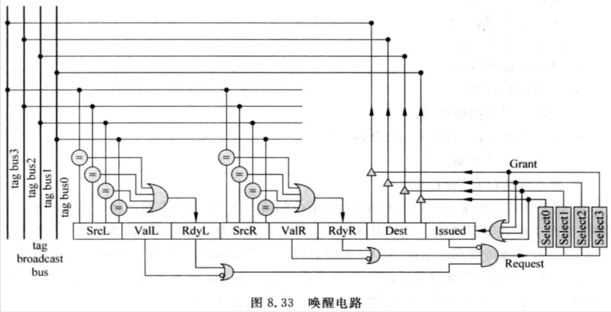

# 8.5 - 喚醒 (Wake up)

## 8.5.1 - 單週期指令的喚醒

- Wake up 是指被 select 電路選中的指令將其執行完後，將其 destination register 和 Issue Queue 中所有的 source registers 編號做比較，並將相同編號的 source registers 標記為 ready 的過程
    - 因為需要將被選中指令的 destination register 編號需要傳遞到 Issue Queue 中的所有 entries，當 Issue Queue 容量比較大，或是 Issue Queue 的個數比較多時，這個編號就需要走很長的路徑
- 一般情況下，select 電路的個數等同於 `issue width`
- 以下是 *Issue width = 4* 的 wake-up 電路 (只包含一個 Issue Queue 的 entry，且所有 select 電路共用同一個 Issue Queue)：

    

    - `SrcL` /`SrcR`：第一、第二個 source register 的編號
    - `ValL` / `ValR`：指令是否存在第一、第二個 source register
    - `RdyL` / `RdyR`：第一、第二個 source register 是否準備好
    - `Dest`：Destination register 的編號
    - `Issued`：指令是否已經被 issued 出去
        - 當指令準備好，並被 select 電路選中時，此時該指令不一定會馬上被 issued 出去 (e.g. 一條指令使用了 load 指令的結果，即使其被 select 電路選中，也不可以馬上離開 Issue Queue)，因此需要透過 `Issued` 記錄該指令是否已經被 issued 了
            - 如果已經被 issued，select 電路就不會重複選到該指令
    - 當指令準備好時，就會向 select 電路送 request 訊號，請求被仲裁
    - Select 電路會選擇根據是否選擇了該指令，送出 grant 訊號
        - 四個 select 電路同時間只會有一個 grant 訊號是 valid 的
    - 如果一條指令被 granted，那麼就會將其 `Dest` 送到 tag bus 上，以便 broadcast 給所有的 Issue Queue entries
- 實務上，為了提供速度，需要減少 Issue Queue 的容量，因此可以使用多個容量較小的 Issue Queue
    - 例如 FU 可以拆分成：
        - 兩個 ALU、一個 Mul/Div、一個 Load/Store ⇒ 共四個 ALU
        - 可以使兩個 ALU 共用同一個 Issue Queue，其他 FU 各自有其獨立的 Issue Queue
    - 雖然每個 FU 仍然需要使用一個 select 電路，且沒辦法減少 wake-up 電路的複雜度，但由於 Issue Queue 的容量變小了，select 電路的 latency 也會因此減少，加快 select 電路的速度，進而減少 select 和 wake-up 兩個 stages 對 CPU cycle time 的影響
- 大部分的 RISC ALU 指令都是 single-cycle 完成的，這種指令可以在 select 電路選中指令時，同個 cycle wake up 其他 Issue Queue 中的指令，被 wake up 的指令在 execute stage 可以透過 bypassing network 獲得被選中指令的執行結果，進而實現 back-to-back 的執行
- **Single-cycle 指令**的 wake-up 流程：
    1. 被 select 電路選中的指令，其 destination register 會被送到 tag bus 上
    2. 每一條 tag bus 上的值會跟所有 Issue Queue 中所有指令的 source registers 編號做比較，如果相等，則將該 source registers 標記為 ready
    3. 當 Issue Queue 中的指令所有的 registers 都準備好了，並且還沒有被 select 電路選中過，其就可以向對應的 select 電路發出 request 訊號，要求被仲裁
    4. 如果 select 電路選擇了其他優先度更高的指令 (如年齡更老的指令)，則這條指令可以在下一個 cycle 持續向 select 電路發出 request 訊號，要求被仲裁
    5. Issue Queue 中這條指令根據 grant 訊號，當 grant 訊號為 valid 時，將其 destination register 的編號送到對應的 tag bus 上，用來 wake up Issue Queue 中所有相關的 source register；同時這條指令就可以被 issued 至 FU 中執行了

## 8.5.2 - 多週期指令的喚醒

- 當一條指令無法在 1 個 cycle 內執行完成時，就不能在被 select 電路選中的那個 cycle，wake up Issue Queue 中的其他指令，而需要根據它在 FU 執行的 cycles 數，delay 這個 wake-up
- Wake-up 過程主要分為兩個階段：
    1. 將被選中的指令的 destination register 送到 tag bus 上 broadcast
    2. 將 tag bus 上的值與所有 Issue Queue 中的 source registers 編號做比較
    - 因此如果要 delay wake-up，就是需要 delay 這兩個階段
- 總共有兩種 delay 方法：
    - `Delay tag broadcast`
    - `Delay wake-up`
- **Delay tag broadcast：**
    - 當發現被 select 電路選中的指令執行 cycles 數 > 1，則在被選中的那個 cycle，並不將這條指令的 destination register 編號送到 tag bus 上，而是根據這條指令所需執行的 cycles 數：`N`，延遲 `N - 1` 個 cycles 後，才將 destination register 編號送到 tag bus 上

        

        - 乘法指令的執行 cycles 數為 **3**，因此 delay：**3 - 1 = 2** 個 cycles 才將其 destination register 編號送到 tag bug 上
        - 但當乘法和其他操作共用一條 tag bus 時，如：Mul/Div FU，乘法和除法會共用同一個 FU 以及同一條 tag bus，則有可能會出現：
            - 當乘法指令的 destination register 編號 delay 了幾個 cycles 後送到 tag bus 上，其他的指令 (e.g. 除法指令)，同時間也要使用這條 tag bus，產生了衝突

                

                - `MUL` 和 `ADD` 共用同一個 FU 以及同一條 tag bus，當 `MUL` 要將其 destination register 編號送到 tag bus 上時，`ADD` 指令也同時要將其 destination register 編號送到同一條 tag bus 上，產生了衝突
                - 解決方法：
                    - 增加這個 FU 所對應的 tag bus 的數量
                        - 缺點：
                            - 當處理器中有很多這種情況時，會導致需要大量的 bus，增加 wake-up 電路的複雜度，因此在實際設計中是無法使用的
                    - 使用一個表格記錄當前 FU 中執行的指令所需的 cycles 數，後續被 select 電路選中的指令，如果從這個表格中發現了衝突，那麼這條被選中的指令就不會馬上被送到 FU 中執行，而是在下個 cycle 繼續參與仲裁

                        

                        - 指令 A 需要 3 個 cycles 來執行，因此指令 A 在被 select 電路選中後，需要 delay 2 個 cycles 才 wake up 其他的指令
                        - 指令 B 需要 2 個 cycles 來執行，因此指令 B 在被 select 電路選中後，需要 delay 1 個 cycle 才 wake up 其他的指令
                        - 透過表格可以知道，指令 B 和指令 A 在 *cycle 2* 會同時使用 tag bus，也就是存在衝突，因此指令 B 是不會被允許在 *cycle 2* 被選中的，會在下個 cycle 繼續參與仲裁
                        - 表格的查詢和 select 電路是同步運行的，因此指令 B 即使被 select 電路選中，也有可能被表格否決掉
                            - 優點：
                                - 沒有增加電路的延遲
                            - 缺點：
                                - 指令 B 被否決的那個 cycle，指令 C 因為不會產生 tag bus 衝突，因此原本也是可以被 select 電路選中的，但因為指令 C 比指令 B 來得新，因此 select 電路選擇了指令 B，結果指令 B 被表格給否決，浪費了一個 cycle，造成性能的下降
                        - 因此，也可以採用先查詢表格，如果表格否決了該指令，則該指令就不會對 select 電路發出 request 訊號，把機會讓給其他的指令
                            - 缺點：
                                - 需要先查詢表格，再讓 select 電路仲裁指令，因此 cycle time 會增加
                        - 具體要選擇哪種設計，取決於實際設計中的折衷和權衡
- **Delay wake-up：**
    - 被 select 電路選中的指令同樣會在當個 cycle 就將其 destination register 的編號 broadcast 到 tag bug 上，並和 Issue Queue 中所有的指令的 source registers 做比較；但此時比較結果相同的 source registers 的 ready bit 並不會馬上被設為 valid，而是會依據被 select 電路所選中的指令執行所需的 cycles 數，delay 相對應的 cycles 後，才將 ready bit 設為 valid
    - 優點：
        - 這種方法不需要增加這個 FU 所對應的 tag bus 的數量

        

        - 指令 A 需要 4 個 cycles 來執行，因此指令 A 在被 select 電路選中後，在 Issue Queue 中所有的 `R3` source registers (e.g. 指令 B 的 `R3`) 都需要 delay 3 個 cycles 後，ready bit 才會被設為 valid
    - 其中一種實做 delay wake-up 控制電路的方法：

        

        - 採用 **shift register** 來實現 delay wake-up
        - 每個指令執行所需的 cycles 數在 decode stage 就可以得知了，可以在指令進入到 Issue Queue 時，將該指令的 `DELAY` 值一併寫入 Issue Queue 中
        - 當一條指令被 select 電路選中時，除了將其 destination register 的編號 broadcast 到 tag bus 上，同時也會將其 `DELAY` 值一起 broadcast 到 delay bus 上
            - 一般來說，每個 FU 都會對應一個 delay bus
        - Issue Queue entry 中每個欄位的內容：
            - `Freed`：
                - 這個 Issue Queue entry 是否為空閒的
                - 當一條指令被寫入此 Issue Queue entry 時，該 Issue Queue entry 就不是空閒的 (`Freed = 0`)
                - 當該指令被 select 電路選中，且確定沒有問題，可以離開 Issue Queue 時，這個 Issue Queue entry 就會變為空閒的狀態 (`Freed = 1`)
                    - 一條指令被 select 電路選中時，並不一定馬上就會離開 Issue Queue
                        - 因為有可能此時 source registers 都還沒準備好 (e.g. 如果等待 load 指令的結果)，但處理器為了加速執行效率，採用了 [speculative wake-up](#853---推測喚醒) 的方式，此時就算該指令被 select 電路選中，也有可能會在之後的時間重新再次參與仲裁
                - 最簡單管理 Issue Queue entry 的方式，就是等一條指令 retire 時，才將該 Issue Queue entry 變為空閒的狀態
                    - 缺點：
                        - 會導致許多無效的指令佔著 Issue Queue entries，使 Issue Queue 中可用的 entries 數變少，降低了處理器的執行效率
                    - 因此現實中的處理器都會採用更高級的方法
            - `Issued`：
                - 是否被 select 電路選中
                    - 0：沒被 select 電路選中，當 source registers 皆 ready 時，向 select 電路發出 request 訊號
                    - 1：被 select 電路選中，不再向 select 電路發出 request 訊號
                - 被 select 電路選中的指令，並不一定馬上就會離開 Issue Queue，因此需要將該指令進行標記，使其不再繼續向 select 電路發出 request 訊號
            - `SrcL`：
                - 指令的第一個 source register 的編號，會與 tag bus 上所有的 destination registers 編號值做比較
            - `SrcL_M`：
                - 當 tag bus 上的 destination registers 與 `SrcL` 比較結果相同時，`SrcL_M` 就會被設為 1 (i.e. match)
                - 當指令收到 select 電路的 grant 訊號時，`SrcL_M` 會被設為 `0`
                    - 被 select 電路選中的指令，就會將其 destination register 的編號 broadcast 到 tag bus 上，同時也會將其 `DELAY` 值一起 broadcast 到 delay bus 上
                - `SrcL_M` 為 `SrcL_SHIFT` 的 enable 訊號，當 `SrcL_M` 為 `1` 時，`SrcL_SHIFT` 每個 cycle 都會 arithmetic right shift 一位 (i.e. MSB 為 1 時，right shift 也會補 1)
            - `SrcL_SHIFT`：
                - 當 tag bus 上的 destination registers 與 `SrcL` 比較結果相同時，被 select 電路選中的指令的 `DELAY` 值就會被寫入 `SrcL_SHIFT` 中

                    - `DELAY` 值會被 encoded，如被 select 電路選中的指令執行需要 3 個 cycles，且 `DEALY` bit width 為 8 bits，那麼 `DELAY` 值就會被 encoded 為 `2’b11111100` (i.e. `bit[7:2]` 皆被設成 `1`)
                - 當 `SrcL_M` 為 `1` 時，`SrcL_SHIFT` 每個 cycle 都會 arithmetic right shift 一位
                - 當 `SrcL_SHIFT` 的 LSB 為 `1` 時 (i.e. `Rdy = 1`)，就代表該指令可以被 wake up 了
                    - 透過這樣的方式，就可以實現 delay wake-up
                - 當指令收到 select 電路的 grant 訊號時，`SrcL_SHIFT` 會被清為 `0`
            - `Rdy(_R)`：
                - 指令的第一個 source register 是否已經準備完成，其值為 `SrcL_SHIFT` 的 LSB
            - `SrcR`、`SrcR_M`、`SrcR_SHIFT`、`Rdy(_L)` 代表指令的第二個 source register，其定義皆與第一個 source register 相同
            - `SrcR_imm_valid`：
                - 指令的第二個 source register 是否為 immediate value
            - `DELAY`：
                - 記錄該指令執行時所需的 cycles 數，在 decode stage 就可以得知
                - 當該指令被 select 電路選中時，除了將其 destination register 的編號 broadcast 到 tag bus 上，同時也會將此 `DELAY` 值一起 broadcast 到 delay bus 上
                - `DELAY` 值會被 encoded，如該指令執行需要 3 個 cycles，且 `DEALY` bit width 為 8 bits，那麼 `DELAY` 值就會被 encoded 為 `2’b11111100` (i.e. `bit[7:2]` 皆被設成 `1`)
                - `DELAY` 的 bit width 由 FU 所有支援的指令中，執行所需 cycles 數最長的那個指令來決定
            - `ROB_ID`：
                - 這條指令在 ROB 中的 index，用來表示該指令的年齡，使 select 電路可以實現 oldest-first 仲裁

## 8.5.3 - 推測喚醒

- 先前的 wake-up 機制都是建立在指令的執行 cycles 數都是可以預知的前提，才可以替每個指令指定 `DELAY` 值，但實際上，還有很多指令的執行 cycles 數是沒辦法提前預知的：
    - Load 指令：
        - Load 指令的執行 cycles 數取決於 D-Cache 是否 hit，甚至是 L2 Cache、L3 Cache 和 DRAM 的時間
            - DRAM 由於自身的結構 (e.g. queuing delay)，從其讀取資料所需的時間並不是一個固定的值
    - 在某些處理器中，定義了一些特殊的情況，如：
        - PowerPC 603 CPU，當被乘數的值比較小時，乘法的結果可以提前被計算出來，稱為 early out
        - Intel Core2 CPU 對於除法操作也存在 early out
        - 因此這些指令的執行 cycles 數並不是一個固定的值
- 對於這些執行 cycles 數不固定的指令，一個最簡單的處理方式，就是等這些指令執行完時，才 wake up 其他相關的指令
- 例如，針對 load 指令：
    - 當 load 指令 A 執行完畢後，才 wake up 指令 B，假設 D-Cache hit，那麼指令 B 就需要 delay 5 個 cycles
        - 如果在這之間找不到足夠的指令來執行，就會導致處理器執行效率的下降

        

    - 由於 D-Cache 是否 hit 可以在資料被讀出前得知，因此可以將 pipeline 改為：

        

        - `Cal Addr`：計算並得到 load address
        - `TLB/Tag`：得知 D-Cache 是否 hit/miss
            - 在此 cycle 就提前 wake up 相關的指令，減少所需的 delay cycles 數，指令 B 只需 delay 3 個 cycles
        - `Data`：讀出資料
    - D-Cache hit 的機率應該是很高的，那麼可以進一步的假設 D-Cache 總是 hit，將 pipeline 改為：

        

        - 在 Cal Addr 就 wake up 相關的指令，並在 Bypass stage 就可以夠過 bypassing network 得到 load 指令的結果，指令 B 只需 delay 2 個 cycles
        - 然而，如果 D-Cache miss 了，那麼就沒辦法透過 bypassing network 得到 load 指令的結果，指令 B 也就無法被執行
            - 此外，指令 B 也無法就此停住等待結果，因為指令 B 已經佔用了 FU 了，會導致其他的指令無法被執行
        - 因此，最好的方法就是直接將指令 B 重新放回 Issue Queue 中，並重新參與仲裁，讓 FU 繼續執行其他的指令

            

- 讀取 L1 Cache、L2 Cache、甚至是 L3 Cache 所需要的 cycles 數是固定的 (假設皆為 hit 的情況)，所以可以使用上述 delay wake-up 的方法
- 然而，對於讀取時間不固定的情況，如讀取 DRAM，就只能等到從 DRAM 中讀回資料後，才能 wake up 相關的指令
    - 這種方式會需要比較多的 delay cycles，性能較差
    - 但如果在這之間可以找到足夠的指令來執行，就可以降低性能上的損失
- 針對像 load 指令這種執行所需 cycles 數不確定的指令，如果等到指令的結果被計算出來後，才 wake up 與其相關的指令，會降低處理器的性能，因此需要使用預測的方法來預測指令執行所需的 cycles 數，在指令得到結果之前，就 wake up 相關的指令，這種方法就稱為 `speculative wake-up`：

    

- 既然是預測，就有可能會預測錯誤，因此就需要恢復預測錯誤前的狀態
    - 對於 load 指令，由於 D-Cache 的 hit rate 是很高的，因此可以假設所有的 load 指令的 D-Cache 都是 hit 的；當 load 指令被 select 指令選中後，就可以依照其最短的執行 cycles 數，wake up 與其相關的指令
    - 當 load 指令真的存取 D-Cache 時，如果此時發現了 D-Cache miss，就代表預測錯誤，需要恢復預測錯誤前的狀態：
        - 被 load 指令 wake up 的 source registers 都必須重新被設為 not ready
        - 對於已經離開 Issue Queue 的指令，還需要將其從 pipeline stage 中給 flush 掉，並重新放回 Issue Queue 中，並等待 load 指令重新 wake up 它們
            - 此時 load 指令可以繼續預測 L2 Cache 是 hit 的，依照 L2 Cache hit 時所需的執行 cycle 數，依照該 cycles 數 wake up 其相關的指令
            - 如果此時預測也失敗，那麼就需要依照同樣的方式，恢復預測錯誤前的狀態
- Load 指令被 select 電路選中後，需要等待 2 個 cycles 才可以 wake up 相關的指令，在這 2 個 cycles，select 電路可以選擇和 load 指令不相關的指令，這 2 個 cycles 稱為 `Independent Window (IW)`；此外，從 load 指令等待 2 個 cycles 後開始將相關的指令 wake up，直到執行時發現是否為 D-Cache hit/miss，中間共間隔了 2 個 cycles，這 2 個 cycles 稱為 `Speculative Window (SW)`：

    

    - SW 中的指令不一定和 load 指令存在相關性
        - 如果被 load 指令 wake up 的指令並沒有被 select 電路選中，SW 中的指令就不會使用 load 指令的結果
    - IW 中的指令一定和對應的 load 指令不存在相關性，但仍有可能與其他的 load 指令存在相關性
        - 因為兩道 load 指令，其 IW 和 SW 有可能是重疊的：

            

            - Load 3 指令的 IW 和 Load 1 指令的 SW 重疊
            - 假設在 TLB/Tag stage 就可以得知 D-Cache 是 hit 或 miss，那麼在 *cycle 5* 的時候，如果 Load 1 指令發生了 D-Cache miss，那麼就需要將與其相關的指令 (i.e. 第四和第五條指令) 從 pipeline 中給 flush 掉，並重新放回 Issue Queue 中，等待重新被 wake up ⇒ 這個過程稱為 `replay`
                - **因為採用 speculative wake-up，預測失敗時，與其相關的指令是沒辦法獲得該指令的執行結果的，因此需要將與其相關的指令 replay**
    - 一條指令被 select 電路選中後，可以選擇：
        1. 直接從 Issue Queue 離開
        2. 繼續停留在 Issue Queue 中，直到被允許時才離開
        - 這兩種設計方式會需要使用不同狀態的恢復方法，產生不同的執行效率和硬體消耗
        - 常用的兩種方法：
            - `Issue Queue Based Replay`
            - `Replay Queue Based Replay`
- **Issue Queue Based Replay：**
    - 採用這種設計，指令被 select 電路選中後，並不會馬上離開 Issue Queue，只有在該條指令確認可以被正確執行後 (i.e. 不需要 replay)，才會允許該條指令離開 Issue Queue
        - 需要在 Issue Queue 中新增一個 [`issued`](#issued-flag) flag，標記該指令已經被 select 電路選中，但還沒離開 Issue Queue
            - 當 `issued` flag 為 `1` 時，就不會繼續向 select 電路發出 request 訊號請求仲裁
        - 當這條指令需要 replay 時，會將 `issued` flag 清為 `0`，這樣它就可以繼續向 select 電路發出 request 訊號請求仲裁了
    - 實際上，有很多情況都會需要 replay 指令：

        - Load 指令發生 D-Cache miss

        - 採用 interleaving 架構的 D-Cache 發生了 bank 衝突

        - Store/load 指令的違例
            - 存取**相同位址**的 store、load 指令，結果 load 指令在 store 指令之前先被執行了
                - i.e. load 指令讀到了 store 指令前的結果

        - Load/load 指令的違例：
            - 存取**相同位址**的兩條 load 指令，結果後面的 load 指令比前面的 load 指令先被執行了
                - 在某些 multi-core 的處理器中，需要保持原始的程式執行順序
    - 上述的情況都必須將與其相關的指令 replay，此時最簡單的方法就是讓所有的指令被 select 電路選中時，都不要馬上離開 Issue Queue，只有在確定指令可以被正確執行時，才將該指令從 Issue Queue 中移除
    - 什麼時候才能確定指令可以被正確執行呢?
        - 如果是完全 out-of-order 來執行 load 和 store 指令：
            - 即使 load 指令是 D-Cache hit，甚至 load 指令已經執行完畢，但只要 load 指令還沒有 retire，都有可能會發生：
                - **store/load 指令違例：**
                    - load → store 同一個位址，結果 store 指令比 load 指令先被執行了，而導致 load 指令的結果是錯誤的
                - **load/load 指令違例：**
                    - load → load 同一個位址，結果比較年輕的 load 指令比比較老的 load 指令先被執行了
                        - 在 multi-core 的環境下，有可能兩條 load 指令之間會有另一個 CPU 的 store 指令寫入了同一個位址，因此兩條 load 指令的執行順序應該要保持 in-order
            - 此時需要將 load 指令和與其相關的指令都 replay (同時把 `issued` flags 重新設回 `0`)
                - P.S. store → load 同一個位址，結果 load 指令比 store 指令先被執行了，這種情況**並不算是指令違例，因此不需要 replay**，因為這只代表 load 指令可以直接從 store buffer 中讀取 store 指令的資料 (需等待 store 指令執行完畢)，不需存取 D-Cache，但是 store 指令和 load 指令之間的執行仍然要保持 in-order
                    - 但如果 load 指令需要的資料寬度大於 store 指令的資料寬度 (e.g. 32-bit load vs. 8-bit store) 時，代表 load 指令所需要的資料有一部分存在 store buffer 中，另外一部份存在 D-Cache 中，load 指令就沒辦法在同一個 cycle 內得到其所需的資料了
                        - 此時，仍需將 load 指令和與其相關的指令都 replay (同時把 `issued` flags 重新設回 `0`)
            - 因此，只有在一條指令 retire 後，才能保證其是正確執行的，此時該指令才可以離開 Issue Queue
        - 如果是完全 in-order 或是 partially out-of-order 來執行 load 和 store 指令，則不會出現上述的違例情況
            - 此時只有 load 指令的 SW 中的指令才有可能需要 replay **(load 指令本身不需要 replay)**
            - 因此，只需等到 load 指令確定是 D-Cache hit/miss 的結果後，就可以決定 SW 中的指令是否可以離開 Issue Queue 了
                - D-Cache hit ⇒ SW 中的指令不需要 replay ⇒ load 指令和其 SW 中的指令可以離開 Issue Queue
                - D-Cache miss ⇒ SW 中的指令需要 replay ⇒ SW 中的指令無法離開 Issue Queue

    - 優點：
        - 設計複雜度比較低

    - 缺點：
        - 由於指令被 select 電路選中後，並不會馬上離開 Issue Queue，只有在該條指令確認可以被正確執行後 (i.e. 不需要 replay)，才會允許該條指令離開 Issue Queue；然而實際上由於 D-Cache hit rate 是很高的，且發生 store/load 指令等違例的機率並不高，所以大部分指令被 select 電路選中後，其實並不需要 replay，但這些指令仍佔據著 Issue Queue 的空間，直到確認其不需要 replay 為止，導致 Issue Queue 中實際可用的 entries 數減少
            - 增加 Issue Queue 的空間則會增加 select 和 wake-up 電路的 latency，因此無法無上限地增加
    - 由於上述的缺點，針對*與 load 指令相關的指令*，可以採取適當的折衷：
        - 一旦 load 指令在執行階段得到 **D-Cache hit** 的結果，就直接釋放與其相關指令 (有被 select 電路選中的指令) 的 Issue Queue entries
            - 優點：
                - 這樣可以最大限度的減少指令對 Issue Queue 的佔用
            - 然而，這樣的折衷方式會導致當發生 store/load 指令違例，或是 load/load 指令違例時，其 replay 的方式會有所不同 (P.S. 只有採用完全 out-of-order 來執行 load 和 store 指令在 D-Cache hit 後還有可能會發生違例)：
                - 由於很多需要 replay 的指令已經離開 Issue Queue 了，此時由於 Issue Queue 中有可能已經沒有多餘的空間了，因此就沒辦法將這些指令重新加回 Issue Queue 中，且有可能會發生 deadlock 的情況
                    - 需要被 replay 的指令因為 Issue Queue 中沒有空間，因此無法被 replay，導致那些依賴這些 replay 指令的指令，也無法被 wake up 來釋放 Issue Queue 的空間
                - 因此一旦需要 replay，就必須 flush 掉這些需要被 replay 的指令，並從 I-Cache 中重新讀取這些指令進 pipeline；這樣會損失一些性能，但這就是折衷的方法
        - 但當 load 指令在執行階段得到 **D-Cache miss** 的結果時，一個比較簡單的方法就是將所有在 load 指令之後被 select 電路選到的指令都重新”放回” Issue Queue 中 (P.S. 只是將 `issued` flag 重新設回 `0`，因為這些指令還沒真的離開 Issue Queue)
            - 然而，考量到 IW 的存在，甚至是 SW 中的指令，並不一定都與 load 指令存在相關性，這些原本並不需要 replay 的指令也會一併被 replay
            - 這種方法稱為：`Non-Selective Replay`
            - 優點：
                - 實做比較簡單
            - 缺點：
                - 由於不用 replay 的指令也 replay 了，因此在一定程度上損失了一些性能

                

                - 假設 `LD` 指令在 Data stage 得知 D-Cache miss，則需將 `LD` 指令之後被 select 電路選中的指令，全部從 pipeline 中 flush 掉，並重新”加回” Issue Queue 中等待重新被 wake up
                - 但其實只有 `OR` 和 `SUB` 指令跟 `LD` 是有相關的，其他的指令其實沒有必要一起 replay
        - 改進方法：
            - 由於 IW 中的指令一定是與 load 指令無關的，因此處於 `Cal Addr` 和 `TLB/Tag` 這兩個 stages 的指令其實是可以不用 replay 的，只需將 `Select` 和 `RF` 這兩個 stages 的指令 replay 即可
    - 如何判斷指令所操作的暫存器是否與 load 指令存在相關性?
        - 相關性分為兩種：
            - 直接相關性
                - 如上例的 `OR` 指令
            - 間接相關性
                - 如上例的 `SUB` 指令
                    - `SUB` 指令與 `OR` 指令相關，`OR` 指令又與 `LD` 指令相關
        - 可以使用一個 `load-vector` 來記錄 pipeline 中所有的 load 指令，每一個 bit 表示一條 load 指令，這個值的寬度等於 pipeline 中最多可以容納的 load 指令個數
            - 每個 architecture register (或是經過 register renaming 後，physical register)，都會分配一個 load-vector

                

                - 假設由左至右：bits[0] → bits[4]
                - 第一條 `load` 指令佔據 load-vector 一個 bit：`R1` ⇒ `2’b10000`
                - 第二條 `ADD` 指令，因為依賴 `load` 指令的 `R1`，因此其 load-vector = 第一條 load 指令的 load vector：`R1` ⇒ `2’b10000`
                - 第三條 `load` 指令佔據 load-vector 額外一個 bit：`bits[1]`，且因其也依賴第一條 load 指令的 `R1`，因此其 load vector 的值等於兩者 OR 後的結果：`R3` ⇒ `2’b01000 | 2’b10000` = `2’b11000`
                - 第四條 `SUB` 指令依賴第三條 `load` 指令的 `R3`，因此其 load-vector = 第三條 `load` 指令的 load-vector：`R4` ⇒ `2’b11000`
                - 第五條 `load` 指令佔據 load-vector 額外一個 bit：`bits[2]`：`R5` ⇒ `2’b00100`
                - 第六條 `ADD` 指令依賴 `SUB` 的 `R4`，以及第五條 `load` 指令的 `R5`，因此其 load vector 的值等於兩者 load-vector 值 OR 後的結果：`R7` = `2’b11000 | 2’b00100` = `2’b11100`
            - 每當 load 指令發生 D-Cache miss 時，就可以透過查詢 Issue Queue 中每個指令的 source registers 的 load-vector，是否有 bit 與 load 指令的 load-vector 重疊，進而得知是否與 load 指令存在相依性
            - 缺點：
                - 如果 pipeline 深度比較深，可以容納的 load 指令數跟著增加，所需的 load-vector 的寬度也會需要跟著增加，增大硬體面積
                    - Load-vector 只適合 pipeline 深度不深的 CPU
        - 每條 load 指令可以改用 5 個 bits 的 `Load Position Value (LPV)` 來記錄 load 指令在 pipeline 中哪個 stage (`Select`、`RF`、`Cal Addr`、`TLB/Tag`、`Data`，假設 load 指令在 FU 中執行需要 3 個 cycles)
            - 每當一條 load 被 select 電路選中時，都會將其 LPV 重置為 `2’b10000`，表示這條 load 指令目前處在 `Select` stage
                - 在 `Select` stage，load 指令的 destination register 編號都會與 Issue Queue 中所有指令的 source registers 編號做比較，如果相符，則每個相符的 source register 都會得到該 load 指令的 LPV
                - 每條指令在被 select 電路選中並 wake up 其他指令時，如果被 wake up 的指令的 source registers 與被 select 電路選中指令的 destination register 相同，則被 select 電路選中指令的 destination register 的 LPV 值也會一併被複製給這些被 wake up 的指令的 source registers，以識別哪些指令的 source registers 與 load 指令存在間接相關性
                - 之後的每個 cycle，所有 source registers 的 LPV 都會 right shift 一位，用來追蹤 load 指令在 pipeline 中的 stage
                - 同時，load 指令的 LPV 每個 cycle 也會 right shift 一位，記錄其在 pipeline stage 中哪個 stage
            - 當 load 指令抵達 Data stage，發現 D-Cache miss 時，在 Issue Queue 中那些 LPV 的最低位 (`bits[0]`) 為 `1` 的 source registers，都與這條 load 指令存在直接或間接的相關性，需要 replay 並將這些 source registers 在 Issue Queue 中對應的 `Rdy` bit 設為 `0`
            - 範例：

                

                - `LD` 指令被 select，wake up `XOR` 指令，將 `LD` 的 LPV：`2’b10000` 複製給 `XOR` 指令的 source register：`R2`

                

                - `XOR` 指令被 select，wake up `ADD` 和 `SLL` 指令，將 `XOR` 此時的 LPV：`2’b00010` 複製給 `ADD` 指令和 `SLL` 指令的 source register：`R3`

                

                - `ADD` 指令和 `SLL` 指令被 select，`ADD` 指令 wake up `AND` 指令，並將其 LPV：`2’b00001` 複製給 `AND` 指令的 source register：`R4`
                - 此外，`AND` 指令還依賴 `LD2` 指令，因此也會將 `LD2` 指令的 LPV：`2’b00100` 複製給 `AND` 指令的 source register：`R6`
                - 此時 `LD1` 已經進到 `Data` stage 了 (假設在 `Data` stage 才可以得知 D-Cache hit 或是 miss 的即果)，所有與 `LD1` 指令有相關性的 source registers 其 LPV 最低位 (`bits[0])` 皆為 `1`
                    - 如果 D-Cache hit，那就繼續執行即可
                    - 如果 D-Cache miss，則必須：
                        - 將這些相關的 source register 在 Issue Queue entry 中的 `Rdy` bit 設為 `0`
                        - Replay SW 中與 load 指令相關的指令
            - 優點：
                - LPV 所需的 bits 數不會隨著 pipeline stages 的深度而改變，只會與 load 指令執行所需的 stages 個數有關
                - 相較於 load-vector 的方法，硬體面積比較小，執行速度也比較快
            - 當一個 cycle 可以執行多條的 load 指令時，那麼在 Issue Queue 中每條指令 source register 的 LPV 電路個數就需要做相對應的複製
                - 例如：每個 cycle 可以執行 2 條 load 指令，那麼每個 source register 就需要 2 個 LPV 分別記錄這兩條 load 指令的 LPV
                - 不過由於 D-Cache ports 數的限制，因此每個 cycle 可以執行的 load 指令個數並不會過多，因此此方法並不會對增加太多的硬體面積
            - 此外，LPV 也可以作為 select 電路選擇指令的依據：
                - 如果 LPV 為 `0`，代表該指令的 source register **沒有與任何 load 指令相關**，select 電路可以**優先選擇該指令**
                - 反之，如果 LPV 不為 `0`，代表該指令的 source register **與某個 load 指令相關**，select 電路可以**優先選擇其他沒有相關性的指令**
            - 這種只 replay 與 load 指令相關的指令的方法，稱為：`Selective Replay`
    - Non-Selective Replay 總結：
        - Load 指令在執行階段發現 D-Cache miss 時，就將 SW 中**所有**指令都 replay，並將 `issued` flag 清為 `0`；此外，與 load 指令相關的 source registers 的 `Rdy` bit 也會被清為 `0`
            - 由於與 load 指令不相關的指令其 source registers 的 `Rdy` bit 都仍為 `1`，因此在下一個 cycle 馬上就可以向 select 電路發出 request 訊號請求仲裁
            - 與 load 指令相關的指令則要等之後再次被 wake up 後才可以重新參加仲裁
    - Selective Replay 總結：
        - 透過 LVM，當 load 指令在執行階段發現 D-Cache miss 時，**只將 SW 中與 load 相關**的指令 replay

            

            - 只需 replay 與 load 指令相關的 `OR` 和 `SUB` 指令
    - 基於 Issue Queue replay 的方法，很多指令在被 select 電路選擇後沒辦法馬上離開 Issue Queue，因此其最大的缺點就是降低了 Issue Queue 中可以使用的空間，降低了處理器的執行效率
- **Replay Queue Based Replay：**
    - 採用這種設計，指令被 select 電路選中後，會馬上離開 Issue Queue，並存入 **Replay Queue** 中
        - 當一條指令 retire 時，就可以從 Replay Queue 中移除

        

    - 舉例來說，當 load 指令發生 D-Cache miss 時：
        - 需將與 load 指令相關的指令，從 pipeline 中給 flush 掉
        - 將這些相關的指令從 Replay Queue wake up，且這些指令被 select 電路仲裁的 priority，比其他在 Issue Queue 中的指令來得高，以便這些需要 replay 的指令可以優先重新送入 FU 中執行
    - Replay Queue Based Replay 同樣支援處理：

    - 優點：
        - 提高了 Issue Queue 的使用效率

    - 缺點：
        - Replay Queue 會佔用額外的硬體空間
        - Replay Queue 也需一起參與 select 電路的仲裁和 wake up，因此設計較複雜
- 從 select stage 到 execute stage 所需的 cycles 數越多，需要 replay 的指令也就越多，因此：
    - 對於 [data-capture](../superscalar-overview-ch8-part1/#data-capture) 架構的設計：
        - 由於其 select stage → execute stage 的時間比較短，需要 replay 的指令個數也就比較少
            - 比較適合搭配 Issue Queue Based Replay 的設計
    - 對於 [non-data-capture](../superscalar-overview-ch8-part1/#non-data-capture) 架構的設計：
        - 由於指令在 issued 後會讀取 physical register file，所以其 select stage → execute stage 的時間比較長，需要 replay 的指令個數也就比較多
            - 採用 Issue Queue Based Replay 的設計會導致 Issue Queue 的可用空間變少
            - 比較適合搭配 Replay Queue Based Replay 的設計
