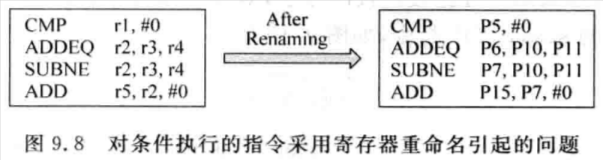

# 9.1 - 概述

- FU 的個數決定了每個 cycle 最大可以同時執行的指令個數，也就是 issue width
- Execute stage 另一個重要的部份就是 bypassing network，其負責將 FU 的運算結果送到其他需要它的地方，像是 physical register file (PRF)、其他 FU 的輸入端、store buffer 等
    - 隨著每個 cycle 可以同時執行的指令個數的增多，bypassing network 變得越來越複雜，已經是處理器中速度提昇的一個關鍵部份
- 在不使用 bypassing network 的情況下，指令的 operands 值可以來自於 PRF (for [*non-data-capture*](../superscalar-overview-ch8-part1/#non-data-capture))，或是 payload RAM (for [*data-capture*](../superscalar-overview-ch8-part1/#data-capture))，每個 FU 都是透過 select 電路將 PRF 或是 payload RAM 串連起來的
    - 每個 select 電路和 PRF (或是 payload RAM) 的 read ports 是一一對應的，每個 FU 和 PRF (或是 payload RAM) 的 read ports 也是一一對應的
    - 因此，PRF 總共需要的 read ports 個數與 issue width 是直接相關的；如果對處理器追求更大的 issue width，就代表著 PRF 需要更多的 read ports，反而會限制了處理器的執行速度，現代處理器多會採用 cluster 架構來解決這個矛盾
        - Payload RAM 由於需要與 Issue Queue 綁定在一起，使用 [distributed Issue Queue](../superscalar-overview-ch8-part1/#distributed-issue-queue) 可以減少 payload RAM read ports 的需求

# 9.2 - FU 的類型

## 9.2.1 - ALU

- ALU (Arithmetic and Logic Unit) 通常負責：整數加減法、shift、簡單的乘除法、資料搬移 (e.g. mov、byte-swap 指令)、分支指令目標位址的計算、記憶體存取位址的計算
- 很多處理器在 ALU 中也實現了比較簡單的乘法功能，用來支持乘法指令
    - 不過為了追求比較高的處理效能，高性能處理器通常選擇將乘法器單獨使用一個 FU 來實現，並在這個 FU 中實現乘累加的功能
    - 有些處理器基於功耗和成本的考量，會將整數類型的乘法交由浮點數運算的 FU 來運算
        - 整數轉成浮點數 → 浮點數乘法 → 浮點數轉為整數
        - 指令的 latency 會變長，但較省面積和功耗，Intel Atom CPU 就採用了此設計

## 9.2.2 - AGU

- AGU (Address Generate Unit) 用來計算記憶體存取位址，如 load/store 指令
    - 在一般 pipeline 處理器中，記憶體的存取位址都是交由 ALU 來計算，但是在 superscalar CPU 中，由於需要同時執行多條的指令，記憶體存取指令的執行效率直接影響了處理器的性能，所以通常會單獨使用一個 FU 來計算其位址

## 9.2.3 - BRU

- BRU (Branch Unit) 負責處理 control flow 類型的指令，如 branch、jump、call 和 return 類型的指令，BRU 負責將這些指令所攜帶的目標位址計算出來，並根據一定的條件決定是否使用這些位址；同時，在這個 FU 中還會對分支預測與否正確進行檢查，一旦發現 mis-prediction，就需要啟動相對硬的恢復機制
- ARM 和 PowerPC 等處理器在指令中的編碼加上了 condition code，根據 condition code 來決定指令是否執行
    - 優點：
        - 不須使用分支指令，因此可以降低分支指令使用的頻率，也就降低了分支預測錯誤的風險，可以獲得更好的執行性能
    - 缺點：
        - Condition code 佔據了指令 encoding 的一部分，例如 ARM 使用了 4 bits 的 condition code (`NCZV`)，扣除掉 opcode、immediate… etc，最後只剩 4 bits 可以用來 encode registers，因此 ARM 指令集支援的 registers 個數只有 16 個 (`$r0` ~ `$r15`)
        - 使用更多的 registers 可以降低指令存取記憶體的頻率，增加處理器的執行效率
        - 當 pipeline 中存在很多條件不符合，因此不會被執行的條件指令，就會造成 pipeline 中存在著大量無效的指令，反而降低了處理器的執行效率
    - 此外，條件執行指令也會對 register renaming 帶來額外的麻煩：
        
        
        
        - 如果 `ADDEQ` 指令會被執行，但 `SUBNE` 指令不會被執行，那麼 `ADD` 指令應該使用 `P6` 而非 `P7`
        - 最簡單的方法就是 stall pipeline：一旦在 register renaming 的時候碰到條件執行指令，就 stall pipeline，直到這條指令的執行條件被計算出來，就可以決定後續的 register rename 的結果
            - 缺點：效能非常差
        - 另外一個方法就是對條件執行指令也進行預測：可以先假設所有條件執行指令都會被執行，等到後續指令的執行條件被計算出來，並發現預測錯誤時，再恢復執行前的狀態：
            - 將在這條條件執行指令之後的指令從 pipeline 中 flush
            - 恢復這些指令對 RAT 的修改
            - 重新將這些指令 fetch 進 pipeline，重新做 register renaming 時就會使用正確的結果
            - 缺點：
                - 條件指令相較於分支指令，比較沒有固定的 pattern (i.e. 執行 or 不執行)，因此 mis-prediction 的機率會高得多，效率不高
        - (Intel x86) 硬體插入額外的 `select-uOP` 指令：
            
            
            
            - `select-uOP` 指令可以針對兩個條件執行指令的結果做選擇，所以需要兩個條件執行指令才可以使用
            - 需要編譯器的搭配，手寫 assembly 的時候也需要特別的處理硬體才會插入 `select-uOP` 指令
            - 例如：
                - `ADDEQ` 指令會執行：`P8` = `P6`
                - `SUBNE` 指令會執行：`P8` = `P7`
                - P.S. `ADDEQ` 指令和 `SUBNE` 指令都不會被執行的時候???
        - 硬體在每個條件指令後面都插入一條 `select-uOP` 指令：
            
            
            
            - 不用侷限於一定要兩個條件指令才能使用
            - 缺點：
                - 指令變多，執行效能會降低
            - 也可以先每兩條條件指令插入一條 `select-uOP` 指令，直到最後只剩一條條件執行指令時，再額外插入一條 `select-uOP` 指令
    - ARM 以 **s** 結尾的指令，在執行完畢後，也會修改 CPSR，CPSR 就相當於這條指令的另一個 destination register；所有在這條指令之後的條件執行指令，都會將 CPSR 視為其中一個的 source register (i.e. 相當於使用該指令的 destination register)
        - 因此，CPSR 也可以當作一個普通的 register，也可以對其做 register renaming
        - 不過由於 CPSR 的寬度小於一般的暫存器，因此一般會為 CPSR 使用一個獨立的 PRF
        - 由此可見，使用 CPSR 增加了 register renaming 的複雜度，功耗也會有所增加，各有利弊
- 對於實現分支預測的處理器來說，BRU 還必須負責檢查分支預測是否正確；如果發現 mis-prediction，就必須依照先前介紹分支預測失敗狀態恢復的方法 (參考：[4.4 - 分支預測失敗時的恢復](../superscalar-overview-ch4-part2/#44---分支預測失敗時的恢復))，恢復 pipeline 的狀態

## 9.2.4 - 其他 FU

- 處理器中還包含其他很多類型的 FU：
    - 浮點數運算 FU
    - SIMD 類型指令的 FU

# 9.3 - 旁路網路

- 一條指令可以在 execute stage 才需要 operands，且在 execute stage 末端就可以得到它的結果，因此只需在 FU 的輸入端和 FU 的輸出端之間搭建一個通路，就可以提前將 FU 的計算結果送到所有 FU 的輸入端
    - 處理器內部也有其他的元件需要 FU 的計算結果：PRF、payload RAM 等，因此也需要將 FU 的計算結果送到這些地方
    - 這個通路就稱為：`Bypassing network`
- 在處理器中，為了能夠 back-to-back 的執行指令，bypassing network 都是必須的：
    
    
    
    - 指令 A 的計算結果，需要提前在 EX stage 末端，bypass 計算結果給指令 B
- 在 superscalar CPU 中，指令在被 select 電路選中的那個 stage，wake up pipeline 中相關的指令，仍舊可以 back-to-back 的執行指令：
    
    
    
    - 指令 A 在 Select stage wake up 指令 B，並提前在 Execute stage 末端，bypass 計算結果給指令 B
- 一個更真實的 superscalar CPU，有可能會切分更細的 pipeline stages：
    - Source operands 從 PRF 讀出來，需要經過一段很長的線路，才能抵達 FU 的輸入端，而且 FU 的輸入端還有大量的 multiplexer，用來選擇從不同的 bypassing network 或 PRF 的輸出中選擇合適的 operands
        - 為了降低對 CPU cycle time 的影響，source operands 從 PRF 讀出來後，還需要經過一個 `Source Drive` stage (≥ 1 個 cycle)，才能抵達 FU 的輸入端
    - FU 計算完後，也需要經過複雜的 bypassing network，才能抵達 FU 或是 PRF 的輸入端
        - 為了降低對 CPU cycle time 的影響，FU 的結果被計算出來後，還需要經過一個 `Result Drive` stage (≥ 1 個 cycle)，才能 FU 或 PRF 的輸入端
    
    
    

## 9.3.1 - 簡單設計的旁路網路

- 當 FU 的個數比較少，對 CPU 頻率的要求不高時，bypassing network 可以採用比較簡單的設計
    
    
    
    - FU 的 operands 直接來自於 PRF
    - FU 的計算結果也直接寫入 PRF
    - 一個 FU 想使用另一個 FU 的計算結果只能直接從 PRF 讀取
    
    
    
    - FU 的 operands 可以來自於 PRF、自身 FU 的結果、其他 FU 的結果
        - 每個 FU 都需要一個 3-to-1 的 multiplexer 來選擇 operands 來源
    - FU 的計算結果會透過 bypassing network，寫入 PRF 或是 FU 的輸入端
- 很多 FU 都有多個功能，也就是有多個計算單元；然而，由於 FU 所支援的指令的 latency 不一定都相同，如加減法指令只需 1 個 cycle 即可完成，乘法指令需要 32 個 cycles 才能完成，此時如果使用採用正常的執行，就可能出現一個 FU 中兩個以上計算單元的結果在同一個 cycle 被計算出，並搶用 FU 的 bypassing network，造成衝突
    
    
    
    - 最簡單的解法可以採用類似 [8.5.3 - 推測喚醒](../superscalar-overview-ch8-part2/#853---推測喚醒)的方法，先假設不會發生衝突，等到一條指令到達 FU 中被執行之前，檢查目前 FU 是否可以被使用，例如：
        - 一個 FU 在上個 cycle 執行了 latency = 3 的指令，那麼這個 cycle 就沒辦法執行 latency = 2 的指令了
        - 如果這個 cycle 不幸到達 FU 的指令的 latency = 2，那就必須將這條指令重新放回 Issue Queue 中參與仲裁
        - 缺點：
            - 浪費了原本可以執行其他指令的機會，如果可以事先得知無法執行 latency = 2 的指令，那 select 電路就可以選擇其他 latency ≠ 2 的指令來執行
                
                
                
        - 因此，select 電路在進行仲裁時，應該要將某些 latency 的指令給排除，那就可以在不降低性能的情況下解決 bypassing network 衝突的問題
        - 例如：
            - 假設一個 FU 可以執行三種類型的指令，也就是該 FU 有三種計算單元，其對應的 latency 分別為：1 個 cycle、2 個 cycles、3 個 cycles，那麼：
                - 當這個 cycle 執行 latency = 3 的指令時：
                    - 下個 cycle 不允許執行 latency = 2 的指令
                    - 下下個 cycle 不允許執行 latency = 1 的指令
                - 當這個 cycle 執行 latency = 2 的指令時：
                    - 下個 cycle 不允許執行 latency = 1 的指令
                - 當這個 cycle 執行 latency = 1 的指令時，沒有限制
                - 對於 latency = 3 的指令，沒有限制 (假設 FU 是 pipeline 的)
- Select 電路在仲裁時，需要考慮指令所對應的 FU 是否可以被使用，不會產生 bypassing network 衝突
- 從簡化設計的考量，最好使一個 FU 所執行所有類型的指令的 latency 都是相同的，就不用引入上述的判斷電路

## 9.3.2 - 複雜設計的旁路網路

- 真實的 superscalar CPU 中，execute stage 有可能會切分更細的 pipeline stages：`Source Drive` stage 以及 `Result Drive` stage，這也導致了 bypassing network 需要做對應的變化：
    
    
    
    - 指令 B 只能在 Execute stage 從指令 A 的 Result drive stage 獲得 operands
    - 指令 C 可以在 Source drive stage 從指令 A 的 Result drive stage 獲得 operands
    - 指令 C 也可以在 Execute stage 從指令 A 的 Write back stage 獲得 operands
    - 指令 D 可以在 Source drive stage 從指令 A 的 Write back stage 獲得 operands
    - 指令 E 在 RF read stage 讀去 PRF 時，就可以得到指令 A 寫入 PRF 的結果了，因此不需要透過 bypassing network
        
        
        - 假設 PRF write 可以在前半個 cycle 完成，PRF read 可以在後半個 cycle 完成
- 在複雜的 pipeline 中加入 bypassing network，會使設計的複雜度變大，對 CPU cycle time 造成一定的影響
    
    
    
    - 相較於先前簡單的設計，只增加了 Source Drive 和 Result Drive stages，不使用 bypassing network 並不會增加設計的複雜度
    
    
    
    - 相較於先前簡單的設計，增加了 Source Drive 和 Result Drive stages 會導致在使用 bypassing network 時，設計的複雜度大幅度的增加
- 每新增一個新的 pipeline stage，bypassing network 的複雜度會大幅地增加，因此無法無上限的新增 pipeline stage

# 9.4 - 操作數的選擇

- FU 的輸入端來源包括：PRF、bypassing network、還有指令的 immediate value；而這些來源是透過 multiplexer 來選擇的，需要有對應的訊號來控制這個 multiplexer，決定要選擇的來源
- 所有的 physical register 可以保存在一個表格：`Scoreboard` 中，scoreboard 記錄了一個 physical register 生命週期經過的地方：
    
    
    
    - 真實的 scoreboard 原本圖片所示來得複雜
    - scoreboard 中對於每個 physical register，都記錄了：
        - `FU #`：這個 physical register 會在哪個 FU 被計算出來
            - 當需要透過 bypassing network 取得 physical register 的值時，需要知道它來自於哪個 FU，以控制 multiplexer 選擇對應的值
            - 當一條指令被 select 電路選中時，就會將這條指令的 destination register 在哪個 FU 中執行的資訊記錄到 scoreboard 中
        - `R`：表示這個 physical register 已經被 FU 計算出來並寫進 PRF 中
            - 只需使用一個 bit 即可：
                - `0`：這個 physical register 還沒被寫進 PRF 中，需要透過 bypassing network 來取得值
                - `1`：這個 physical register 已經被寫進 PRF 中了，可以直接讀取 PRF 來取得值
- 在 pipeline 中加入 scoreboard 會對 pipeline 的性能造成一定的影響：
    
    
    
    - 指令 A 在 select stage 會將 `$r1` 的 physical register 在哪個 FU 中執行的資訊寫進 scoreboard 的 `FU #` 中
    - 指令 A 在 write-back stage 除了會將 FU 的結果寫入 PRF，也會將 `$r1` 的 physical register 在 scoreboard 中的 `R` 設成 `1`
    - 指令 B 在 execute stage 時，可以讀取 scoreboard，得知其所需的 `$r1` 需透過 bypassing network 來取得
    - 指令 C 在 execute stage 時，可以讀去 scoreboard，得知其所需的 `$r1` 可以直接讀取 PRF 來取得
- Scoreboard 的讀取如果放在 execute stage，會對 CPU 的 cycle time 造成一定的影響
    
    
    
    - 當 CPU 頻率的需求比較高時，這種作法可能就無法滿足要求
    - 如果需要提高 CPU 的頻率，可以將 scoreboard 的讀取放到 RF read stage，使 scoreboard 的讀取和 PRF 的讀取可以同時進行，”隱藏” scoreboard 的讀取時間：
        
        
        
        - 然而，這樣會導致新的問題：
            
            
            
            - 指令 C 原本可以在 execute stage 直接讀取 PRF 獲得 `$r1` 的值，但由於指令 C 讀取 scoreboard 時，指令 A 尚未完成 scoreboard `R` bit 的更新，因此會讓指令 C 錯誤地認為 `$r1` 必須透過 bypassing network 才能獲得
        - 可以在讀取和寫入 scoreboard 的地方加入新的邏輯：
            - 當寫入 scoreboard 所使用的 physical register 編號和讀取 scoreboard 的 physical register 編號相同時，就將 multiplexer 設為從 PRF 中獲得 operands
- 補充：
    - 實際上的 scoreboard 範例：
        
        ```asm
        MUL F2, F0, F4    ; F2 = F0 * F4
        ADD F6, F2, F8    ; F6 = F2 + F8
        SUB F10, F6, F12  ; F10 = F6 - F12
        ```
        
        ```
        +------+-------+-----+-----+-----+-----+-------+-------+-----+-----+
        |  FU  | Busy  | Op  | Fi  | Fj  | Fk  |  Qj   |  Qk   | Rj  | Rk  |
        +------+-------+-----+-----+-----+-----+-------+-------+-----+-----+
        | MUL1 |   Y   | MUL | F2  | F0  | F4  |   -   |   -   |  T  |  T  |
        | ADD1 |   Y   | ADD | F6  | F2  | F8  | MUL1  |   -   |  F  |  T  |
        | ADD2 |   Y   | SUB | F10 | F6  | F12 | ADD1  |   -   |  F  |  T  |
        +------+-------+-----+-----+-----+-----+-------+-------+-----+-----+
        ```
        
        - `FU`：FU 的名稱
        - `Busy`：FU 是否正在忙
        - `Op`：這個 FU 正在執行的 operation
        - `Fi`：這個 FU 要寫的 destination register
        - `Fj`, `Fk`：FU 所需的 source registers
        - `Qj`, `Qk`：如果 `Fj`/`Fk` 尚未 ready，哪個 FU 會提供它
        - `Rj`, `Rk`：來源是否 ready
    - 現代處理器，scoreboard 幾乎已經被 Tomasulo (Issue Queue + Register Renaming + Bypassing Network) 給取代了

# 9.5 - Cluster

- 現在處理器隨著 pipeline stages 級數的提高，會導致硬體的設計越來越複雜，例如需要更多的 read/write ports、PRF，更複雜的 bypassing network，不僅增加了硬體的面積，也增加了硬體的功耗，限制了 CPU 的頻率，需要採用 **Cluster** 架構來解決這個問題

## 9.5.1 - Cluster Issue Queue

- 除了 Issue Queue 外，由於 register file 與 Issue Queue 彼此是緊密相關的，因此 register file 同時也會採用 cluster 架構
- [8.1.1 -  集中式 (Centralized) vs. 分佈式 (Distributed)](../superscalar-overview-ch8-part1/#811----集中式-centralized-vs-分佈式-distributed) 介紹的 distributed Issue Queue 就是將 Issue Queue 採用了 cluster 架構
    
    
    
    - 每個 cluster Issue Queue 都對應一個 payload RAM (採用 [data-capture](../superscalar-overview-ch8-part1/#data-capture) 架構) 和 FU
    - 優點：
        - 減少每個 Issue Queues 的 ports 數
        - 每個 Issue Queue 對應的 select 電路只需從少量的指令中做仲裁，因此可以加快 select 電路的速度
        - 由於 Issue Queue 的容量較小，因此 wake up 指令的速度也比較快
        - Payload RAM 也可以採用 cluster 架構，因此每個 payload RAM 的容量也會比較小，而且也不需要支援這麼多的 read/write ports
    - 缺點：
        - 被 select 電路選中的指令如果要 wake up 的指令存在另外的 Issue Queue 中，那麼需要走比較長的 wake up 電路
            - 對頻率有要求的 CPU，跨 cluster 的 wake up 有可能會需要額外新增一個 pipeline stage
            - 當兩條存在相關性的指令存在不同 cluster 的 Issue Queue 時，有可能就會有 bubble，無法 back-to-back 的執行指令
            - 例如：一個 2-way issue 的 CPU，執行指令 A ~ E，假設指令 A ~ E 的 dependency 如下：
                
                
                
                - 如果指令 A、B、E 被分配到同一個 cluster，指令 C、D 被分配到另外一個 cluster，共需 5 個 cycles 才能執行完畢：
                    
                    
                    
                    - 指令 A 需要多 1 個 cycle 才能 wake up 指令 C
                    - 指令 B 需要多 1 個 cycle 才能 wake up 指令 D
                    - 指令 D 需要多 1 個 cycle 才能 wake up 指令 E
                - 如果指令 A、C 被分配到同一個 cluster，指令 B、D、E 被分配到另一個 cluster，只需 3 個 cycles 才能執行完畢：
                    
                    
                    
                    - 指令 A 可以 back-to-back wake up 指令 C
                    - 指令 B 可以 back-to-back wake up 指令 D
                    - 指令 D 可以 back-to-back wake up 指令 E
                - 因此想使處理器有比較高的執行效率，指令 [allocation](../superscalar-overview-ch8-part1/#83---分配-allocation) 的演算法就必須有適當的設計
- 對於採用 [non-data-capture](../superscalar-overview-ch8-part1/#non-data-capture) 架構的 CPU 來說，指令在被 select 電路選中後，會先去讀 PRF，因此就需要 PRF 支援 multiple read ports，因此也會增大硬體面積，執行效率也會比較慢，因此，也可以對 PRF 採用 cluster 架構
    
    
    
    - 每個 cluster 都有”完整”的 PRF：每個 FU 在更新自己 cluster 內部 PRF 的同時，也同時需要更新其他 clusters 的 PRF
    - 每個 FU 都只能在自己的 cluster 內使用 bypassing network
    - 優點：
        - 減少 PRF 所需的 read ports
            - 4 個 FU → 每個 cluster 2 個 FU，因此 read ports 可以減少，進而減少硬體面積
            - 但無法減少 write ports，因為 FU 仍需要更新其他 clusters 的 PRF
        - 減少 bypassing network 的複雜度
    - 缺點：
        - Bypassing network 無法跨 cluster，當兩個存在相關性的連續指令處於不同的 clusters 時，後面的指令需要等到前面的指令更新完 PRF 後，才能從 PRF 中讀取 operands
            - 雖然硬體可以嘗試找其他不相關的指令到這兩條指令中間來執行，但當 pipeline 較深的時候，硬體可能沒辦法找到這麼多不相關的指令，引進較多的 bubbles

## 9.5.2 - Cluster Bypassing Network

- 為了減少 bypassing network 的複雜度，也可以讓 bypassing network 採用 cluster 的架構
    
    
    
    - 採用 cluster 架構的 bypassing network 後，每個 FU 就沒辦法將其計算結果送到其他 clusters 的 FU
        - 當兩條相關的指令都使用同一個 FU 時，還是可以透過 bypassing network，back-to-back 的執行
            - 跨 cluster 只能透過 PRF 來傳遞 operands
        - 但當兩條相關的指令使用不同 clusters 的 FU 時，就沒辦法 back-to-back 的執行了
    - 由於 bypassing network 的複雜度降低了，因此 pipeline 中的 Source Drive stage 和 Result Drive stage 就可以被移除了
        - 雖然跨 cluster 只能透過 PRF 來傳遞 operands，但由於 pipeline 少了 Source Driver stage 以及 Result Driver stage，因此一條指令的執行效率是有被提高的，兩條跨 cluster 的指令只需間隔 1 個 cycle 即可
            
            
            
            - Out-of-order CPU 可以找一條不相關的指令插到這個 cycle 中來執行
                - 然而，隨著 CPU 同時可以執行的指令數越來越多，PRF 的 ports 數量也會隨著增加，加上 CPU 的頻率的提高 (i.e. cycle time 的減少)，有可能會導致 PRF 沒辦法在同一個 cycle 中做 write & read，兩條相關的指令就需要間隔更多的 cycles，Out-of-order CPU 有可能沒辦法找到這麼多條不相關的指令插到這幾個 cycles 中來執行，影響到 CPU 的執行效率
            - In-order CPU 由於沒辦法調度不相干的指令來執行，只能產生 bubbles，因此通常 in-order CPU 都會採用”完全”的 bypassing network，而非採用 cluster 架構的 bypassing network
                - 例如：Intel Atom 就有複雜的 bypassing network
- 對於 Cluster Issue Queue 和 cluster bypassing network，當兩條相關的指令分處於不同的 cluster 時，都會需要 delay 1 個 cycle，但這兩個 delays 其實並不會被累加：
    
    
    
    - 指令 A 需要 delay 1 個 cycle 才能 wake up 指令 B
    - 由於已經 delay 1 個 cycle 才 wake up 指令 B，指令 A bypass 其 FU 的計算結果的 delay 剛好被隱藏起來了；當指令 B 進到 execute stage 時，指令 B 的 FU 剛好可以接收到來自指令 A 的 FU 的計算結果，不需要額外的 delay
    - 總共只需要 delay 1 個 cycle 即可

# 9.6 - 記憶體指令的加速

## 9.6.1 - Memory Disambiguation

- 暫存器的相關性 (RAW、WAW、WAR)，都是可以在 register renaming stage 被解決；然而，針對記憶體存取的相關性 (i.e. load、store 指令)，由於記憶體存取位址是在 execute stage 才被計算出來的，才可以得知兩條記憶體存取的指令，是否存在相關性
    - 記憶體存取指令間也存在 RAW、WAW、WAR 相關性：


- 記憶體存取的 WAW、WAR 是沒辦法像暫存器可以用 register renaming 來消除的，因此記憶體存取的 RAW、WAW、WAR 都是真的相關性，需要特別處理
- 為了降低設計難度，大部分的處理器：
    - **Store 指令都是 in-order 的**，可以避免 WAW 相關性
    - Load 指令則有不同的實現方式：
        - **完全 in-order：**
            - Load 指令和 store 指令都完全依照程式的順序來執行
        - **部份 out-of-order：**
            - In-order 的 store 指令將程式劃分成了不同的 blocks，當一條 store 指令的存取位址被計算出來後，這條 store 指令和它後面的 store 指令之間的 load 指令可以以 out-of-order 的方式來執行：
            - 這種設計可以降低 RAW 相關性的檢查難度
        - **完全 out-of-order：**
            - Load 指令不受 store 指令的限制，只要 load 指令的 operands 都準備好了，它就可以被送到 FU 中執行
            - 這種設計 WAR 和 RAW 相關性都必須在 pipeline 中被處理
- 完全 in-order：
    - Load 指令和 store 指令都是嚴格得照程式的執行順序來執行，為最保守的一種方法
    - 由於 load 指令通常處於相關性的頂端，這種方法沒辦法使 load 指令盡可能地提前被執行，導致所有相關的指令都必須等待 load 指令才能被執行，性能較差
    - 在 superscalar CPU 中基本上不會採用此方法
- 部份 out-of-order：
    - Store 指令仍是 in-order 執行，但兩條 store 指令之間的所有 load 指令都可以以 out-of-order 的方式來執行
    - 可以使 load 指令盡可能地提早被執行
    - 當一條 store 指令的存取位址被計算出來後，在它之後進入到的所有 load 指令就可以判斷 RAW 的相關性了，每條 load 指令的存取位址被計算出來後，需要和前面所有已經執行的 store 指令的存取位址進行比較
    - 因此，需要使用 `store buffer` 來儲存還沒 retire 的 store 指令，如果 load 指令在 store buffer 中發現了相同存取位址的 store 指令，則說明了存在 RAW 的相關性，此時 load 指令就可以直接從 store buffer 拿到 store 指令的值；如果在 store buffer 中沒有找到相同存取位址的 store 指令，那 load 指令就必須去存取 D-Cache 或是 memory 來取得值
    - 實際上，當 store 指令被 select 電路選中後，就可以 wake up 後面的 load 指令了，無須等到 store 指令的存取位址真的被計算出來；當 load 指令的存取位址被計算出來時，其前面 store 指令的存取位址一定也早就被計算出來了
        - 然而除了比較**存取位址**外，還需要比較**指令的先後順序**，例如：
            
            
            
            - 即使 store 指令 E 和 store 指令 A 的存取位址相同，load 指令 B、C、D 也不會跟 store 指令 E 有 RAW 相關性，如果只比對 store buffer 中的存取位址，有可能就會判斷錯誤 (如果 load 指令 B、C、D 執行時，store 指令 E 已經存入 store buffer 中了)
                - RAW 相關性檢查只需檢查 load 指令之前的 store 指令即可，因此需要對 load 指令和 store 指令前後順序進行編號
            - 可以在 decode stage 替每條 load 指令和 store 指令進行編號，這個編號的 bits 寬度由 pipeline 中最多可容納的 load 指令和 store 指令的個數來決定
                - 編號的比較方法可以參考 [ROB 編號的比較方式](../superscalar-overview-ch8-part1/#rob-index-based-age-comparison)
                - 由於 ROB 中儲存了所有的指令，使用 ROB 編號作為 load 指令和 store 指令的編號會變得非常的稀疏，浪費比較器的 bits 寬，增加硬體面積，不過在真實處理器中也有採用
        - P.S. 一條 load 指令是有可能會與多條 store 指令存在 RAW 相關性的
            - 例如：兩條 store 指令各 store 1 byte 的資料，但另外一條 load 指令 load 的 4 bytes 資料中，其中 2 bytes 是從這兩條 stores 而來，此時這條 load 指令就與這兩條 store 指令存在 RAW 相關性
            - 因此不能單單只比較位址，還需比較**存取的資料範圍**
                - i.e. `addr + size`
    - 另外一種設計方法，可以限制後面的 store 指令只有在前面所有的 load 指令全部都被 select 電路選中後，才允許該 store 指令向 select 電路發出 request
        - 這樣每一條 load 指令在比對 store buffer 時，只會遇到在自己老的 store 指令，而不會遇到比自己年輕的 store 指令，就不需要比對指令的先後順序，簡化 RAW 相關性的檢查
        - 例如上例中，store 指令 E 只能在 load 指令 B、C、D 都被 select 電路選中後，才會向 select 電路發出 request
    - 然而這種部份 out-of-order 的設計，仍然無法最大限度的同步執行指令：
        
        
        
        - Load 指令 F 與 store 指令 B 沒有相關性，但卻沒辦法在 store 指令 B 之前被執行
- 完全 out-of-order：
    - Store 指令仍是 in-order 執行，但只要 load 指令的 operands 都準備好了，就可以向 select 電路發出 request
    - 可以採用 load 指令和 store 指令共用同一個 Issue Queue，每個 cycle 只 issue 一條 load 指令或 store 指令的設計，或是每個 cycle 同時 issue 一條 load 指令和 store 指令的設計
        - Load 指令和 store 指令在一般程式中佔的比例比較大，所以最好每個 cycle 都盡可能的增加每個 cycle 可以同時執行的 load 指令和 store 指令的個數
        - 不過由於 load 指令和 store 指令的處理過程不同，即使使用同一個 Issue Queue，仍需要使用互相獨立的 select 電路
            - 對於 store 指令的 select 電路來說：
                - 當指令被寫入 Issue Queue 中時，需根據指令的年齡資訊，找到最舊的那條 store 指令來 issue；如果還沒有準備好，則必須一直等待 ⇒ In-order
            
            - 對於 load 指令的 select 電路來說：
                - 只需要比對準備好的 load 指令的年齡資訊即可，找到最舊，且準備好的 load 指令來 issue ⇒ Out-of-order
    - 也可以採用 load 指令和 store 指令各自使用獨立的 Issue Queue 的設計
        - Store 指令的 Issue Queue 可以直接使用 FIFO 來實做，select 電路不用比較年齡資訊，只需判斷 FIFO 中最舊的那條 store 指令是否準備好就好
- **Store/load 指令違例：**
    
    
    
    - 第二條 load 指令被提前到 store 指令之前被執行，結果發現 store 指令與第二條 load 指令的存取位址相同，彼此之間存在 RAW 相關性，因此必須恢復 pipeline 的狀態
        - 除此之外，不僅第二條 load 指令的結果有錯，所有與這條 load 指令有直接關係或間接關係的指令，都需要從 pipeline 中被 flushed 掉，恢復 pipeline 的狀態，並重新參與仲裁並執行，因此會影響處理器的執行效能
    - 需要採用 load/store 相關性的預測，來預測哪些 load 指令和前面的 store 指令存在 RAW 相關性而不能提前被執行：
        - 透過 load/store 相關性的預測，一旦發現一條 load 指令和它前面的 store 指令存在 RAW 相關性，就將其記錄下來，之後再遇到這條 load 指令時，就不提前執行，而且需要從 store buffer 中獲取 load 指令所需要的值
            - 額外好處：只有那些與 store 指令存在 RAW 相關性的 load 指令，才需要存取 store buffer，因此可以減少 store buffer 所需的 ports 數及比較電路的個數，並降低設計的複雜度和功耗
        - P.S. 預測失敗並不需要恢復 pipeline 的狀態， 因為 load 指令只是比較晚被執行而已

## 9.6.2 - Non-blocking Cache

- I-Cache 由於 fetch 指令需要照 program order，不能簡單地使用 non-blocking cache，因此 non-blocking cache 主要會用在 D-Cache
    - 然而對於使用了 branch prediction 的 CPU 來說，是可以根據當前指令的位址來對下一條指令的位址做預測的；當使用一個 PC address 讀取 I-Cache 發生 I-Cache miss，且同時預測這個 PC address 所的指令是一條分支指令時，如果不採用 non-blocking I-Cache，那 CPU 就得等這條分支指令從 I-Cache 讀出來後，才可以繼續使用預測的 PC address 來 fetch 下一條指令，此時再次發生 I-Cache miss 的機率是很高的：
        
        
        
        - 有可能連續發生兩次 miss penalties
    - 如果使用 non-blocking I-Cache，就可以隱藏一部分的 miss penalty，提高處理器的執行效率：
        
        
        
        - Non-blocking I-Cache 不用等到所預測的分支指令從 I-Cache 讀出來後，才開始 fetch 下一條指令 (有可能又會再發生一次 I-Cache miss)
    - 然而，由於指令的特性，就算後面的指令比前面一個指令先被 fetched 進來，也沒辦法先執行後面的指令；因此通常不用使用太大的 [**MSHR**](#mshr)
- 對於 load 指令來說 (假設 L1 D-Cache 下一級就是記憶體)：
    - 如果需要的資料不在 D-Cache 中，就會發生 D-Cache miss，需要從下一級的記憶體中讀取data block (一條 cache line 的 size)，並找到一條 cache line 將該 data block 寫入
        - 如果被寫入的 cache line 是 dirty 的，那在寫入之前，還需要先將 dirty 的 cache line flush 回記憶體後，才可以將讀到的 data block 寫入 cache line
- 對於 store 指令來說 (假設 L1 D-Cache 下一級就是記憶體)：
    - 如果 store 的位址不在 D-Cache 中，對於 “write back + write allocate” 類型的 D-Cache 來說，首先需要從記憶體中找到這個位址對應的 data block，讀出來後與 store 指令的資料合併，並找到一條 cache line 將合併後的資料寫入
        - 如果被替換的 cache line 是 dirty 的，那在寫入之前，還需要先將 dirty 的 cache line flush 回記憶體後，才可以將合併後的資料寫入 cache line
- 不管是 load 指令還是 store 指令，當發生 D-Cache miss 時，D-Cache 和記憶體都是需要交換資料的，通常需要好幾個 cycles 才能完成；如果在這幾個 cycles 內，又發生了 D-Cache miss，該如何處理?
    - 最簡單的方法就是在發生 D-Cache miss 並未被解決前，鎖定 D-Cache 和記憶體之間的 bus，只處理目前發生 D-Cache miss 的指令
        - 缺點：
            - D-Cache miss 通常處理的時間都比較長，如果這段時間 block 了 load 指令和 store 指令的執行，在一般情況下，load 指令都是處於相關性的最頂端，這樣的 block 就會大大降低處理器可以同步執行指令的數量，降低處理效能
            - 這種 cache 設計方法稱為：`Blocking Cache`
                
                
                
    - 如果在發生 D-Cache miss 時，不用 block load 指令和 store 指令的執行，這種 cache 的設計方法稱為：`Non-blocking Cache`
        
        
        
        - Non-blocking cache 可以在一定程度上掩蓋 D-Cache miss 所佔用的時間 (Miss Penalty)
        - 採用 non-blocking cache 後，load 指令和 store 指令 D-Cache miss 被處理完的時間有可能就跟原始的程式執行順序不一樣了
        - 為了支援 non-blocking cache，必須將產生 D-Cache miss 的 load 指令和 store 指令給記錄起來，用來保存這些資訊的硬體稱為：`MSHR (Miss Status/information Holding Register)`
- D-Cache miss 可以分為兩種：
    - **Primary miss：**
        - 對於一位址來說，存取 D-Cache 時第一次發生的 miss 稱為：*primary miss*
    - **Secondary miss：**
        - 對於一位址來說，primary miss 還沒被處理完前，後續的 load 指令或 store 指令再次存取了**同一條 cache line** 並發生 D-Cache miss，此時的 miss 便稱為：*secondary miss*
- MSHR 和 Load/store Table 的架構如下：
    
    
    
    - MSHR：
        - MSHR 記錄了所有發生 **primary miss** 的指令
        - `V`：
            - Valid bit，用來表示此 MSHR entry 是否被佔用
            - 當發生 primary miss 時，會將該指令存進一 MSHR entry 和 Load/store Table entry，並將 `V` 設成 1
            - 當從下一級的記憶體讀回資料後，就會將對應的 MSHR entry 和 Load/store Table entry 清掉，並將 `V` 設成 0
        - `Block address`：
            - 發生 primary miss 位址的 cache line address
                - 例如：
                    - Cache line = 64 bytes ⇒ 需要 6 bits 來選擇所存取的資料位址是在哪個 byte
                    - 假設存取位址是 32 bits ⇒ Block address = 32 - 6 = 26 bits
            - 每條 load 指令或是 store 指令發生 D-Cache miss 時，都會查詢 MSHR 是否有同一條 cache line 正在被讀取的過程中，這需要比較 MSHR 每個 `V = 1` 的 entries
                - 如果有發現同一條 cache line 正在被讀取的過程，那麼就不需要再發一次 request
            - P.S. DDR3 SDRAM 的 burst size 為 64 bytes，因此處理器通常也會將 cache line size 設為 64 bytes
        - `Issued`：
            - 表示發生 primary miss 的 load 指令或是 store 指令是否已經開始處理，i.e. 是否已經開始從下一級的記憶體讀取 data block
                - 由於 bus 寬度有限，每個 MSHR entry 並不一定會馬上被處理，因此需要透過 `Issued` bit 來表示此 primary miss 是否已經在處理的過程中
    - Load/store Table：
        - 發生 **primary miss** 或是 **secondary miss** 的 load 指令或是 store 指令都會被記錄到 Load/store Table 中
        - `V`：
            - Valid bit，用來表示此 Load/store Table entry 是否被佔用
        - `MSHR entry`：
            - 發生 miss 的 load 指令或 store 指令所對應的 MSHR entry
                - 不同的 load 指令或 store 指令有可能會存取到同一條 cache line，此時 MSHR entry 只會有一個，但 Load/store Table 會記錄所有發生 miss 的指令，以確保在 data block 讀回來後，可以在 Load/store Table 中找到哪些 load 指令和 store 指令屬於這條 cache line
        - `Dest. register`：
            - 對於 load 指令，`Dest. register` 欄位記錄 load 指令的 destination register 編號 (physical register)
            - 對於 store 指令，`Dest. register` 欄位記錄 store 指令在 store buffer 中的編號
                - Store 指令在 retire 前會將其資訊記錄在 store buffer 中，當 store 指令變成 pipeline 中最老的指令時，需要將其資料寫進 D-Cache 中，如果此時發生了 D-cache miss，store buffer 中對應的 entry 就不會馬上被釋放，需要等到 D-Cache miss 解決並將合併後的資料寫進 D-Cache 後，才可以釋放 store buffer 中的 entry
        - `Type`：
            - 記錄指令的類型，如：Load word、Load half word、Load byte、Store word、Store half word、Store byte
        - `Offset`：
            - Load 指令或 store 指令所存取的位址在 data block 中的 offset
                - 例如：64 bytes 共需要 6 bits 來找出 data block 中所對應的 byte(s)
- 當 load 指令或 store 指令發生 D-Cache miss 時，會先搜尋 MSHR 中是否有對應的 entry
    - 如果沒有的話，代表是 primary miss，需將該指令寫入 MSHR 及 Load/store Table 中，並開始處理 D-Cache miss
    - 如果有的話，代表同樣的 D-Cache miss 已經在被處理了 (`Issued = 1`)，或是即將要被處理了 (`Issued = 0`)，此時只需將指令寫入 Load/store Table 中即可
- 如果 MSHR 或 Load/store Table 滿了，那就無法再處理任何的 load 指令或 store 指令，此時得暫停 pipeline 繼續處理 load 指令或 store 指令，直到有 D-Cache miss 被處理完畢，並釋放 MSHR 和 Load/store Table entries
- 當一個 D-Cache miss 被解決後，會釋放一個 MSHR entry，以及一或多個 Load/store Table entries
    - 對於 load 指令，在 refill 完 cache line 後，load 指令所需的資料會被送到對應的 destination register
    - 對於 store 指令，store buffer 中的資料會與讀回來的 data block 合併，並寫回 D-Cache 中；Store buffer 中對應的 entry 也會被釋放
- 在現實處理器中，基於硬體面積和功耗的考量，MSHR 和 Load/store Table 容量通常不會很大，一般多為 4 ~ 8 個 entries，也就是同時可以處理 4 ~ 8 個 D-Cache misses
- 對於 out-of-order CPU，由於採用了 branch prediction 及 out-of-order execution，發生 D-Cache miss 的指令有可能是處在 mis-prediction 路徑上的，除了需要 flush 這些指令外，也需要一種機制能夠選擇性的放棄正在被處理的 D-Cache miss，以及將 mis-prediction 指令所對應的 MSHR 和 Load/store Table entries 給釋放，此外，如果已經從下一級記憶體讀取出 data block，該 data block 也不能寫回 D-Cache

## 9.6.3 - 關鍵字優先

- 當執行一條 load 指令或 store 指令而發生 D-Cache miss 時，會將這條指令所需的整條 data block (e.g .64 bytes) 都從下一級的記憶體讀出來並寫進 D-Cache 中，如果考慮到 prefetching，還需要將相鄰的下一個 data block 也一起讀出來，而且這些 data blocks 的讀取過程是照順序的
    
    
    
- 如果等到所有的數據都寫進 D-Cache 後才將所需的資料送給 CPU，可能就會讓 CPU 等待一段時間；為了加快執行速度，可以對 D-Cache 下一級的記憶體進行”改造”，使資料的讀取順序發生改變：
    
    
    
    - 如果 load 指令或 store 指令所需的資料在 data block 中的第 6 個 word，那麼可以從第 6 個 word 開始讀取記憶體，當讀到 data block 的尾端時，再從頭開始將第 0 ~ 第 5 個 words 給讀出來
    - 當記憶體第一個讀取的 word (i.e. 第 6 個 word) 返回時，CPU 就可以得到所需的資料並繼續執行，D-Cache 會繼續完成剩餘資料的 refill
    - 下一級的記憶體需要額外增加硬體才能支援這種特性，會一定程度上增加硬體的面積及功耗
- 這種方式稱為：`關鍵字優先 (Critical Word First)`

## 9.6.4 - 提前開始

- Critical Word First 由於需要改變資料讀取的順序，因此需要額外增加硬體才能支援此特性；如果不想增加硬體成本，可以改採用`提前開始 (Early Restart)` 的方法
    - 這種方法不會改變硬體讀取資料的順序，因此不需要增加額外的硬體，當發生 D-Cache miss  的指令所需要的資料被讀出來後，CPU 就可以馬上繼續執行
        
        
        
        - 當指令所需的第 6 個 word 被讀取出來後，就可以讓 CPU 繼續執行了，D-cache 會繼續完成剩餘資料的讀取
        - 由於沒有改變資料讀取的順序，因此若是所需的資料位於 data block 比較後面的位置時，這種方法就沒有比較明顯的優勢
